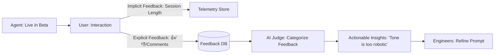

# 👥 User Acceptance Testing (UAT) for AI: The Human Verdict
> **Level:** Advanced | **Language:** Hinglish | **Goal:** Master the frameworks for gathering and analyzing real-world human feedback to ensure your agent is not just "Accurate," but actually "Helpful," "Trustworthy," and "Easy to use."

---

## 🧭 1. Beginner-Friendly Hinglish Explanation
User Acceptance Testing (UAT) ka matlab hai **"Asli Users ka feedback lena"**.

- **The Problem:** Engineers ko lagta hai AI "Perfect" hai, par jab asli user use karta hai, toh wo confuse ho jata hai.
- **The Concept:** 
  - AI "Smart" ho sakta hai par "Annoying" bhi.
  - Humein users ko agent dena hai aur dekhna hai ki:
    - Kya wo ispar trust karte hain?
    - Kya wo asani se baat kar pa rahe hain?
    - Kya AI ka "Tone" unhe pasand aa raha hai?
- **The Goal:** AI ko "Lab" se nikaal kar "Dil" (Users' heart) mein jagah dena.

UAT AI ko sirf "Correct" se **"Helpful"** banata hai.

---

## 🧠 2. Deep Technical Explanation
UAT for AI is about **Qualitative Feedback Analysis** and **UX Metrics**.

### 1. The UAT Workflow:
- **Internal Dogfooding:** Employees using the agent first.
- **Beta Testing:** A small group of real users testing "Edge Cases."
- **Feedback Loops:** Thumbs Up/Down, "Why was this bad?" text boxes, and Star ratings.

### 2. Key UAT Metrics:
- **CSAT (Customer Satisfaction):** Overall happiness with the agent.
- **User Trust Score:** How willing is the user to follow the agent's advice without checking?
- **Task Success Rate (Manual):** Did the user actually get what they wanted?
- **Perceived Latency:** Does the user *feel* the AI is slow? (Often different from actual latency).

### 3. A/B Testing UX:
Testing different "User Interfaces"—e.g., showing the reasoning vs. hiding it—to see which one users prefer.

---

## 🏗️ 3. Architecture Diagrams (The Feedback Engine)


---

## 💻 4. Production-Ready Code Example (A Feedback UI Schema)
```python
# 2026 Standard: Capturing rich feedback for UAT

from pydantic import BaseModel
from typing import Optional

class UserFeedback(BaseModel):
    session_id: str
    message_id: str
    rating: int # 1 to 5
    is_hallucination: bool
    comment: Optional[str]
    user_context: str # e.g., "Beginner" or "Expert"

def submit_feedback(data: UserFeedback):
    # 1. Save to DB
    feedback_repo.save(data)
    
    # 2. Trigger notification if rating is '1'
    if data.rating == 1:
        alert_dev_team(f"🚨 CRITICAL FAILURE in session {data.session_id}")

# Insight: Always ask 'Why?' when a user gives a low rating. 
# A '1-star' without a comment is useless.
```

---

## 🌍 5. Real-World Use Cases
- **Medical Bots:** Asking doctors to "Verify" the AI's diagnosis to build trust before full release.
- **Corporate HR:** Testing if employees feel "Comfortable" talking to an AI about their leave policy.
- **Gaming Agents:** Seeing if players find the "NPC Agent" fun or just "Cheatingly Smart."

---

## ❌ 6. Failure Cases
- **Selection Bias:** Only testing with "Tech-savvy" users who understand AI, then realizing "Non-tech" users are totally lost.
- **Ghosting Feedback:** Gathering 10,000 comments but never reading them or updating the agent.
- **Over-Correction:** Changing the whole agent's personality because $1$ user complained it was "Too happy."

---

## 🛠️ 7. Debugging Guide
| Symptom | Cause | Fix |
| :--- | :--- | :--- |
| **Users say AI is 'Stupid' but evals are 90%** | Eval set is too simple | Update your **'Golden Dataset'** with the real-world "Stupid" examples provided by users. |
| **Low engagement in UAT** | Feedback is too hard to give | Add **'One-click'** feedback buttons (👍/👎) inside the chat bubble. |

---

## ⚖️ 8. Tradeoffs
- **Unstructured Feedback (Detailed/Hard to analyze) vs. Structured Ratings (Simple/Easy to analyze).**
- **Moderated UAT (In-person interviews) vs. Unmoderated UAT (Self-service beta).**

---

## 🛡️ 9. Security Concerns
- **Feedback Injection:** A malicious user giving 1000 "Thumbs Down" to a perfectly good feature to sabotage the project.
- **PII in Comments:** Users putting their phone numbers or passwords in the "Comment Box." **Fix: Scrub the feedback DB for PII.**

---

## 📈 10. Scaling Challenges
- **Analyzing 100k Comments:** How to read all the feedback? **Solution: Use an 'LLM Summarizer' to group feedback into clusters (e.g., "60% of users want a Dark Mode").**

---

## 💸 11. Cost Considerations
- **Incentive Costs:** Sometimes you have to "Pay" or "Give Vouchers" to users to get high-quality UAT feedback.

---

## 📝 12. Interview Questions
1. What is the most important metric for User Acceptance in AI?
2. How do you analyze "Unstructured" feedback from users?
3. How do you handle "Bias" in human feedback?

---

## ⚠️ 13. Common Mistakes
- **Ignoring the 'Silent Majority':** Focusing only on the people who complain and forgetting the $90\%$ who are happy but quiet.
- **No 'Close the Loop':** Not telling the user "Thanks! We've updated the agent based on your feedback."

---

## ✅ 14. Best Practices
- **Segment your Users:** See if "Paid" users have different feedback than "Free" users.
- **Context is King:** Always save the "Trace Log" alongside the feedback so you can see exactly what the AI said.
- **Iterative UAT:** Don't do UAT once at the end; do it every 2 weeks.

---

## 🚀 15. Latest 2026 Industry Patterns
- **Passive Feedback Analysis:** Monitoring "Delete" or "Rewrite" actions to detect user frustration without them saying anything.
- **Synthetic Users:** Using a "Persona Agent" (e.g., "A frustrated 60-year-old") to do a "Pre-UAT" scan.
- **Dynamic UX:** The agent changing its UI based on the user's "Feedback Profile" (e.g., showing more details to a 'Skeptical' user).
