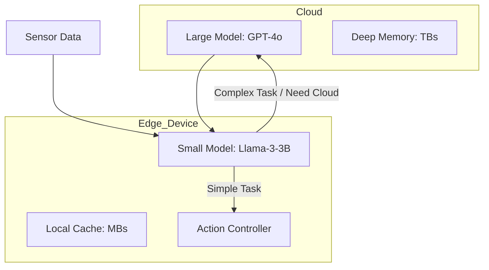

# 📡 Edge Deployment for Embodied AI: Intelligence on the Device
> **Level:** Advanced | **Language:** Hinglish | **Goal:** Master the optimization, quantization, and hardware-specific deployment of AI agents on local devices (Robots, Phones, IOT) where cloud connectivity is unreliable or slow.

---

## 🧭 1. Beginner-friendly Hinglish Explanation
Edge Deployment ka matlab hai "AI ko device ke andar hi rakhna". Sochiye ek robot jungle mein kaam kar raha hai jahan internet nahi hai. Agar wo har baar "Cloud" (Internet) se puchne jayega ki "Ab kya karun?", toh wo wahin phans jayega. "Edge" deployment mein hum dimaag (AI model) ko itna chota banate hain ki wo robot ke apne chote computer par chal sake. Isse agent fast ho jata hai (No latency), sasta ho jata hai (No API bills), aur internet bina bhi kaam karta hai.

---

## 🧠 2. Deep Technical Explanation
Deploying to the edge requires aggressive model optimization:
1. **Quantization:** Converting 16-bit or 32-bit weights to 4-bit or 8-bit to reduce model size by 4x-8x with minimal accuracy loss.
2. **Pruning:** Removing "weak" neurons from the model that don't contribute much to the output.
3. **Hardware Acceleration:** Using **NPUs (Neural Processing Units)**, **TPUs**, or **GPUs** (like NVIDIA Jetson) instead of standard CPUs.
4. **Knowledge Distillation:** Training a small "Student" model to mimic the behavior of a massive "Teacher" model (e.g., Llama-3-70B distilled to 3B).
5. **Local Vector Stores:** Using lightweight databases like **DuckDB** or **SQLite-VSS** for local memory.

---

## 🏗️ 3. Real-world Analogies
Edge Deployment ek **Pocket Calculator** ki tarah hai.
- Aapko simple maths ke liye supercomputer ke paas nahi jana padta.
- Aapke haath mein jo choti machine hai, wahi saara kaam turant kar deti hai.
- Ye "Local Intelligence" hai.

---

## 📊 4. Architecture Diagrams (The Edge vs Cloud)


---

## 💻 5. Production-ready Examples (Quantization with llama.cpp)
```bash
# 2026 Standard: Quantizing a model for Edge Deployment
# Convert model to GGUF format and quantize to 4-bit
./quantize ./models/llama-3-8b-f16.gguf ./models/llama-3-8b-q4_k_m.gguf q4_k_m

# Run locally on a Raspberry Pi or Jetson Nano
./main -m ./models/llama-3-8b-q4_k_m.gguf -p "Robot Task: Pick up the cup"
```

---

## ❌ 6. Failure Cases
- **Over-Quantization:** Model ko itna chota kar diya ki ab wo "Hosh kho baitha" hai (Garbage output/Hallucinations).
- **Thermal Throttling:** Chote device par model chalane se wo itna garam ho gaya ki uski speed 10x kam ho gayi.

---

## 🛠️ 7. Debugging Section
- **Symptom:** The model is too slow (1 token per second).
- **Check:** **VRAM Usage**. Kya model GPU memory se bahar nikal kar slow RAM par chala gaya? Check the **Quantization Level**. Maybe try a 2-bit or 3-bit version if memory is the bottleneck.

---

## ⚖️ 8. Tradeoffs
- **Edge Deployment:** Zero latency, High Privacy, No Internet required.
- **Cloud Deployment:** Maximum Intelligence, Infinite Memory, Easy Updates.

---

## 🛡️ 9. Security Concerns
- **Physical Theft:** Agar robot chori ho jaye, toh attacker uska edge model aur local memory (Sensitive data) extract kar sakta hai. Always use **Encrypted Storage**.

---

## 📈 10. Scaling Challenges
- Different devices (Android, iOS, Linux, Arduino) ke liye alag-alag model formats (CoreML, ONNX, TFLite) manage karna ek "DevOps Nightmare" hai.

---

## 💸 11. Cost Considerations
- Upfront hardware cost high hai (Buying GPUs/NPUs), par monthly API costs zero ho jati hain. Great for **Long-term ROI**.

---

## ⚠️ 12. Common Mistakes
- Tiny models se GPT-4 jaisi performance expect karna.
- Battery life ko ignore karna (AI models drain batteries very fast).

---

## 📝 13. Interview Questions
1. What is 'Weight Quantization' and how does it affect model performance?
2. Why is 'Knowledge Distillation' important for edge devices?

---

## ✅ 14. Best Practices
- Implement **'Hybrid Inference'**: Do simple tasks on the edge, send complex ones to the cloud.
- Always monitor **Device Temperature** and CPU load.

---

## 🚀 15. Latest 2026 Industry Patterns
- **NPU-First Design:** New chips from Apple, Qualcomm, and NVIDIA designed specifically to run transformer models at 100+ tokens/sec on the edge.
- **Unified Memory:** Systems where GPU and CPU share the same fast memory (like Apple M-series), making local AI incredibly fast.
