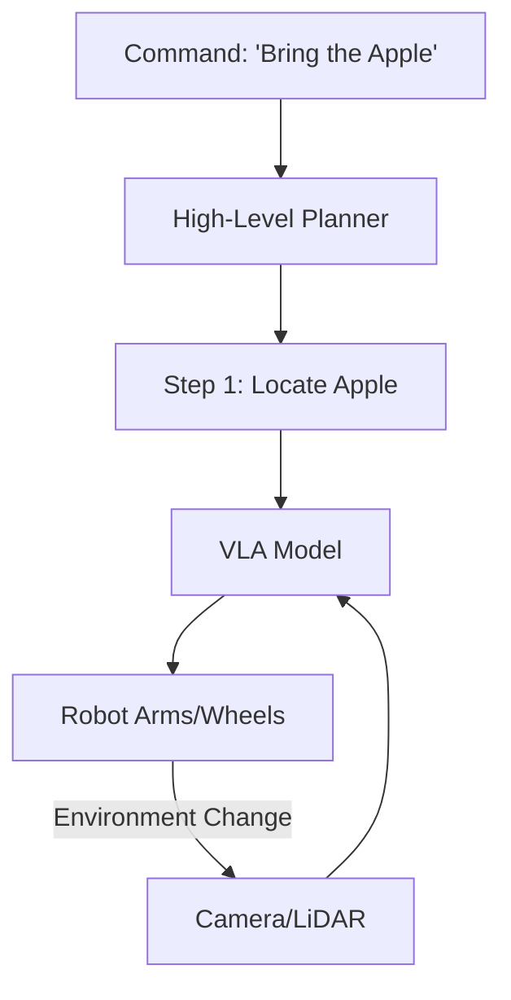

# 🤖 Embodied AI and Robotics: Agents with Bodies
> **Level:** Advanced | **Language:** Hinglish | **Goal:** Master the intersection of LLMs and physical robotics, where agents translate high-level language goals into real-world motor actions and sensory perceptions.

---

## 🧭 1. Beginner-friendly Hinglish Explanation
Embodied AI ka matlab hai "Dimaag ko Shareer dena". Ab tak humne jo agents dekhe wo sirf screen par text likhte the. Embodied AI wo hai jab wahi AI dimaag ek Robot (Shareer) mein fit ho jata hai. Ab wo agent sirf "Chai ki recipe" nahi batayega, balki kitchen mein jakar "Chai banayega" (Physical action). Isme agent ko dunya ko dekhna (Computer Vision), chuna (Haptics), aur move karna (Control) seekhna padta hai. Ye AI ka agla level hai jahan virtual world asli world se milta hai.

---

## 🧠 2. Deep Technical Explanation
Embodied AI requires a bridge between **Symbolic Reasoning** (Language) and **Continuous Control** (Motors):
1. **Visual-Language-Action (VLA) Models:** Models like **OpenVLA** or **RT-2** that take an image and a text command as input and output direct robot motor commands.
2. **Perception-Action Loop:** The agent constantly perceives the world (via cameras/sensors) and adjusts its movement in milliseconds.
3. **Sim-to-Real Transfer:** Training robots in simulation (fast and safe) and then transferring that knowledge to a physical robot.
4. **Foundation Models for Robotics:** Using LLMs to plan a task (e.g., "Clean the room") and then breaking it into small primitives (e.g., "Pick up the toy", "Move to the bin").

---

## 🏗️ 3. Real-world Analogies
Embodied AI ek **Child Learning to Walk** ki tarah hai.
- Baccha sunta hai (Command).
- Wo apni aankhon se dunya ko dekhta hai (Perception).
- Wo apne pairon ko hilane ki koshish karta hai (Action).
- Girne se wo seekhta hai ki balance kaise banana hai (Learning from feedback).

---

## 📊 4. Architecture Diagrams (The VLA Loop)


---

## 💻 5. Production-ready Examples (The Planning Interface)
```python
# 2026 Standard: Breaking High-level tasks into Robot Actions
def robot_action_planner(goal):
    # LLM translates "Clean the spill" into actionable steps
    steps = llm.plan(f"Convert this goal into robot primitives: {goal}")
    # steps = ["find_paper_towel", "move_to_spill", "wipe_surface"]
    
    for step in steps:
        robot.execute_primitive(step)
```

---

## ❌ 6. Failure Cases
- **Occlusion:** Robot ko cheez dikh rahi thi, par jab wo paas gaya toh uske hath ne camera block kar diya, aur wo "Andha" ho gaya.
- **Physical Safety:** Robot ne "Bottle pakadne" ke chakkar mein use itne zor se dabaya ki wo phat gayi (Force control failure).

---

## 🛠️ 7. Debugging Section
- **Symptom:** Robot is shaking or moving erratically.
- **Check:** **Control Frequency**. Kya aapka model actions slow generate kar raha hai? Physical world mein hamesha high frequency ($> 100Hz$) control chahiye hota hai. Use **Action Chunking** (Predicting multiple steps at once) to stay smooth.

---

## ⚖️ 8. Tradeoffs
- **End-to-End Models:** Bahut intelligent hain par unhe train karna bahut mushkil hai.
- **Modular Systems:** Safe hain par "Complex/New" situations mein phans jate hain.

---

## 🛡️ 9. Security Concerns
- **Kinematic Hijacking:** Ek hacker robot ke hardware control ka access le sakta hai, jisse wo physical harm pahuncha sakta hai. Always use **Hardware-level Kill Switches**.

---

## 📈 10. Scaling Challenges
- Collecting "Physical Data" (Robot movements) bahut slow aur mehenga hai. Virtual text data billions mein hai, par robot data sirf thousands mein.

---

## 💸 11. Cost Considerations
- Robots mehenge hote hain ($10k - $100k+). Use **Simulators** (like NVIDIA Isaac Lab) to test 99% of your code for free before buying a robot.

---

## ⚠️ 12. Common Mistakes
- Physical friction aur gravity ko ignore karna (In physics, nothing is perfect).
- Robot ke "Context" ko sirf camera pixels tak rakhna (It needs memory of where it was).

---

## 📝 13. Interview Questions
1. What is 'Sim-to-Real' gap and how do you mitigate it?
2. How do LLMs help in solving the 'Long Horizon' planning problem in robotics?

---

## ✅ 14. Best Practices
- Every physical robot must have a **'Safe Zone'** defined in its code.
- Use **Proprioception** (Robot's internal sense of its joints) alongside Vision.

---

## 🚀 15. Latest 2026 Industry Patterns
- **Humanoid Agents:** General-purpose robots (like Tesla Optimus or Figure) that run LLMs directly to perform household chores.
- **Teleoperation-to-Learning:** Humans remotely control a robot to teach it, and the AI learns to copy those actions.
