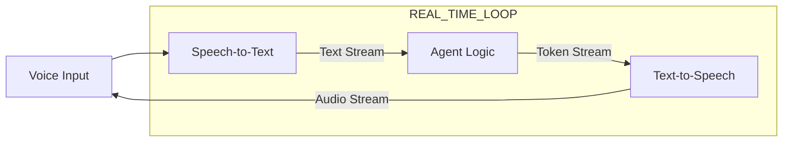

# ⚡ Real-Time Interaction Basics: Speed is the Key
> **Level:** Beginner | **Language:** Hinglish | **Goal:** Master the core concepts of building agents that respond to users with sub-second latency, enabling natural voice and chat experiences.

---

## 🧭 1. Beginner-friendly Hinglish Explanation
Real-Time Interaction ka matlab hai "Turant jawab dena". Sochiye aap kisi se phone par baat kar rahe hain. Agar aap kuch bole aur wo 10 second baad jawab de, toh aapko ajeeb lagega. AI Agents mein bhi jab hum Voice ya Live Chat use karte hain, toh hum chahte hain ki agent "Insani speed" par jawab de. Isme sabse bada challenge hota hai **Latency** (Derie). Is section mein hum seekhenge ki kaise agent ko itna fast banayein ki user ko lage ki wo kisi machine se nahi, balki ek asli insaan se live baat kar raha hai.

---

## 🧠 2. Deep Technical Explanation
Real-time interaction requires optimizing the full stack for **low latency**:
1. **Time to First Token (TTFT):** The time between user input and the first word of output. Goal for real-time is $< 200ms$.
2. **Streaming:** Not waiting for the full response to generate. Sending words to the UI as soon as they are born.
3. **WebSocket/gRPC:** Using persistent connections instead of slow HTTP requests.
4. **Speech-to-Text (STT) & Text-to-Speech (TTS):** Using fast models like **Whisper (Turbo)** and **Deepgram/ElevenLabs** to convert voice in real-time.
**Key Technique:** **Asynchronous Processing**—Processing the next part of the thought while the previous part is being spoken/shown.

---

## 🏗️ 3. Real-world Analogies
Real-Time Interaction ek **Live Radio Show** ki tarah hai.
- Host bol raha hai (Output).
- Caller turant sawal puchta hai (Input).
- Host bina pause liye jawab deta hai.
Agar beech mein 5 second ka sannata (Latency) ho, toh show kharab ho jayega.

---

## 📊 4. Architecture Diagrams (The Low-Latency Pipeline)


---

## 💻 5. Production-ready Examples (Streaming Response)
```python
# 2026 Standard: Streaming with OpenAI/LangChain
def stream_agent_response(query):
    # Using 'stream' parameter to get tokens as they are generated
    for chunk in llm.stream(query):
        print(chunk.content, end="", flush=True)
        # Send this chunk immediately to the Frontend via WebSocket
        socket.emit('token', chunk.content)

# User sees the text appear word-by-word instantly.
```

---

## ❌ 6. Failure Cases
- **Laggy Audio:** Internet slow hone ki wajah se voice cut rahi hai ya beech mein ruk rahi hai.
- **Interruption Failure:** User ne beech mein bolna shuru kiya par agent chup nahi hua aur bolta raha (Barge-in failure).

---

## 🛠️ 7. Debugging Section
- **Symptom:** There is a 2-second delay before the agent starts speaking.
- **Check:** **Network Hops**. Kya aapka STT, LLM, aur TTS teeno alag-alag providers par hain? Har hop par latency add hoti hai. Try to use **Unified Realtime APIs** (like OpenAI Realtime API) jahan sab kuch ek hi server par hota hai.

---

## ⚖️ 8. Tradeoffs
- **High Quality:** Better reasoning par higher latency.
- **High Speed:** Faster responses par potential "Hallucinations" kyunki model ko sochne ka kam waqt mila.

---

## 🛡️ 9. Security Concerns
- **Voice Spoofing:** Attacker agent ki real-time voice ko use karke kisi ko phone par scam kar sakta hai. Always add **Watermarks** to agent-generated audio.

---

## 📈 10. Scaling Challenges
- Millions of real-time audio streams manage karna server ki "Bandwidth" aur "CPU" par bahut heavy load dalta hai.

---

## 💸 11. Cost Considerations
- Real-time models (especially for Voice) mehenge hote hain. Optimize by using **Silence Detection** (Don't process silence as tokens).

---

## ⚠️ 12. Common Mistakes
- Streaming na use karna (User wait karte-karte app band kar dega).
- User ki interruption (Barge-in) ko handle na karna.

---

## 📝 13. Interview Questions
1. What is 'Time to First Token' (TTFT) and why is it important for voice agents?
2. How do you implement 'Barge-in' (interruption) logic in a real-time voice system?

---

## ✅ 14. Best Practices
- Always use **WebSockets** for real-time chat/voice.
- Provide a **Visual Indicator** (like a moving wave) so the user knows the agent is "Listening" or "Thinking".

---

## 🚀 15. Latest 2026 Industry Patterns
- **Native Multimodal Models:** Models (jaise GPT-4o) jo bina STT/TTS ke seedha audio samajhte aur bolte hain, reducing latency by 50%.
- **Edge TTS:** User ke phone par hi voice generate karna taaki cloud se audio stream na karna pade.
