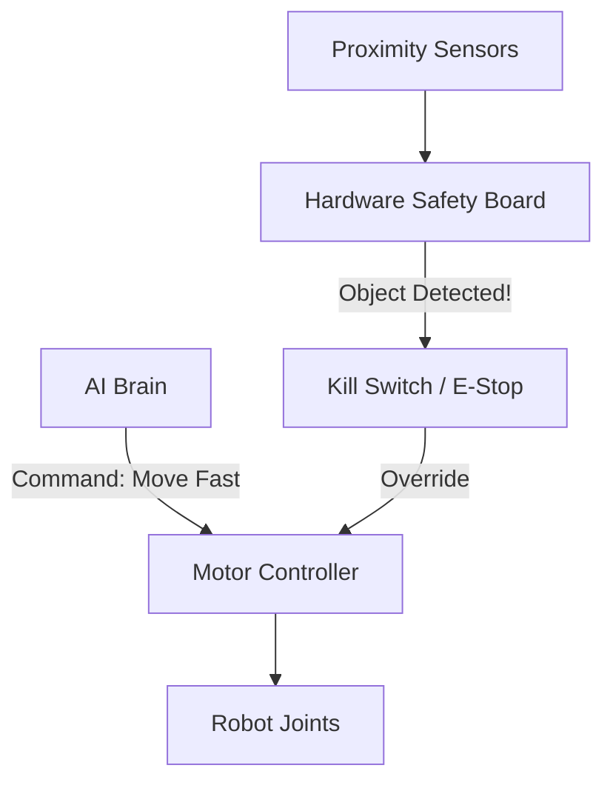

# 🛡️ Safety in Physical Environments: The Robot's Law
> **Level:** Advanced | **Language:** Hinglish | **Goal:** Master the safety protocols, collision avoidance, and fail-safe mechanisms required when AI agents control physical hardware in proximity to humans.

---

## 🧭 1. Beginner-friendly Hinglish Explanation
Physical Safety ka matlab hai "Robot ko insaan ko chot pahunchane se rokna". Virtual agent galti kare toh data loss hota hai, par Physical agent (Robot) galti kare toh "Jaan ka khatra" ho sakta hai. Sochiye ek robot arm warehouse mein saaman utha raha hai. Agar koi insaan uske raste mein aa jaye, toh robot ko milisecond mein rukna chahiye. Is section mein hum seekhenge ki kaise "Sensors" aur "Hardcoded Rules" ko AI ke saath milayein taaki robot hamesha safe rahe, chahe AI dimaag confuse hi kyu na ho jaye.

---

## 🧠 2. Deep Technical Explanation
Safety in embodied agents is implemented through **Layered Defense**:
1. **Kinematic Limits:** Hardcoding the maximum speed, torque, and range of motion at the firmware level (outside the AI's control).
2. **Collision Avoidance:** Using **Lidar/Depth Cameras** to create a "Safety Bubble" around the robot. If something enters the bubble, the motors stop.
3. **Formal Verification:** Using mathematical models to prove that the agent's logic will never enter an "Unsafe State".
4. **Fail-Safe Mechanisms:** If the AI model crashes or the internet drops, the hardware must enter a default "Brake/Locked" state.
5. **Human-Robot Collaboration (HRC) Standards:** Following international safety standards like **ISO 10218**.

---

## 🏗️ 3. Real-world Analogies
Physical Safety ek **Elevator (Lift)** ki tarah hai.
- Lift ka computer decide karta hai kahan jana hai.
- Par lift mein ek "Mechanical Brake" aur "Light Curtain" (Door sensor) hota hai.
- Agar darrwaaze ke beech mein hath aa jaye, toh computer kuch bhi bole, darrwaza nahi band hoga (Override).

---

## 📊 4. Architecture Diagrams (The Safety Override)


---

## 💻 5. Production-ready Examples (The Safety Bubble Logic)
```python
# 2026 Standard: Enforcing a Safety Perimeter
def execute_motor_command(command, distance_to_human):
    SAFE_DISTANCE = 1.0 # 1 meter
    
    if distance_to_human < SAFE_DISTANCE:
        print("SAFETY VIOLATION: Human too close. Reducing speed to zero.")
        return stop_motors()
    
    return apply_torque(command)

# This check happens at the lowest level of the control loop.
```

---

## ❌ 6. Failure Cases
- **Sensor Blind Spot:** Camera ne insaan ko nahi dekha kyunki wo "Andhere" mein tha ya kisi cheez ke piche tha.
- **Latent Stop:** AI ne "Stop" command bheji par network lag ki wajah se wo 1 second baad pahunchi, tab tak collision ho gaya.

---

## 🛠️ 7. Debugging Section
- **Symptom:** Robot is stopping even when nothing is there (Ghost blocks).
- **Check:** **Sensor Noise**. Kya LiDAR dust ya smoke se "False Positives" de raha hai? Use **Temporal Filtering** to confirm if an object is real or just noise.

---

## ⚖️ 8. Tradeoffs
- **Ultra-Safe:** Robot bahut dheere chalta hai aur baar-baar ruk jata hai (Low productivity).
- **High-Performance:** Fast kaam karta hai par risk level badh jata hai.

---

## 🛡️ 9. Security Concerns
- **Remote Hijacking of Safety Controls:** Ek hacker safety limits ko "Disable" kar sakta hai software ke zariye. Always use **Read-only Firmware** for safety limits.

---

## 📈 10. Scaling Challenges
- Crowd mein kaam karne wale robots (e.g., Delivery bots on sidewalks) ke liye "Safety" bahut complex hai kyunki environment hamesha badalta rehta hai.

---

## 💸 11. Cost Considerations
- High-quality safety sensors (Safety-rated LiDARs) normal sensors se 5x mehenge hote hain. Don't cut costs here.

---

## ⚠️ 12. Common Mistakes
- Sirf software par bharosa karna (Software crashes, Hardware brakes don't).
- "Stop" aur "Slow down" ke beech ka fark na samajhna.

---

## 📝 13. Interview Questions
1. What is an 'Emergency Stop' (E-Stop) and why should it be hardware-based?
2. How do you implement 'Force Limiting' in collaborative robots (cobots)?

---

## ✅ 14. Best Practices
- Always implement an **External E-Stop button** that a human can reach.
- Use **Redundant Sensors** (e.g., Camera + Ultrasonic) so if one fails, the other works.

---

## 🚀 15. Latest 2026 Industry Patterns
- **Visual Safety Transformers:** Models jo scene dekh kar predict karte hain "Kahan galti ho sakti hai" aur pehle se hi speed kam kar dete hain.
- **Active Collision Prediction:** Robots jo insaan ki movement ko predict karke unke raste se pehle hi hat jate hain (Proactive Safety).
