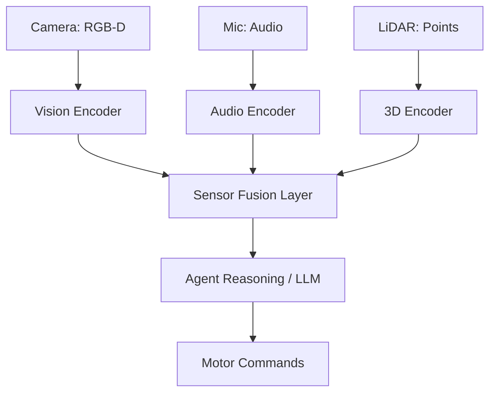

# 👁️ Sensory Processing in Agents: Beyond Text
> **Level:** Advanced | **Language:** Hinglish | **Goal:** Master the integration of multi-modal inputs (Vision, Audio, Lidar, Haptics) into the agent's reasoning loop for real-world environmental awareness.

---

## 🧭 1. Beginner-friendly Hinglish Explanation
Sensory Processing ka matlab hai "Agent ko aankhein aur kaan dena". Ab tak agent sirf text samajhta tha. Par Embodied AI (Robots/Smart devices) mein agent ko dunya ko "Sense" karna hota hai. Camera se dekhna (Vision), Microphone se sunna (Audio), aur sensors se distance naapna (Lidar). Agent ko in sab signals ko "Translate" karna hota hai taaki wo samajh sake: "Mere samne ek kursi hai aur wo 2 meter door hai". Bina sensory processing ke, agent andha aur behra hai, wo sirf virtual dunya mein reh sakta hai.

---

## 🧠 2. Deep Technical Explanation
Sensory processing involves converting raw sensor data into **Latent Representations** (Embeddings) that an agent can reason about:
1. **Computer Vision (CV):** Using **ViT (Vision Transformers)** or **CNNs** to identify objects, detect depth, and estimate poses.
2. **Audio Processing:** Using **Mel-spectrograms** or **Whisper** to identify voices, detect background noise (e.g., a glass breaking), and localize sound.
3. **Sensor Fusion:** Combining data from multiple sources (e.g., Camera + LiDAR) to create a more accurate **3D World Model**.
4. **Haptics & Force Sensing:** For robots, sensing "Touch" to know how hard to grip an object without breaking it.
**Standard:** Using **Multimodal Embeddings** (like CLIP) that project images and text into the same mathematical space.

---

## 🏗️ 3. Real-world Analogies
Sensory Processing ek **Smartphone** ki tarah hai.
- Camera se photo leta hai (Vision).
- Mic se 'Hey Siri' sunta hai (Audio).
- GPS se location track karta hai (Positioning).
- Ye sab data milkar phone ko "Smart" banate hain (Context).

---

## 📊 4. Architecture Diagrams (The Sensory Mesh)


---

## 💻 5. Production-ready Examples (Visual Context Injection)
```python
# 2026 Standard: Passing Image Context to an Agent
def process_visual_scene(image_path, user_query):
    # Encode image into tokens the model understands
    visual_features = vision_model.encode(image_path)
    
    # Combine text query with visual scene
    prompt = f"Analyze this scene: {visual_features}. Task: {user_query}"
    
    # Agent decides based on what it SEES
    return agent.invoke(prompt)
```

---

## ❌ 6. Failure Cases
- **Over-reliance on Vision:** Light chali gayi aur agent "Andha" ho gaya kyunki uske paas night-vision ya audio fallback nahi tha.
- **Sensor Conflict:** Camera bol raha hai "Rasta saaf hai" par LiDAR bol raha hai "Glass wall hai" (Transparency issues). Failure in **Conflict Resolution**.

---

## 🛠️ 7. Debugging Section
- **Symptom:** Agent is identifying objects wrongly.
- **Check:** **Input Resolution**. Kya camera se aa rahi photo dhundli (blur) hai? Use **Pre-processing filters** (Sharpening, De-noising) before sending data to the AI brain.

---

## ⚖️ 8. Tradeoffs
- **Raw Data Processing:** Maximum info par high compute and latency.
- **Feature Extraction:** Fast and efficient par "Detail" lose ho sakti hai.

---

## 🛡️ 9. Security Concerns
- **Sensory Spoofing:** Attacker camera ke samne ek "Poster" rakh deta hai jisse agent ko lage ki rasta saaf hai (Adversarial image). Always use **Multi-modal Cross-validation**.

---

## 📈 10. Scaling Challenges
- Millions of video frames process karna bandwidth aur storage par massive load dalta hai. Use **Edge Processing** (process on the device, send only summaries to cloud).

---

## 💸 11. Cost Considerations
- Video tokens text tokens se 10x mehenge hote hain. Use **Keyframe Extraction** (process 1 frame every 2 seconds instead of 30 frames per second).

---

## ⚠️ 12. Common Mistakes
- Calibration bhool jana (Camera aur LiDAR ka alignment galat hona).
- "Temporal" data ko ignore karna (Seeing one frame instead of a sequence of movement).

---

## 📝 13. Interview Questions
1. What is 'Sensor Fusion' and why is it critical for autonomous agents?
2. How do 'Multimodal Transformers' handle both images and text simultaneously?

---

## ✅ 14. Best Practices
- Every sensor should have a **'Confidence Score'**.
- Implement **'Sensor Heartbeat'** (If a sensor stops sending data, the agent must enter a 'Safe State').

---

## 🚀 15. Latest 2026 Industry Patterns
- **Neuromorphic Sensing:** Event-based cameras jo sirf "Change" detect karte hain, reducing power consumption by 90%.
- **World Models:** Agents jo sensory inputs se dunya ka ek 3D "Digital Twin" banate hain aur usmein future actions predict karte hain.
