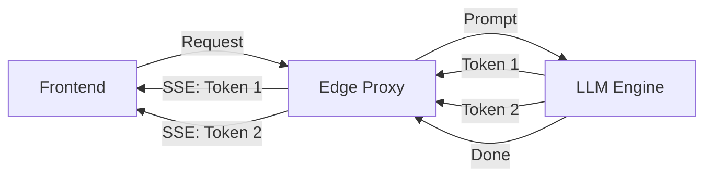

# 🌊 Streaming and Low Latency Agents: Eliminating the Wait
> **Level:** Advanced | **Language:** Hinglish | **Goal:** Master the deep engineering of streaming tokens, handling partial outputs, and optimizing the network stack for zero-lag agentic interactions.

---

## 🧭 1. Beginner-friendly Hinglish Explanation
Streaming ka matlab hai "Data ka jharna". Sochiye aap YouTube par video dekh rahe hain. Kya aap poori movie download hone ka wait karte hain? Nahi, jaise-jaise data aata hai, video chalti jati hai. "Streaming Agents" bhi wahi karte hain. Jaise hi agent ke dimaag mein pehla shabd (token) aata hai, wo user ko dikh jata hai. User ko ye nahi lagta ki "Agent soch raha hai", balki use lagta hai ki "Agent live baat kar raha hai". Ye "Low Latency" (Kam derie) experience users ke liye magic ki tarah hota hai.

---

## 🧠 2. Deep Technical Explanation
Optimizing for low latency involves several layers of the stack:
1. **Token Streaming (Server-Sent Events - SSE):** Instead of one big JSON response, the server sends a stream of tokens. This reduces the **TTFT (Time to First Token)** significantly.
2. **Partial Tool Execution:** Starting a tool call even before the LLM finishes the entire thought (if the intent is clear).
3. **Speculative Decoding:** Using a smaller model to predict the next few tokens and only verifying them with the large model.
4. **Edge Computing:** Deploying the agent orchestration logic closer to the user (e.g., Cloudflare Workers) to reduce network round-trip time (RTT).
5. **KV Caching:** Reusing the "Key-Value" pairs of the transformer's attention mechanism for faster subsequent token generation.

---

## 🏗️ 3. Real-world Analogies
Streaming ek **News Ticker** ki tarah hai.
- Aap poori news aane ka wait nahi karte.
- Words screen par ek-ek karke "Flow" hote hain (Stream).
- Aap turant news padhna shuru kar dete hain, chahe reporter abhi bol hi kyu na raha ho.

---

## 📊 4. Architecture Diagrams (The Streaming Flow)


---

## 💻 5. Production-ready Examples (The FastAPI Stream)
```python
# 2026 Standard: Streaming JSON via FastAPI
from fastapi import FastAPI
from fastapi.responses import StreamingResponse

app = FastAPI()

async def agent_streamer(query):
    async for chunk in agent.astream(query):
        # Sending data in small, immediate chunks
        yield f"data: {json.dumps(chunk)}\n\n"

@app.get("/stream")
async def stream(query: str):
    return StreamingResponse(agent_streamer(query), media_type="text/event-stream")
```

---

## ❌ 6. Failure Cases
- **Buffer Bloat:** Aapne stream toh shuru ki par beech mein network jam ho gaya, jisse user ko "A... D... H... U... R... A" (laggy) output milne laga.
- **Malformed JSON:** Streaming mein JSON ke beech mein break aa sakta hai, jisse frontend ka parser crash ho jaye. Always use **Partial JSON Parsers** (like `partial-json-parser`).

---

## 🛠️ 7. Debugging Section
- **Symptom:** The first word takes 5 seconds to appear, but the rest is fast.
- **Check:** **Cold Start / Initialization**. Kya aapka model load hone mein time le raha hai? Use **Warmed-up Instances** or persistent server connections. Check if your **Middleware** is buffering the response instead of streaming it.

---

## ⚖️ 8. Tradeoffs
- **Streaming:** Great UX, but harder to implement error handling (as the response has already started).
- **Batching:** Easier to handle errors and log data, but poor UX (Long wait).

---

## 🛡️ 9. Security Concerns
- **Stream Injection:** Attacker stream ke beech mein malicious control characters bhej sakta hai. Always **Sanitize** every chunk before it hits the UI.

---

## 📈 10. Scaling Challenges
- Millions of active SSE (Server-Sent Events) connections manage karna server ki "File Descriptors" aur "RAM" par heavy load dalta hai. Use **Redis Pub/Sub** for scale.

---

## 💸 11. Cost Considerations
- Streaming doesn't necessarily cost more tokens, but it keeps the server "Connection" open longer, which might increase **Infrastructure/Compute costs**.

---

## ⚠️ 12. Common Mistakes
- WebSocket aur SSE mein confuse hona (SSE is usually better for one-way streams like text).
- Frontend par "Auto-scroll" handle na karna (User ko manually scroll karna pad raha hai text padhne ke liye).

---

## 📝 13. Interview Questions
1. What is the difference between 'TTFT' and 'Total Request Latency'?
2. How do you parse 'Partial JSON' from a streaming agent response?

---

## ✅ 14. Best Practices
- Always use a **Loading Spinner** for the first few milliseconds before the first token arrives.
- Implement **Auto-Retry** for broken streams.

---

## 🚀 15. Latest 2026 Industry Patterns
- **Direct-to-Browser Streaming:** Agents jo models ko browser (WebGPU) par hi chala dete hain, eliminatng network latency entirely.
- **Multi-Modal Streams:** Streaming text, audio, aur video frames simultaneously ek hi connection par.
