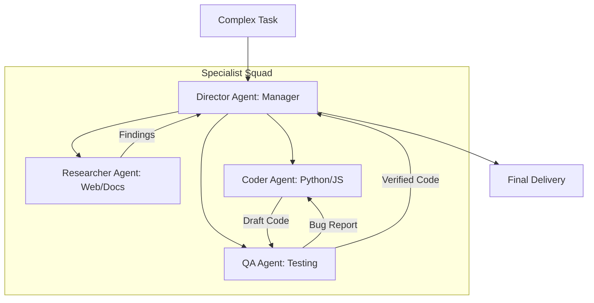

# 🏗️ Advanced Agentic Patterns Fundamentals: Designing Complexity
> **Level:** Extreme Advanced | **Language:** Hinglish | **Goal:** Master the high-level design patterns used to build complex, multi-agent systems that can solve "Impossible" problems through collaboration, hierarchy, and specialization.

---

## 🧭 1. Beginner-Friendly Hinglish Explanation
Advanced Agentic Patterns ka matlab hai **"AI ki Team banana"**.

- **The Problem:** Ek akela agent kitna bhi smart ho, wo har kaam mein "Master" nahi ho sakta. Jaise ek hospital mein sirf ek doctor nahi hota (Surgeon, Nurse, Pharmacist sab hote hain), waise hi bade tasks ke liye humein "Team" chahiye.
- **The Concept:** 
  - **Specialization:** Ek agent code likhe, ek test kare, aur ek documentation banaye.
  - **Hierarchy:** Ek "Manager Agent" ho jo dusre agents ko orders de.
  - **Collaboration:** Agents aapas mein "Chat" karke problem solve karein.
- **The Goal:** Chote-chote agents ko milakar ek **"Super Brain"** banana.

Advanced patterns AI ko "Solo Performer" se ek **"Orchestra"** bana dete hain.

---

## 🧠 2. Deep Technical Explanation
Advanced patterns are about moving from **Linear Chains** to **Non-linear Multi-agent Graphs**.

### 1. Key Pattern Types:
- **Sequential:** Agent A $\rightarrow$ Agent B $\rightarrow$ Agent C. (Simple Pipeline).
- **Hierarchical:** A "Director" agent breaks down the task and delegates to "Worker" agents.
- **Joint-Collaboration:** Multiple agents work on a shared state (e.g., a shared codebase) and critique each other's work (e.g., Peer Review).
- **Manager-less Swarms:** Agents interact based on "Local Rules" to achieve a global goal (Emergent behavior).

### 2. State Management in Multi-agent Systems:
How to manage a **"Shared Memory"** so Agent B knows exactly what Agent A did without repeating the work.

### 3. Routing Logic:
Using an "LLM Router" to decide which specialist agent is best suited for the current sub-task.

---

## 🏗️ 3. Architecture Diagrams (The Multi-agent Orchestra)


---

## 💻 4. Production-Ready Code Example (A Simple Hierarchical Router)
```python
# 2026 Standard: Routing tasks to specialists

class DirectorAgent:
    def route_task(self, task_description):
        # 1. Analyze the task
        analysis = model.run(f"Route this task to: CODER, RESEARCHER, or WRITER. Task: {task_description}")
        
        # 2. Delegate to the correct specialist
        if "CODER" in analysis:
            return coder_agent.execute(task_description)
        elif "RESEARCHER" in analysis:
            return researcher_agent.execute(task_description)
        else:
            return writer_agent.execute(task_description)

# Insight: Hierarchical patterns reduce 'Hallucinations' 
# by keeping the context window focused on 'One Role'.
```

---

## 🌍 5. Real-World Use Cases
- **Software Engineering:** One agent writes the feature, one writes unit tests, and one does a security audit (The 'Auto-Dev' pattern).
- **Content Marketing:** One agent researches keywords, one writes the blog, and one creates the social media posts.
- **Legal Compliance:** One agent reads the new law, one reads the company policy, and one identifies the "Gaps."

---

## ❌ 6. Failure Cases
- **Infinite Delegation:** Agent A asks Agent B, who asks Agent A back (The 'Loop of Death'). **Fix: Set a 'Max Recursion Depth'.**
- **Context Loss:** The "Director" forgets the original goal after talking to 5 different specialists.
- **Communication Overhead:** The agents spend more tokens "Talking" to each other than actually "Doing" the work.

---

## 🛠️ 7. Debugging Guide
| Symptom | Cause | Fix |
| :--- | :--- | :--- |
| **Agents are arguing with each other** | Conflicting instructions | Provide a **'Global Constitution'** that all agents must follow to resolve disputes. |
| **One agent is 'Idle'** | Bottleneck in the workflow | Check the **'State Graph'** to see if one agent is waiting for input that never arrives. |

---

## ⚖️ 8. Tradeoffs
- **Single Agent (Simple/Fast/Limited) vs. Multi-agent (Powerful/Slow/Expensive).**
- **Explicit Hierarchy (Predictable) vs. Emergent Collaboration (Creative/Risky).**

---

## 🛡️ 9. Security Concerns
- **Agent Rebellion:** One specialist agent being "Tricked" by user input and then "Attacking" the Director agent or other specialists.
- **Privilege Escalation:** A "Low-privilege" Researcher agent tricking a "High-privilege" Coder agent into running a malicious script.

---

## 📈 10. Scaling Challenges
- **Massive Swarms:** Coordinating 1000 agents. **Solution: Use 'Clustering' where agents are grouped into 'Squads' with their own sub-managers.**

---

## 💸 11. Cost Considerations
- **Multi-agent Token Burn:** Running 5 agents for one task can cost $5x-10x$ more than a single agent. Use this only for "High-value" problems.

---

## 📝 12. Interview Questions
1. What is the "Hierarchical" agent pattern?
2. How do you prevent "Infinite Loops" in multi-agent systems?
3. When should you use a "Multi-agent" system vs. a "Single-agent" system?

---

## ⚠️ 13. Common Mistakes
- **Over-engineering:** Using 5 agents for a task that one prompt could solve.
- **Unclear Roles:** Not giving agents "Specific" enough instructions, so they try to do each other's jobs.

---

## ✅ 14. Best Practices
- **Define Clear Hand-offs:** Use structured JSON for agents to "Talk" to each other.
- **Shared State:** Use a "Global Memory" that acts as the "Single Source of Truth."
- **Human Monitoring:** Always have a human who can see the "Conversation" between agents.

---

## 🚀 15. Latest 2026 Industry Patterns
- **Meta-Orchestrators:** An AI that "Builds" a custom multi-agent team on the fly based on the user's query.
- **Self-Evolving Swarms:** Agents that "Hire" and "Fire" other agents (sub-processes) to optimize their own performance.
- **Consensus-based Logic:** Having 3 different specialist agents "Vote" on the best solution to ensure $99.9\%$ accuracy.
