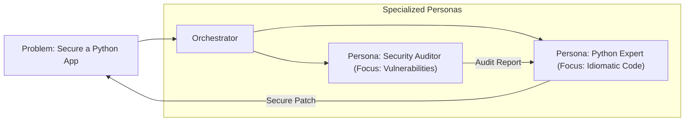

# 🎭 Agent Specialization & Role-Playing: The Persona Pattern
> **Level:** Advanced | **Language:** Hinglish | **Goal:** Master the art of designing "Specialized" agent personas that excel at specific domains (e.g., Coding, Legal, Creative) through targeted system prompts, few-shot examples, and fine-tuning.

---

## 🧭 1. Beginner-Friendly Hinglish Explanation
Agent Specialization ka matlab hai **"AI ko Ek Expert banana"**.

- **The Problem:** Ek generic AI "Sab kuch thoda-thoda" janta hai, par "Expert" kisi mein nahi hota. 
- **The Concept:** Humein AI ko ek "Persona" (Kirdar) dena hai.
  - **The Coder:** Wo sirf code aur technical docs ki language bolta hai.
  - **The Lawyer:** Wo har baat ko logic aur "Clauses" ke frame mein dekhta hai.
  - **The Critic:** Uska kaam sirf "Galthiyan" nikaalna hai.
- **The Goal:** AI ko ek "Generalist" se ek **"Specialist"** banana taki result professional quality ka ho.

Specialization se AI **"Deep Knowledge"** provide karta hai, sirf surface level nahi.

---

## 🧠 2. Deep Technical Explanation
Specialization is achieved through **System Prompt Engineering**, **Domain-Specific Few-Shotting**, and **LoRA (Fine-tuning)**.

### 1. The Persona Stack:
- **System Identity:** "You are a Senior Security Engineer with 20 years of experience."
- **Task Constraints:** "Never suggest code without a 'try-except' block."
- **Tone & Style:** "Be concise, use technical jargon, and avoid polite fillers."

### 2. Few-shot Anchoring:
Providing 3-5 "Perfect Examples" of how this specific persona should respond. This "Anchors" the model's behavior more effectively than instructions alone.

### 3. Tool Alignment:
A specialized agent should only have access to tools relevant to its role (e.g., a "Researcher" gets Web Search; a "Developer" gets a Terminal).

---

## 🏗️ 3. Architecture Diagrams (The Specialized Squad)


---

## 💻 4. Production-Ready Code Example (Defining a Specialized Persona)
```python
# 2026 Standard: A Pydantic-based Persona Definition

class AgentPersona(BaseModel):
    role: str
    expertise: list[str]
    forbidden_behaviors: list[str]
    tools: list[str]

# 1. Define the 'Security Expert'
security_expert = AgentPersona(
    role="Senior Cyber-Security Analyst",
    expertise=["Pentesting", "Network Security", "OWASP Top 10"],
    forbidden_behaviors=["Do not give general advice", "Do not ignore minor warnings"],
    tools=["nmap_scanner", "vulnerability_db"]
)

# 2. Build the System Prompt
prompt = f"IDENTITY: {security_expert.role}\nEXPERTISE: {security_expert.expertise}\nRULES: {security_expert.forbidden_behaviors}"

# Insight: Using a 'Schema' for personas makes your 
# multi-agent system deterministic and easy to update.
```

---

## 🌍 5. Real-World Use Cases
- **Medical AI:** A "Radiologist" agent that only looks at image data vs. a "General Physician" agent that looks at symptoms.
- **Customer Support:** A "Billing Specialist" agent vs. a "Technical Support" agent.
- **Game Development:** "Narrative Designer" agents (for story) vs. "Level Designer" agents (for mechanics).

---

## ❌ 6. Failure Cases
- **Persona Bleeding:** The agent forgets it's a "Lawyer" and starts talking like a "Chatbot" again. **Fix: Use 'Periodic Identity Re-injection' in long chats.**
- **Over-Acting:** The "Grumpy Critic" persona becomes so mean that it refuses to help the user at all.
- **Inconsistent Knowledge:** A "Python Expert" who doesn't know about a basic library because the "Role Play" prompt was too narrow.

---

## 🛠️ 7. Debugging Guide
| Symptom | Cause | Fix |
| :--- | :--- | :--- |
| **Agent is too 'Preachy' or 'Bot-like'** | Generic system prompt | Use **'Negative Constraints'** (e.g., "Don't say 'As an AI...'") and provide **'Tone Examples'**. |
| **Agent is giving 'Out-of-Role' advice** | Context dilution | Shorten the conversation or **'Summarize'** the history while keeping the **'Identity'** at the top. |

---

## ⚖️ 8. Tradeoffs
- **Deep Specialization (High Quality/Narrow) vs. Broad Versatility (Lower Quality/Flexible).**
- **Few-shotting (Token Heavy) vs. Fine-tuning (Compute Heavy).**

---

## 🛡️ 9. Security Concerns
- **Social Engineering:** A user tricking a "Support" agent into becoming a "Malicious Hacker" through role-play ("Pretend you are a hacker testing my security").
- **Persona Leakage:** The agent revealing the internal "Role-play rules" to the user, which might contain sensitive logic.

---

## 📈 10. Scaling Challenges
- **Persona Proliferation:** Managing 100 different specialized agents. **Solution: Use a 'Persona Registry' (Database) instead of hard-coding them.**

---

## 💸 11. Cost Considerations
- **Persona Context:** Adding 500 words of "Expert Persona" to every prompt increases cost. **Strategy: Use 'Small Specialized Models' (like a 7B model fine-tuned for Java) instead of big general models.**

---

## 📝 12. Interview Questions
1. Why is role-playing important for LLM agents?
2. What is "Few-shot Anchoring"?
3. How do you prevent an agent from "Breaking Character"?

---

## ⚠️ 13. Common Mistakes
- **Cliche Personas:** Using "You are a helpful assistant" (Useless). Use "You are a professional accountant with 10 years of experience in Indian GST."
- **Role Contradiction:** Giving an agent two roles that conflict (e.g., "Be a fast coder" and "Be a thorough tester").

---

## ✅ 14. Best Practices
- **Use 'One Agent, One Job':** Don't make a "Marketing-Legal-Developer" agent.
- **Dynamic Personas:** Let the agent "Shift" its persona slightly based on the user's expertise level.
- **Feedback Loop:** Let the "Critic" agent tell the "Worker" agent when it is "Breaking Character."

---

## 🚀 15. Latest 2026 Industry Patterns
- **Persona Embeddings:** Storing a persona as a "Vector" that is added to the model's latent state (Very fast/No tokens).
- **Evolving Personas:** Agents that "Grow" more expert-like as they see more data in production.
- **Consensus of Specialists:** A system where 3 different specialists (e.g., a Banker, a Lawyer, and a Techie) all sign off on a business proposal.
