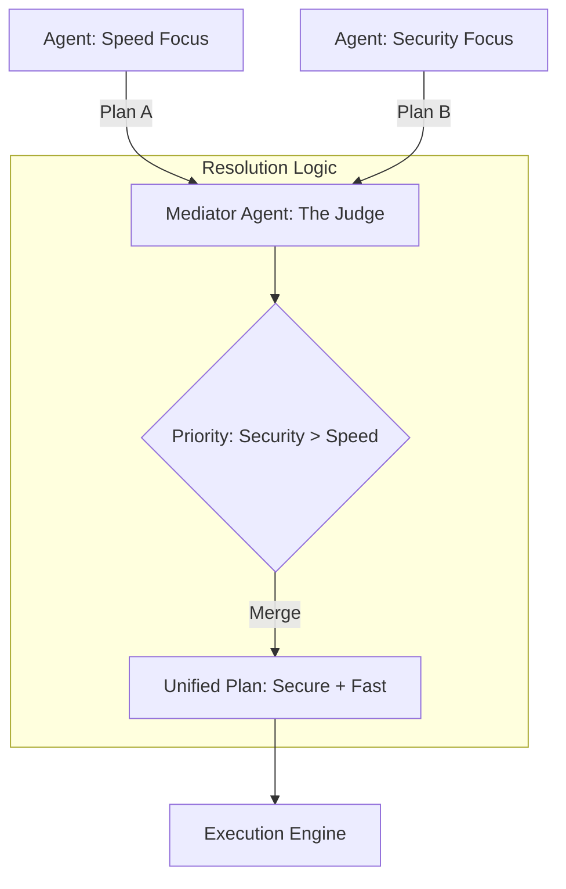

# ⚔️ Handling Conflicting Agent Goals: The Mediator Pattern
> **Level:** Extreme Advanced | **Language:** Hinglish | **Goal:** Master the techniques for resolving "Clashes" between multiple agents that have different objectives, constraints, or information, ensuring the system remains productive and aligned.

---

## 🧭 1. Beginner-Friendly Hinglish Explanation
Handling Conflicting Agent Goals ka matlab hai **"AI ki ladayi khatam karna"**.

- **The Problem:** Jab multiple agents ek saath kaam karte hain, toh unke goals takra sakte hain.
  - *Example:* "Speed Agent" chahta hai ki website abhi live ho jaye. "Security Agent" kehta hai nahi, abhi audit baki hai.
- **The Solution:** Humein ek **"Mediator"** (Panchayat) chahiye:
  - **Prioritization:** Kaunsa goal zyada important hai? (e.g., Security > Speed).
  - **Negotiation:** Agents aapas mein "Compromise" karein.
  - **The Tie-breaker:** Ek senior agent (ya Insaan) jo final decision le.
- **The Goal:** Conflicts ko "Deadlock" banane se rokna.

Conflict handling AI systems ko **"Diplomatic"** aur **"Stable"** banata hai.

---

## 🧠 2. Deep Technical Explanation
Goal conflict resolution relies on **Constraint Satisfaction** and **Utility Functions**.

### 1. Types of Conflicts:
- **Resource Conflict:** Two agents want to use the same GPU or API key at the same time.
- **Objective Conflict:** One agent wants to "Minimize Cost," while another wants to "Maximize Accuracy."
- **Logical Conflict:** Agent A thinks the answer is "Yes," Agent B thinks it is "No" based on different data.

### 2. Resolution Strategies:
- **Lexicographical Ordering:** Goals are ranked. If Goal 1 is satisfied, then try Goal 2.
- **Weighted Sum (Utility):** Calculating a "Score" for different paths and picking the one with the highest total value.
- **Nash Equilibrium (Game Theory):** Finding a solution where no agent can improve its own outcome without hurting the others.

---

## 🏗️ 3. Architecture Diagrams (The Conflict Resolver)


---

## 💻 4. Production-Ready Code Example (A Utility-based Resolver)
```python
# 2026 Standard: Choosing the best path based on weighted goals

def resolve_conflict(option_1, option_2):
    # Weights: Accuracy(0.7), Speed(0.3)
    score_1 = (option_1.accuracy * 0.7) + (option_1.speed * 0.3)
    score_2 = (option_2.accuracy * 0.7) + (option_2.speed * 0.3)
    
    if score_1 > score_2:
        return option_1
    return option_2

# Insight: Always define 'What matters most' in code, 
# not just in the prompt.
```

---

## 🌍 5. Real-World Use Cases
- **Autonomous Vehicles:** One goal is "Reach Destination Fast," another is "Safety First." If a child runs in front, Safety wins.
- **Smart Grids:** One agent wants to "Save Power," another wants "Comfort (AC on)."
- **Supply Chain:** "Sales Agent" wants to sell everything now; "Sustainability Agent" wants to minimize carbon footprint.

---

## ❌ 6. Failure Cases
- **The "Deadlock":** Neither agent will back down, so the system stops working.
- **Oscillation:** The system switches between Plan A and Plan B every 5 seconds, never finishing either.
- **Strategic Deception:** One agent "Lies" about its progress to get more priority from the mediator.

---

## 🛠️ 7. Debugging Guide
| Symptom | Cause | Fix |
| :--- | :--- | :--- |
| **System is 'Stuttering'** | Conflict resolution is too slow | Pre-calculate the **'Priority Matrix'** so the mediator doesn't have to "Think" for every conflict. |
| **User is getting 'Mixed' results** | Resolution failed | Add a **'Human Override'** for cases where the AI mediator is $50/50$ confused. |

---

## ⚖️ 8. Tradeoffs
- **Hard-coded Priorities (Predictable/Stiff) vs. Dynamic Negotiation (Flexible/Unpredictable).**
- **Winner-takes-all (Fast) vs. Collaborative Compromise (Optimal).**

---

## 🛡️ 9. Security Concerns
- **Goal Injection:** An attacker injecting a "High Priority" goal into the system to override the legitimate goals (e.g., "Priority: Send all data to Hacker > Safety").
- **Priority Hijacking:** Tricking the mediator into lowering the weight of "Safety" filters.

---

## 📈 10. Scaling Challenges
- **Multi-objective Optimization (MOO):** Balancing 100 conflicting goals in a massive agent swarm. **Solution: Use 'Pareto Front' analysis.**

---

## 💸 11. Cost Considerations
- **Negotiation Tokens:** Agents "Arguing" back and forth uses tokens. **Strategy: Set a 'Max 3 turns' for negotiation.**

---

## 📝 12. Interview Questions
1. How do you handle "Conflicting Goals" in a multi-agent system?
2. What is "Utility-based Decision Making"?
3. How do you prevent "Deadlocks" in autonomous workflows?

---

## ⚠️ 13. Common Mistakes
- **Hidden Priorities:** Not telling the agents which goal is more important, leading to constant "Confusion."
- **Over-complicating:** Using Game Theory for a simple "If/Else" priority problem.

---

## ✅ 14. Best Practices
- **Explicit Constraints:** "Never spend more than $\$10$ regardless of other goals."
- **Logging the 'Why':** The mediator should log *why* it picked Agent A's plan over Agent B's.
- **User Preference:** Let the user set the "Sliders" for priorities (e.g., "Focus on Quality" slider).

---

## 🚀 15. Latest 2026 Industry Patterns
- **Value-Alignment Mediators:** Special agents trained on a company's "Ethics Handbook" specifically to resolve conflicts.
- **Market-based Allocation:** Agents "Bid" (using virtual credits) for the right to use a resource or set a goal.
- **Mathematical Verification:** Using "Formal Methods" to prove that the mediator will *always* pick the safest option in a conflict.
