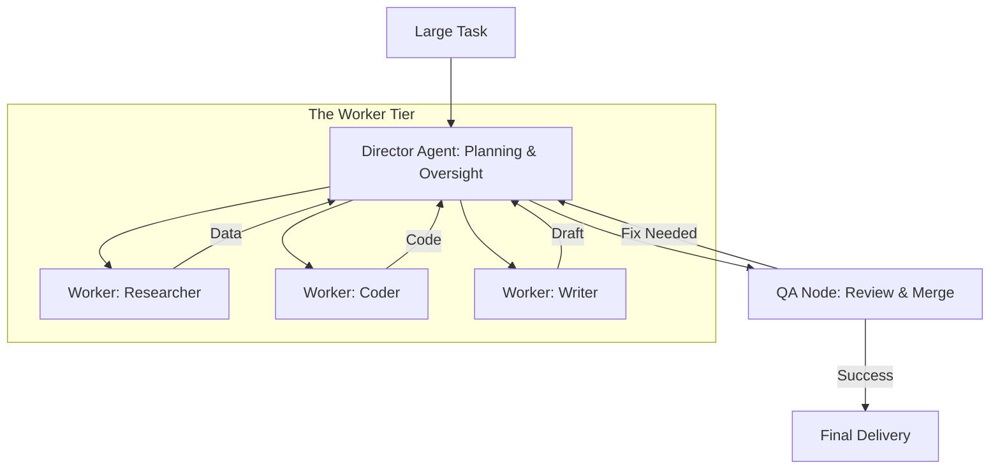

# 👑 Hierarchical Agent Systems: The Chain of Command
> **Level:** Extreme Advanced | **Language:** Hinglish | **Goal:** Master the design of "Top-Down" agent systems where a Manager/Director agent oversees multiple "Worker" agents, managing delegation, task breakdown, and quality control.

---

## 🧭 1. Beginner-Friendly Hinglish Explanation
Hierarchical Agent Systems ka matlab hai **"AI ki Hierarchy banana"**.

- **The Problem:** Ek bahut bada task (e.g., "Ek poori Website banao") ek agent ke liye bahut complex hota hai. Wo context bhool sakta hai ya "Messy" kaam kar sakta hai.
- **The Solution:** Humein ek **"Manager"** chahiye.
  - **The Manager (Director):** Ye sirf "Sochta" hai. Wo task ko chote tukdon mein baantta hai (Task Decomposition).
  - **The Workers:** Ye "Kaam" karte hain (e.g., "Designer," "Coder," "Tester").
  - **The Workflow:** Manager worker ko kaam deta hai, worker report karta hai, aur manager final check karta hai.
- **The Goal:** Complexity ko manage karna taaki result "Professional" aur "Clean" ho.

Hierarchy se AI ek **"Corporate Team"** ki tarah kaam karta hai.

---

## 🧠 2. Deep Technical Explanation
Hierarchical systems rely on **Task Decomposition** and **State Delegation**.

### 1. The Manager's Responsibilities:
- **Planning:** Breaking a high-level goal (e.g., "Build a SaaS") into sub-tasks (e.g., "Design DB," "Write Auth," "Setup Frontend").
- **Delegation:** Assigning each sub-task to the agent with the best "Skillset."
- **Aggregation:** Taking the outputs from 5 different workers and merging them into a single final product.
- **Error Handling:** If Worker A fails, the Manager decides whether to "Retry," "Pivot," or "Ask for Human Help."

### 2. State Scoping:
Ensuring a worker only sees the data relevant to its specific sub-task, which saves tokens and prevents "Context Pollution."

---

## 🏗️ 3. Architecture Diagrams (The Director-Worker Model)


---

## 💻 4. Production-Ready Code Example (A Hierarchical Controller)
```python
# 2026 Standard: A Manager managing Sub-agents

class ManagerAgent:
    def __init__(self):
        self.researcher = ResearcherAgent()
        self.coder = CoderAgent()

    async def execute_project(self, project_desc):
        # 1. Decomposition
        plan = await self.planner.run(f"Break this down: {project_desc}")
        
        # 2. Execution via Workers
        research_results = await self.researcher.run(plan.subtask_1)
        code_output = await self.coder.run(plan.subtask_2, context=research_results)
        
        # 3. Final Integration
        return f"Project Finished! Results: {code_output}"

# Insight: Managers should be 'Senior' models (GPT-4o) 
# while workers can be 'Junior' models (GPT-4o-mini).
```

---

## 🌍 5. Real-World Use Cases
- **Software Development:** A "Project Manager" agent delegating to a "Frontend Agent," "Backend Agent," and "DevOps Agent."
- **Financial Reporting:** A "Director" agent asking for data from a "Bank API Agent," "Stock API Agent," and "Tax Logic Agent."
- **Event Planning:** A "Manager" agent coordinating "Catering," "Venue," and "Guest List" agents.

---

## ❌ 6. Failure Cases
- **Micromanagement:** The Manager keeps asking the worker for "Updates" every 2 seconds, wasting tokens.
- **The "Lazy Manager":** The Manager takes the first (wrong) output from the worker and gives it to the user without checking.
- **Bottlenecks:** 10 workers are ready but the Manager is "Slow" and can't process their outputs fast enough.

---

## 🛠️ 7. Debugging Guide
| Symptom | Cause | Fix |
| :--- | :--- | :--- |
| **Final project is 'Disconnected'** | Workers don't share context | Ensure the **Manager** provides a **'Context Summary'** from Worker A when talking to Worker B. |
| **Infinite Delegation** | Manager is confused | Add a **'Strict State Machine'** so the Manager cannot ask for the same sub-task more than twice. |

---

## ⚖️ 8. Tradeoffs
- **High Hierarchy (Organized/Safe) vs. Flat Swarm (Creative/Fast).**
- **Token Usage:** Managers use a lot of tokens to "Coordinate." Ensure the task is big enough to justify the cost.

---

## 🛡️ 9. Security Concerns
- **Privilege Leaks:** A Worker agent seeing the Manager's internal "System Prompt" or "Keys." **Fix: Use 'Strict Data Isolation'.**
- **Malicious Workers:** A compromised worker agent lying to the Manager to get a "Task Approved."

---

## 📈 10. Scaling Challenges
- **Management Ratios:** One manager can usually handle $3-7$ workers effectively. Beyond that, you need a **"Manager of Managers"**.

---

## 💸 11. Cost Considerations
- **Tiered Model Usage:** Use the most expensive model for the **Manager** (Logic) and the cheapest for the **Workers** (Execution).

---

## 📝 12. Interview Questions
1. What is "Task Decomposition" in hierarchical agents?
2. How do you handle "State" in a Director-Worker architecture?
3. What are the advantages of a "Hierarchical" system over a "Linear" chain?

---

## ⚠️ 13. Common Mistakes
- **No 'Feedback' to Workers:** The manager just says "Failed, try again" without telling the worker *what* was wrong.
- **Ambiguous Sub-tasks:** Giving a worker a sub-task that is too "Vague," making it fail.

---

## ✅ 14. Best Practices
- **Standardized Reporting:** Every worker should return data in a consistent JSON format.
- **Progress Tracking:** The Manager should keep a "Progress Board" (State) that the user can see.
- **Iterative Refinement:** If a worker's output is $80\%$ correct, the Manager should tell it to fix the remaining $20\%$.

---

## 🚀 15. Latest 2026 Industry Patterns
- **Recursive Hierarchy:** Agents that "Spawn" their own sub-agents if a task becomes too complex for them (Auto-scaling intelligence).
- **Dynamic Org Charts:** The system builds the "Team Structure" based on the task (e.g., for a legal task, it hires a 'Paralegal Agent').
- **Executive Dashboards:** UIs that show the "Hierarchy Graph" in real-time, letting humans "Step in" as a Super-Manager.
