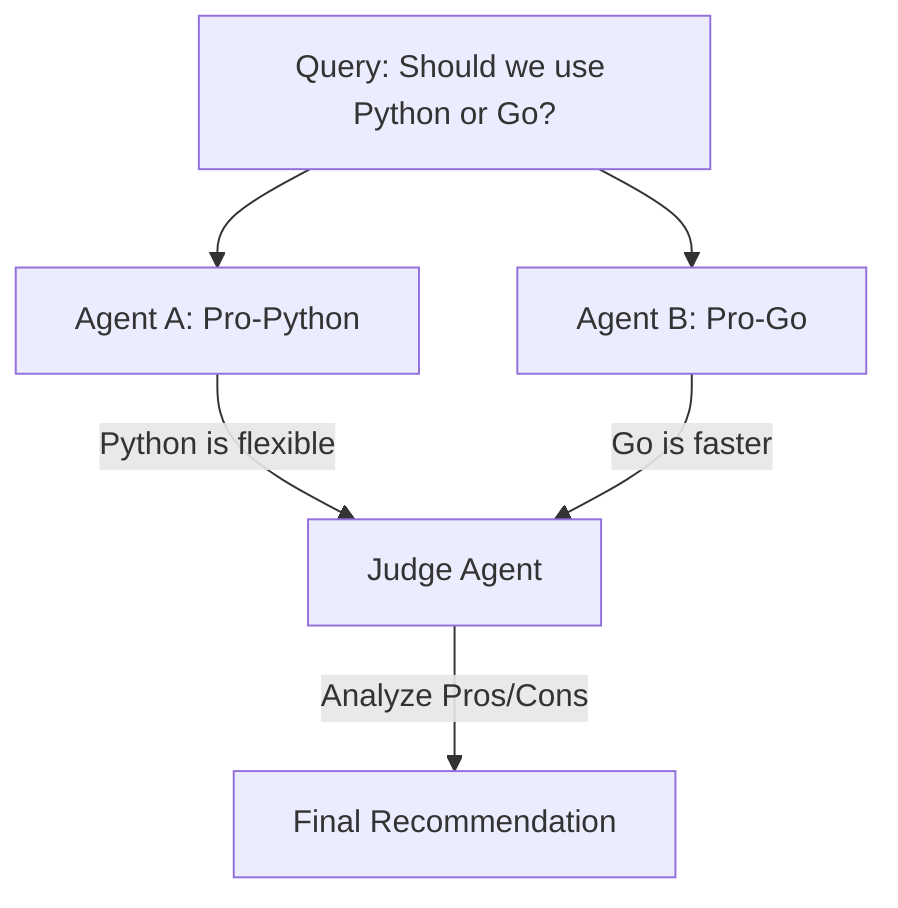

# 🤝 Multi-Agent Collaboration Patterns: Working Together
> **Level:** Extreme Advanced | **Language:** Hinglish | **Goal:** Master the specific protocols and patterns (Debate, Reflection, Peer Review) that allow multiple agents to collaborate effectively on a shared goal.

---

## 🧭 1. Beginner-Friendly Hinglish Explanation
Multi-Agent Collaboration ka matlab hai **"AI ki Group Discussion"**.

- **The Problem:** Akela AI aksar apni galthiyan nahi dekh pata (Self-bias).
- **The Solution:** Humein agents ko "Baat" (Collab) karwana hoga:
  - **Debate Pattern:** Do agents alag-alag sides se argue karein (e.g., Pros vs Cons).
  - **Reflection Pattern:** Ek agent kaam kare, aur dusra use "Check" karke feedback de.
  - **Peer Review:** Team ke baaki agents "Code Review" karein jaise real developers karte hain.
- **The Goal:** Multiple viewpoints se "Sabse Accha" result nikalna.

Collaboration AI ko **"Error-free"** aur **"Creative"** banata hai.

---

## 🧠 2. Deep Technical Explanation
Collaboration patterns rely on **Communication Protocols** and **Conflict Resolution Logic**.

### 1. Key Collaboration Patterns:
- **Reflexive Collaboration:** Agent A generates a draft; Agent B (The Critic) provides critiques; Agent A refines the draft. (Repeat $N$ times).
- **Adversarial Debate:** Agent A and Agent B argue conflicting viewpoints. A third agent (The Judge) decides the winner. This is great for "Fact-checking."
- **Blackboard Pattern:** All agents write their partial solutions to a "Shared Blackboard." Agents watch the board and contribute when they see something they can help with.

### 2. Coordination Mechanisms:
- **Broadcasting:** One agent sends a message to all others.
- **Direct Messaging (P2P):** Agent A sends a structured request to Agent B.

### 3. Joint Action Space:
Managing locks and concurrency when two agents try to modify the same file or resource.

---

## 🏗️ 3. Architecture Diagrams (The Debate Pattern)


---

## 💻 4. Production-Ready Code Example (Implementing a Reflection Loop)
```python
# 2026 Standard: A simple 'Writer-Reviewer' loop

def collaboration_loop(task):
    # 1. WRITER creates draft
    draft = writer.run(f"Write a blog post about {task}")
    
    # 2. REVIEWER provides critique
    critique = reviewer.run(f"Critique this blog post for SEO and Tone: {draft}")
    
    # 3. WRITER refines based on critique
    final_output = writer.run(f"Improve your draft using this feedback: {critique}")
    
    return final_output

# Insight: Even one 'Reflection' step can increase 
# output quality by $20-30\%$.
```

---

## 🌍 5. Real-World Use Cases
- **Scientific Research:** One agent searches for papers, another summarizes, and a third checks for "Citations" accuracy.
- **Cybersecurity:** One agent scans for vulnerabilities, another tries to exploit them, and a third writes the "Security Patch."
- **Creative Design:** One agent creates the UI mockup, another reviews it for "Accessibility," and a third generates the CSS code.

---

## ❌ 6. Failure Cases
- **Echo Chambers:** Two agents agreeing with each other's mistakes instead of critiquing them.
- **Analysis Paralysis:** Agents debating for 20 turns without ever making a decision. **Fix: Set a 'Turn Limit'.**
- **Inconsistent Formats:** Agent A sends a message in JSON, but Agent B expects Markdown.

---

## 🛠️ 7. Debugging Guide
| Symptom | Cause | Fix |
| :--- | :--- | :--- |
| **Agents are repeating themselves** | Lack of 'Novelty' penalty | Tell the **Critic Agent** to specifically look for "Repetitive Content" and "Stale Logic." |
| **One agent is 'Dominating' the chat** | Unbalanced Roles | Use **'Turn-taking'** logic (Round Robin) to ensure everyone contributes. |

---

## ⚖️ 8. Tradeoffs
- **Collaborative Intelligence (Highest Quality) vs. Single-pass Inference (Fastest/Cheapest).**
- **Centralized Control (Organized) vs. Decentralized Swarms (Scalable).**

---

## 🛡️ 9. Security Concerns
- **Sybil Attack:** One malicious agent "Spamming" the collaboration with wrong info to tilt the final decision.
- **Social Engineering:** One agent "Tricking" another agent into giving up its private keys or tokens.

---

## 📈 10. Scaling Challenges
- **The 'N-squared' Problem:** As you add more agents, the number of "Messages" between them grows exponentially. **Solution: Use 'Clustering' and 'Hierarchical Communication'.**

---

## 💸 11. Cost Considerations
- **Reflection Tokens:** Every "Review" step uses more tokens. **Strategy: Use a 'Cheap Model' (e.g., Llama-3-8B) for the Reviewer and a 'Strong Model' (e.g., GPT-4o) for the Writer.**

---

## 📝 12. Interview Questions
1. What is the "Reflection" pattern in agentic systems?
2. How do you implement a "Debate" between two AI agents?
3. What are the pros and cons of the "Blackboard" architecture?

---

## ⚠️ 13. Common Mistakes
- **No 'Judge' Agent:** Letting two agents argue forever without anyone to make the final call.
- **Ignoring the 'Original Intent':** Agents get so caught up in the "Collaboration" that they forget what the user actually asked for.

---

## ✅ 14. Best Practices
- **Define Specific Protocols:** Tell agents exactly *how* to talk to each other (e.g., "Always start your message with [PROPOSAL]").
- **Log Everything:** Use **LangSmith** to see the full "Chat" between agents for debugging.
- **Set a 'Max turns' limit:** $3-5$ turns is usually enough for most collaboration tasks.

---

## 🚀 15. Latest 2026 Industry Patterns
- **Joint Latent Spaces:** Agents that share "Internal Vectors" to communicate faster than text.
- **Consensus Protocols (pBFT for Agents):** Using blockchain-style consensus to ensure 10 agents agree on a high-stakes decision.
- **Dynamic Role Allocation:** Agents that "Switch Roles" (e.g., Writer becomes Reviewer) based on the task difficulty.
