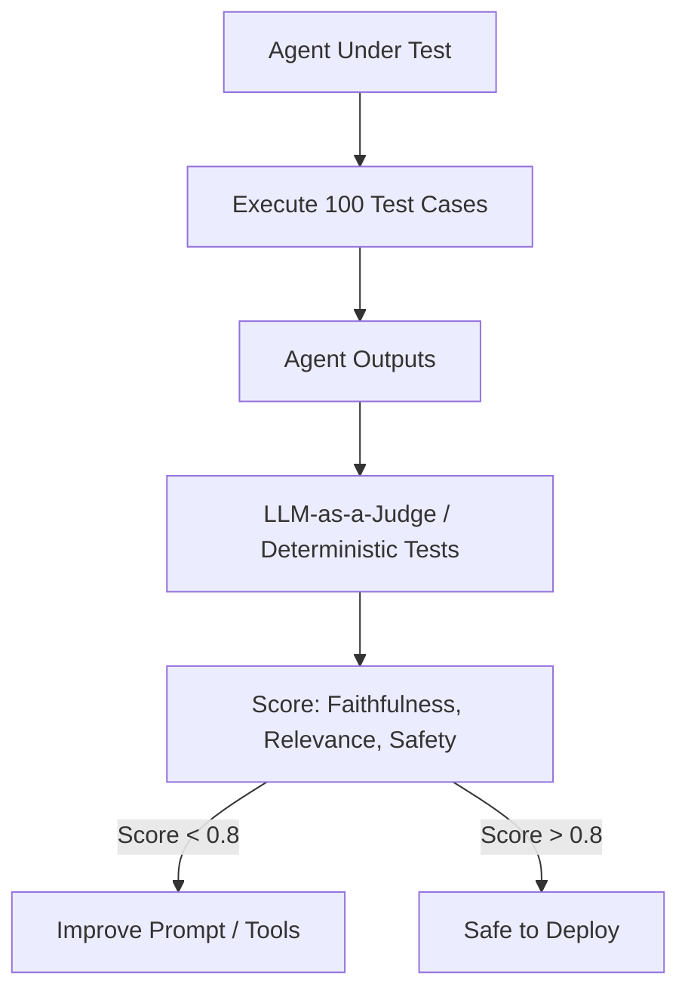

# 🧪 Agent Evaluation Frameworks: Measuring Success
> **Level:** Beginner | **Language:** Hinglish | **Goal:** Master the systematic frameworks (RAGAS, DeepEval, Promptfoo) for evaluating AI agents across accuracy, faithfulness, and goal completion.

---

## 🧭 1. Beginner-friendly Hinglish Explanation
Agent Evaluation ka matlab hai "Agent ka Report Card banana". Sochiye aapne ek student ko exam diya. Aap kaise check karenge ki wo pass hai ya fail? Aap uske answers ko "Key" (Answer sheet) se match karenge. AI Agents mein bhi hume ye karna hota hai. Kya agent ne sahi tool use kiya? Kya usne sahi answer diya? Kya wo "Hallucinate" toh nahi kar raha? Evaluation framework wo "Scales" (Tarazu) hain jo batate hain ki aapka agent kitna "Job-ready" hai. Bina evaluation ke, aap andhere mein teer chala rahe hain.

---

## 🧠 2. Deep Technical Explanation
Evaluation in agents is multi-dimensional and requires specialized frameworks:
1. **RAGAS (RAG Assessment):** Focuses on **Faithfulness** (Is the answer based on data?), **Answer Relevance** (Did it answer the question?), and **Context Precision** (Did it find the right data?).
2. **DeepEval / Promptfoo:** Unit-testing for LLMs. Running 100s of test cases on every code change to detect regressions.
3. **Component-wise Eval:** Testing the **Router** (Did it pick the right tool?), the **Memory** (Did it remember past steps?), and the **Final Answer**.
4. **Trajectory Eval:** Did the agent take the "Shortest Path" to the goal, or did it wander in loops?

---

## 🏗️ 3. Real-world Analogies
Evaluation Framework ek **Driving Test** ki tarah hai.
- Sirf car chalana (Running the agent) kaafi nahi hai.
- Inspector (Framework) check karta hai: "Signal par ruke?" (Safety), "Sahi mod liya?" (Tool usage), "Speed limit mein the?" (Token usage).
- Agar score 80% se upar hai, tabhi license (Production) milta hai.

---

## 📊 4. Architecture Diagrams (The Eval Pipeline)


---

## 💻 5. Production-ready Examples (The DeepEval Test)
```python
# 2026 Standard: Using DeepEval for Faithfulness
from deepeval.metrics import FaithfulnessMetric
from deepeval.test_case import LLMTestCase

def test_agent_accuracy():
    metric = FaithfulnessMetric(threshold=0.7)
    test_case = LLMTestCase(
        input="Who is the CEO of Apple?",
        actual_output="Tim Cook is the CEO.",
        retrieval_context=["Tim Cook took over as CEO in 2011."]
    )
    metric.measure(test_case)
    print(f"Faithfulness Score: {metric.score}") # 1.0 = Perfect
```

---

## ❌ 6. Failure Cases
- **Metric Gaming:** Agent ne seekh liya ki "Small answers" dene se "Relevance Score" badh jata hai, toh usne detail dena band kar diya (Optimization failure).
- **The "Lazy Judge":** Judge LLM ne bina dhyan diye sabko "5 stars" de diye kyunki prompt weak tha.

---

## 🛠️ 7. Debugging Section
- **Symptom:** Evaluation scores are inconsistent (Randomly high/low).
- **Check:** **Judge Temperature**. Evals ke liye hamesha `temperature=0` use karein taaki results repeatable hon. Check if the **Ground Truth** (Correct answers) provided to the eval system are actually correct.

---

## ⚖️ 8. Tradeoffs
- **Human Eval:** 100% accurate par slow aur expensive.
- **AI Eval (Judge):** Fast aur cheap par 90% accurate.

---

## 🛡️ 9. Security Concerns
- **Eval Leakage:** Test cases ka data agent ke training data mein chala gaya, jisse wo "Cheating" karke high score la raha hai. Always keep a **Secret Test Set**.

---

## 📈 10. Scaling Challenges
- Millions of users ke liye real-time eval karna impossible hai. Use **Continuous Sampling** (Audit 1% of production traffic).

---

## 💸 11. Cost Considerations
- Running evals requires another LLM call (The Judge). Use **Smaller Models** (GPT-4o-mini or Llama-3-8B) as judges to save 90% cost.

---

## ⚠️ 12. Common Mistakes
- Sirf "Accuracy" check karna (Safety, Hallucination, aur Token cost bhi utne hi important hain).
- Test cases ko update na karna (World changes, data gets old).

---

## 📝 13. Interview Questions
1. What is the difference between 'Faithfulness' and 'Relevance' in RAG evaluation?
2. How do you design a test set for an agent that uses 5 different tools?

---

## ✅ 14. Best Practices
- Every PR (Pull Request) must run a **Basic Eval Suite**.
- Maintain a **'Golden Dataset'** of 50-100 high-quality Q&A pairs that the agent MUST pass.

---

## 🚀 15. Latest 2026 Industry Patterns
- **G-Eval:** Using Chain-of-Thought (CoT) inside the Judge LLM to get a detailed explanation of why it gave a certain score.
- **Continuous Evals:** Dashboards jo live production data ka "Health Score" dikhate hain har minute.
