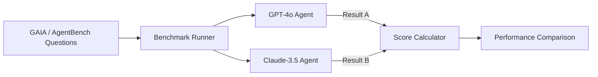

# 🏁 Benchmarking Agent Performance: The Competitive Edge
> **Level:** Intermediate | **Language:** Hinglish | **Goal:** Master the usage of industry-standard benchmarks (GAIA, AgentBench, SWE-bench) to compare different models and architectures for specific agentic tasks.

---

## 🧭 1. Beginner-friendly Hinglish Explanation
Benchmarking ka matlab hai "Sabse Best agent kaun hai?". Sochiye ek race ho rahi hai. "Agent A" 2 second mein kaam karta hai par galti karta hai. "Agent B" 5 second leta hai par 100% sahi hai. Benchmarks wo "Standard Exams" hain jo duniya bhar ke AI models (GPT-4, Claude-3, Llama-3) dete hain. Isse hume pata chalta hai ki Coding ke liye kaunsa model best hai? Reasoning ke liye kaunsa? Aur Tools chalane ke liye kaunsa? Benchmarking se aap sahi model chunte hain taaki aapka paisa aur waqt dono bachein.

---

## 🧠 2. Deep Technical Explanation
Benchmarking agents is harder than benchmarking simple LLMs because of the **Action Loop**:
1. **AgentBench:** A comprehensive framework testing agents across OS, DB, Knowledge Graph, and Card Games.
2. **GAIA (General AI Assistants):** Tasks that are conceptually simple for humans but require an agent to use multiple tools (Web search, file edit).
3. **SWE-bench:** A benchmark for software engineering agents. It asks the agent to fix real GitHub issues.
4. **Metric: Success Rate vs Step Count.** An agent that completes a task in 5 steps is better than one that takes 20 steps for the same task.

---

## 🏗️ 3. Real-world Analogies
Benchmarking ek **Entrance Exam** (jaise IIT-JEE ya UPSC) ki tarah hai.
- Lakhon log (Models) exam dete hain.
- Sabko same sawal milte hain (Benchmark Dataset).
- Jiske sabse zyada marks aate hain, wo "Topper" (Best Model) banta hai.
- Aap topper ko hi apni "Company" (Project) mein hire karna chahte hain.

---

## 📊 4. Architecture Diagrams (The Benchmark Runner)


---

## 💻 5. Production-ready Examples (Running a Simple Benchmark)
```python
# 2026 Standard: Custom Benchmark Loop
def run_benchmark(agent, dataset):
    results = []
    for test_case in dataset:
        # Measure time and success
        start_time = time.now()
        success = agent.run(test_case.input) == test_case.ground_truth
        end_time = time.now()
        
        results.append({
            "id": test_case.id,
            "success": success,
            "latency": end_time - start_time
        })
    return summarize_performance(results)
```

---

## ❌ 6. Failure Cases
- **The "Overfitted" Model:** Model ne benchmark ke sawal "Ratt" (memorize) liye hain. Isliye benchmark par 100% score hai par real world mein fail ho raha hai.
- **Inconsistent Tools:** Benchmark fail ho gaya kyunki search API down thi, na ki agent ki galti ki wajah se (Infrastructure noise).

---

## 🛠️ 7. Debugging Section
- **Symptom:** Agent score is very low on SWE-bench.
- **Check:** **Environment Setup**. Kya agent ke paas `git` aur `npm` access hai sandbox mein? Benchmark tasks aksar specific tools par depend karte hain. Make sure the **Execution Environment** matches the benchmark requirements.

---

## ⚖️ 8. Tradeoffs
- **Industry Benchmarks:** Trusted and standard, but might not represent your "Specific" business use case.
- **Custom Benchmarks:** Highly relevant, but time-consuming to create and maintain.

---

## 🛡️ 9. Security Concerns
- **Sensitive Data in Benchmarks:** Galti se benchmarks mein real client data use karna. Always use **Synthetic Data** for benchmarking.

---

## 📈 10. Scaling Challenges
- Millions of parameter combinations (Temperature, Prompt versions) ko benchmark karna compute-heavy hai. Use **Randomized Grid Search**.

---

## 💸 11. Cost Considerations
- Running GAIA or SWE-bench can cost hundreds of dollars in tokens. Use **Subsets** (e.g., run only 10% of the benchmark) during active development.

---

## ⚠️ 12. Common Mistakes
- Sirf "Accuracy" dekhna (Latency and Cost are equally important benchmarks).
- Model update hone par puraana benchmark score reuse karna (Models change monthly!).

---

## 📝 13. Interview Questions
1. What is 'SWE-bench' and why is it the gold standard for coding agents?
2. How do you detect if a model has 'Leaked' benchmark data in its training set?

---

## ✅ 14. Best Practices
- Run benchmarks at least **Once a Month** to detect model drift.
- Use a **'Leaderboard'** internal dashboard to show which prompt/model combo is winning.

---

## 🚀 15. Latest 2026 Industry Patterns
- **Live Benchmarking:** Systems jo dynamically naye "Internet-based" sawal banate hain taaki models unhe ratt na sakein.
- **Multi-Agent Benchmarks:** Testing how well agents collaborate in a team to solve a complex puzzle.
