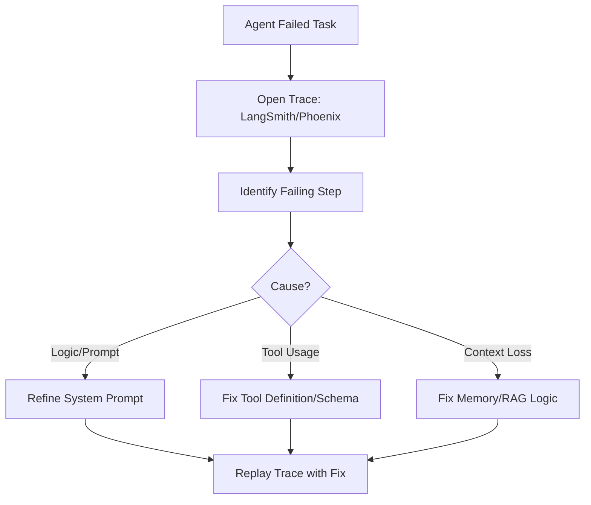

# 🐞 Debugging Agentic Workflows: Solving the Logic Puzzle
> **Level:** Advanced | **Language:** Hinglish | **Goal:** Master the systematic process of identifying, isolating, and fixing bugs in non-deterministic agent loops, multi-agent systems, and tool execution pipelines.

---

## 🧭 1. Beginner-friendly Hinglish Explanation
Debugging ka matlab hai "Agent ki galti dhoondhna aur theek karna". Normal software mein error line number se mil jata hai. Par AI Agents mein debugging mushkil hai kyunki agent kabhi-kabhi sahi karta hai, kabhi galat. Kabhi wo tool galat use karta hai, kabhi wo "Loop" mein phans jata hai. Is section mein hum seekhenge ki kaise agent ke "Dimaag" (Logs) mein ghus kar ye pata lagayein ki: Wo rasta kahan bhatka? Kya usne galti se galat file uthayi? Ya kya usne instruction ko galat samjha?

---

## 🧠 2. Deep Technical Explanation
Debugging agents requires a shift from **Step-by-step Execution** to **Trace Analysis**:
1. **The 'Why' Problem:** In normal code, you ask "What happened?". In agents, you ask "Why did it think this was the right step?".
2. **Replayability:** Capturing the exact state, prompt, and tool outputs so you can **Replay** the failed run deterministically.
3. **State Inspection:** Checking the agent's memory at each step $t$ to see when the context window got "Dirty" or "Confused".
4. **Tool Debugging:** Separating model errors (logic) from tool errors (wrong parameters/API fail).
**Key Tool:** **LangSmith's 'Playground'** allows you to edit a failing step and see if the agent recovers.

---

## 🏗️ 3. Real-world Analogies
Debugging Agentic Workflows ek **Crime Scene Investigation (CSI)** ki tarah hai.
- Detective (Aap) crime scene (Failed Agent Run) par pahunchta hai.
- Aap "Evidence" (Logs/Traces) collect karte hain.
- Aap timeline banate hain ki "Pehle ye hua, fir ye..." (Tracing).
- Aap identify karte hain ki "Suspect" (The bug) kaun hai: LLM, Tool, ya User Input.

---

## 📊 4. Architecture Diagrams (The Debugging Loop)


---

## 💻 5. Production-ready Examples (The Debugger Helper)
```python
# 2026 Standard: Inspecting Agent State
def debug_agent_state(state):
    print("--- DEBUG START ---")
    print(f"Current Node: {state['next']}")
    print(f"Last Thought: {state['history'][-1].content}")
    print(f"Tool Result: {state['last_observation']}")
    # Checking for common hallucination patterns
    if "I'm sorry" in state['history'][-1].content:
        print("WARNING: Agent is apologizing. Likely a tool fail.")
    print("--- DEBUG END ---")
```

---

## ❌ 6. Failure Cases
- **Non-deterministic Bugs:** Agent 10 mein se 1 baar fail hota hai (Flaky behavior). Ise theek karne ke liye **High-Sample Evaluation** zaroori hai.
- **The Infinite Loop:** Agent Step A se Step B par jata hai, aur B se wapas A par (Circular reasoning). Implement a **Max Iteration Guardrail**.

---

## 🛠️ 7. Debugging Section
- **Symptom:** Agent says "Task complete" but nothing actually happened.
- **Check:** **Tool Call Validation**. Kya tool actually call hua ya agent ne sirf "Socha" ki usne call kiya? Check the **Actual Logs** of your tool functions.

---

## ⚖️ 8. Tradeoffs
- **Real-time Debugging (Breakpoints):** Accurate but slow, blocks execution.
- **Post-mortem Debugging (Traces):** Fast and non-blocking, but requires high storage for logs.

---

## 🛡️ 9. Security Concerns
- **Sensitive Data in Debug Logs:** Debugging ke waqt agents aksar passwords ya tokens log mein print kar dete hain. Always use **Log Redaction** scripts.

---

## 📈 10. Scaling Challenges
- Millions of steps ke traces mein "Specific Bug" dhoondhna impossible hai. Use **Filter-based Search** (e.g., "Find all traces where tool X failed").

---

## 💸 11. Cost Considerations
- Detailed traces storage mehenga ho sakta hai. Save full traces only for **Failed Runs** and **Top 5% complex runs**.

---

## ⚠️ 12. Common Mistakes
- Sirf "Final Output" dekhna (The bug is usually 5 steps BEFORE the final output).
- System Prompt badalna bina purana version save kiye (No version control).

---

## 📝 13. Interview Questions
1. How do you debug an agent that is stuck in an infinite loop?
2. What is 'Trace Reconstruction' and why is it useful for non-deterministic agents?

---

## ✅ 14. Best Practices
- Every agent run should have a **Unique Trace URL**.
- Use **Human-in-the-loop** debugging: Pause the agent at the failing step and let a human provide the "Correct" thought to see if it continues properly.

---

## 🚀 15. Latest 2026 Industry Patterns
- **AI-Debugger Agents:** Specialized agents jo doosre agents ke traces scan karte hain aur automatically identify karte hain: "Here, the agent misinterpreted the API response."
- **Visual Trajectory Maps:** Graphical view jo dikhata hai ki agent ka "Logic Path" kahan bhatka (Red vs Green paths).
