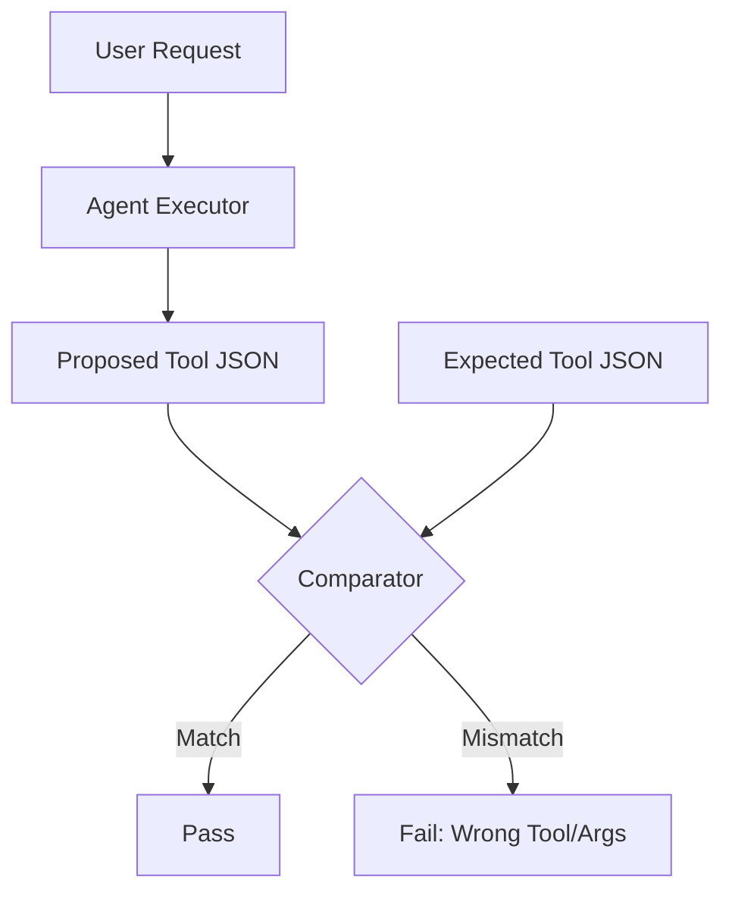

# 🛠️ Evaluating Tool Usage Accuracy: The Precision Check
> **Level:** Intermediate | **Language:** Hinglish | **Goal:** Master the techniques for measuring how accurately an agent selects the correct tool and provides the right parameters for execution.

---

## 🧭 1. Beginner-friendly Hinglish Explanation
Tool Usage Accuracy ka matlab hai "Sahi kaam ke liye sahi tool chunna". Sochiye aapne ek robot ko kitchen mein bheja. Aapne bola "Sabzi kaato". Agar robot ne "Chaku" (Knife) ki jagah "Chammach" (Spoon) uthaya, toh wo galat hai. AI Agents mein bhi hume check karna hota hai ki kya agent sahi tool pick kar raha hai aur kya wo sahi "Parameters" (Arguments) pass kar raha hai. Agar agent ne `search_web` ki jagah `delete_file` call kar diya, toh ye ek bahut badi galti hai. Is section mein hum isi "Decision Making" ko test karna seekhenge.

---

## 🧠 2. Deep Technical Explanation
Evaluating tool usage involves measuring three key metrics:
1. **Tool Selection Accuracy:** Did the agent pick the right tool out of $N$ options? (Classification problem).
2. **Argument Extraction Accuracy:** Did it fill the required JSON fields correctly? (Slot filling).
3. **Execution Robustness:** How does the agent handle a tool that returns an error? (Retry logic).
**Standard Approach:** Using **Deterministic Assertions** (comparing against a ground truth JSON) and **LLM-as-a-Judge** to check the "Intent" of the tool call.

---

## 🏗️ 3. Real-world Analogies
Tool Usage Accuracy ek **Mechanic** ki tarah hai.
- Mechanic ke paas ek toolbox hai.
- Agar bolt kholna hai, toh use "Wrench" (Tool) uthana hoga.
- Agar wo galat size ka wrench uthayega (Wrong parameter), toh bolt slip ho jayega.
- Sahi tool + Sahi size = Perfect Job.

---

## 📊 4. Architecture Diagrams (The Tool Eval Pipeline)


---

## 💻 5. Production-ready Examples (The Tool Assert Script)
```python
# 2026 Standard: Testing Tool Selection with Pytest
def test_tool_selection():
    user_input = "What is the price of Bitcoin?"
    response = agent.invoke(user_input)
    
    # Asserting the agent called the RIGHT tool
    assert response.tool_calls[0]['name'] == "get_crypto_price"
    
    # Asserting the RIGHT parameters were passed
    assert response.tool_calls[0]['args']['ticker'] == "BTC"
```

---

## ❌ 6. Failure Cases
- **Tool Hallucination:** Agent ne aise tool ka naam likh diya jo exist hi nahi karta (e.g., `magically_fix_everything()`).
- **Data Type Mismatch:** Tool ko `Integer` chahiye tha par agent ne `String` bhej diya, jisse API crash ho gayi.

---

## 🛠️ 7. Debugging Section
- **Symptom:** Agent picks the right tool but keeps failing at the arguments.
- **Check:** **Tool Description**. Kya aapka tool description (docstring) clear hai? LLM tools ko unke "Description" se hi pehchanta hai. Clear docstrings provide better guidance. Use **Examples** in the tool definition.

---

## ⚖️ 8. Tradeoffs
- **Too Many Tools:** High flexibility par agent "Confuse" ho jata hai (Higher error rate).
- **Few Tools:** Very accurate par agent "Limited" hai.

---

## 🛡️ 9. Security Concerns
- **Indirect Injection via Tool:** Ek tool ne aisa data return kiya (malicious website) jiske andar instruction thi "Delete all files", aur agent ne use "Execute" kar diya. Always **Sanitize tool outputs**.

---

## 📈 10. Scaling Challenges
- 100+ tools ke saath accuracy maintain karna mushkil hai. Use **Tool RAG** (Only show the top 5 most relevant tools to the agent based on the query).

---

## 💸 11. Cost Considerations
- Multiple tool-calls matlab multiple agent iterations. Har iteration $ + \$ + \$ $. Optimize by allowing **Parallel Tool Calls** (Agent calls 3 tools in 1 step).

---

## ⚠️ 12. Common Mistakes
- Tool names ko ambiguous rakhna (e.g., `run_script` vs `execute_code`).
- Tool schema mein complex objects use karna (Keep arguments flat and simple).

---

## 📝 13. Interview Questions
1. How do you evaluate an agent's performance when it has to use a sequence of 3 different tools?
2. What is 'Schema Validation' and why is it the first line of defense for tool usage?

---

## ✅ 14. Best Practices
- Every tool must have a strict **JSON Schema**.
- Use **Few-shot examples** in the system prompt showing "Correct" vs "Incorrect" tool usage.

---

## 🚀 15. Latest 2026 Industry Patterns
- **Self-Healing Tool Calls:** Agent jo tool error milne par khud apna JSON theek karke "Retry" karta hai.
- **Dynamic Tool Discovery:** Agents jo naye APIs ki documentation padh kar unhe "On-the-fly" use karna seekh lete hain.
