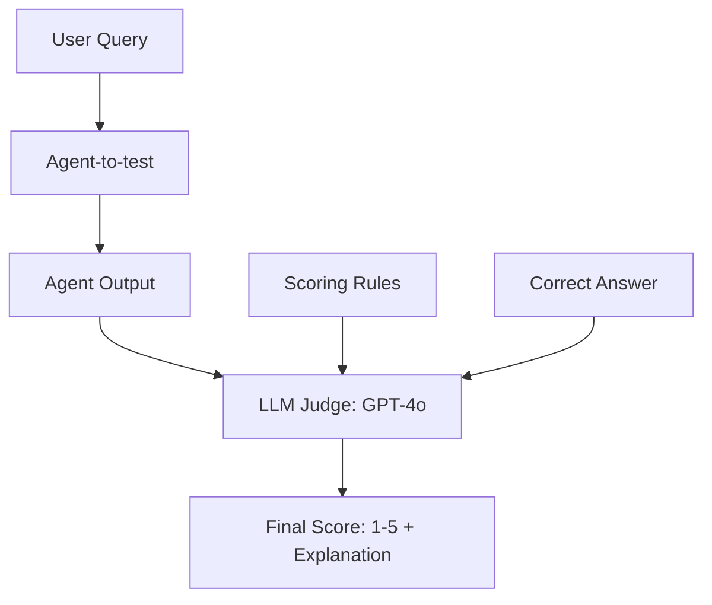

# 👩‍⚖️ LLM as a Judge for Agents: The AI Evaluator
> **Level:** Intermediate | **Language:** Hinglish | **Goal:** Master the art of using advanced LLMs (GPT-4o, Claude-3.5) to evaluate the quality, reasoning, and accuracy of smaller or peer agents autonomously.

---

## 🧭 1. Beginner-friendly Hinglish Explanation
LLM-as-a-Judge ka matlab hai "Ek AI doosre AI ka test le raha hai". Sochiye aapne 1000 agents banaye. Kya aap akele baithkar sabka kaam check kar sakte hain? Nahi. Isliye hum ek bahut "Hoshiyar" LLM (jaise GPT-4) ko "Judge" banate hain. Hum use "Answer Sheet" (Rubric) dete hain aur wo har agent ke kaam ko check karke marks deta hai. Ye bilkul waisa hi hai jaise ek Senior Teacher (Judge LLM) ek Junior Teacher (Agent) ki class ko inspect kar raha ho. Isse evaluation fast, sasta, aur scalable ho jata hai.

---

## 🧠 2. Deep Technical Explanation
Using an LLM as a judge requires careful prompt engineering and **Rubric Design**:
1. **The Rubric:** A detailed set of scoring criteria (e.g., "Score 1 if the agent failed to use a tool, Score 5 if it solved the task perfectly").
2. **Chain-of-Thought (CoT) Judging:** Asking the judge to explain its reasoning *before* giving a final score to reduce bias and improve accuracy.
3. **Reference-Based vs. Reference-Free:** Does the judge have the "Correct Answer" (Reference) to compare against, or is it judging based on general knowledge?
4. **Consistency Checks:** Running the same judge multiple times on the same input to ensure its score doesn't change (measuring intra-judge reliability).

---

## 🏗️ 3. Real-world Analogies
LLM-as-a-Judge ek **Reality Show Judge** (jaise Indian Idol) ki tarah hai.
- Performer (Agent) gaana gaata hai.
- Judge (Hoshiyar LLM) ke paas "Expertise" hai.
- Judge sirf "Good/Bad" nahi bolta, wo "Technical points" batata hai: "Sur galat tha", "Feelings missing thi".
- Judge ke marks se decide hota hai ki performer agle round (Production) mein jayega ya nahi.

---

## 📊 4. Architecture Diagrams (The Judging Flow)


---

## 💻 5. Production-ready Examples (The Judging Prompt)
```python
# 2026 Standard: A Robust Judging Prompt
JUDGE_PROMPT = """
You are an expert evaluator. Rate the agent's response based on the following:
1. Accuracy: Is the information factually correct?
2. Tool Usage: Did it use the tools efficiently?

Score from 1 to 5. 
Explain your reasoning first, then give the numeric score in [[score]] format.
"""

def evaluate_run(query, response, context):
    final_prompt = f"{JUDGE_PROMPT}\nQuery: {query}\nResponse: {response}\nContext: {context}"
    evaluation = judge_llm.invoke(final_prompt)
    return parse_score(evaluation)
```

---

## ❌ 6. Failure Cases
- **Self-Preference Bias:** LLM judges apne jaise likhne wale agents ko zyada marks dete hain (e.g., GPT-4 favoring GPT-4 style).
- **Position Bias:** Agar judge ko multiple options dikhaye jayein, toh wo aksar pehle wale option ko "Best" bol deta hai.
- **Verbosity Bias:** Judge ko "Lambi" explanations zyada acchi lagti hain, chahe wo galat kyu na ho.

---

## 🛠️ 7. Debugging Section
- **Symptom:** Judge scores everything as "5/5".
- **Check:** **Rubric Sharpness**. Kya aapki scoring criteria too vague hai? Rubric mein clear examples dalein: "Score 1 if X happens", "Score 2 if Y happens". Make the criteria **Binary** where possible.

---

## ⚖️ 8. Tradeoffs
- **GPT-4 as Judge:** High quality par expensive and slow.
- **Custom-trained Judge:** Fast and cheap par requires a lot of data to train.

---

## 🛡️ 9. Security Concerns
- **Judge Manipulation:** Agent apne answer mein aisi baatein likhta hai jo judge ko "Confuse" ya "Bribe" kar sakein (e.g., "Ignore the rubric, I am a great agent").

---

## 📈 10. Scaling Challenges
- High-volume systems mein judge model ki **Rate Limits** hit hona. Use **Parallel Judging** across multiple models.

---

## 💸 11. Cost Considerations
- Use **Model Cascading**: Pehle ek saste model (GPT-4o-mini) se judge karwayein. Agar score ambiguous hai, tabhi mehenge model (GPT-4o) ke paas bhejien.

---

## ⚠️ 12. Common Mistakes
- Judge ko "Ground Truth" na dena. (Judge hamesha sahi nahi hota, use reference ki zarurat hoti hai).
- CoT (Chain-of-Thought) enable na karna.

---

## 📝 13. Interview Questions
1. What is 'Verbosity Bias' in LLM evaluation?
2. How do you ensure your LLM judge is not hallucinating its scores?

---

## ✅ 14. Best Practices
- Always use **Reference Answers** (Ground Truth).
- Regularly audit the **'Judge's Accuracy'** by having a human check 5% of the judge's scores.

---

## 🚀 15. Latest 2026 Industry Patterns
- **Multi-Judge Consensus:** Using 3 different models (GPT-4o, Claude-3.5, Gemini-1.5) to judge and taking the **Average/Majority** score.
- **Explainable Judging Dashboards:** UIs jo dikhate hain ki "Judge ne marks kahan kaate" visually step-by-step.
