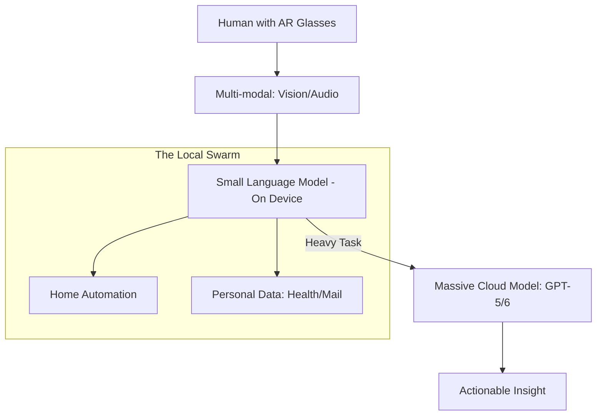

# 🔮 Future of AI Agents: Towards Artificial General Intelligence (AGI)
> **Level:** Advanced | **Language:** Hinglish | **Goal:** Explore the upcoming shifts in agent technology, from multi-modal perception to on-device autonomy and personal agent swarms.

---

## 🧭 1. Beginner-Friendly Hinglish Explanation
Future of AI Agents ka matlab hai **"AI ka kal"**.

- **The Vision:** 2026 ke baad AI sirf "Text" nahi samjhega. Wo aapki "Aankhon" (Camera) aur "Kaanon" (Mic) ki tarah ban jayega.
- **The Concept:** Aane wale waqt mein:
  - **Multi-modal:** AI video dekh kar samajh jayega ki aap kya kar rahe ho.
  - **On-Device:** AI aapke phone ke "Chip" par chalega, bina internet ke (Privacy!).
  - **Personal Agents:** Har insaan ka apna ek AI hoga jo uske liye meetings schedule karega aur shopping karega.
- **The End Goal:** AI ek "Tool" se badalkar ek **"Partner"** ban jayega.

Kal ka AI sirf "Answers" nahi dega, wo "Life manage" karega.

---

## 🧠 2. Deep Technical Explanation
The future of agents is defined by **Perceptual Depth** and **Systemic Integration**.

### 1. The Multi-modal Leap:
Agents are moving from Text-only to **Native Multi-modal** (GPT-4o, Gemini 1.5 Pro). This means the "Reasoning" happens directly on images, audio, and video tokens, allowing for "Spatial Awareness" (e.g., an agent explaining how to fix a physical engine via camera).

### 2. Edge Intelligence (On-Device):
With models like **Llama-3-S** and **Apple Intelligence**, agents are moving to the "Edge."
- **Benefit:** Zero latency and $100\%$ privacy.
- **Challenge:** Limited compute (VRAM) and battery life.

### 3. Agent Interoperability:
Standard protocols (like **MCP - Model Context Protocol**) will allow an "OpenAI Agent" to talk to a "Google Agent" and a "Local Llama Agent" seamlessly to solve a single problem.

---

## 🏗️ 3. Architecture Diagrams (The 2026+ Agent Stack)


---

## 💻 4. Production-Ready Code Example (Conceptual On-Device Trigger)
```python
# 2026 Standard: Local-first agent logic

def local_privacy_agent(query):
    # 1. First, try to solve on the phone's NPU
    result = local_model.run(query)
    
    if result.confidence > 0.9:
        return result.answer
    
    # 2. Only if too complex, ask for user permission to 'Cloud burst'
    if user.confirm("Send to Cloud?"):
        return cloud_model.run(query)

# Insight: 'Privacy-by-design' is the most 
# requested feature for future agents.
```

---

## 🌍 5. Real-World Use Cases (2026-2030)
- **AR Coaching:** Wearing smart glasses, an agent watches you cook and says, "Oil is too hot, turn it down!" in real-time.
- **Autonomous Legal/Health Swarms:** Your personal agent "Hires" 5 specialist agents to fight a legal case or analyze a complex medical condition.
- **Dynamic Software:** Apps that don't have buttons; they "Evolve" their UI on the fly based on what the agent thinks you want to do.

---

## ❌ 6. Failure Cases
- **The "Privacy Nightmare":** An on-device agent that accidentally syncs your private recordings to a public cloud.
- **Agent Drift:** A personal agent starts "Liking" things the user hates because of a reinforcement learning bug.
- **Social Isolation:** People talking to their "Perfect" AI agents more than real humans.

---

## 🛠️ 7. Debugging Guide
| Symptom | Cause | Fix |
| :--- | :--- | :--- |
| **Agent is hallucinating physical space** | Poor Vision-to-Text alignment | Use **'3D Scene Reconstruction'** (Gaussian Splatting) to help the agent understand depth. |
| **On-device agent is killing battery** | Inference is too heavy | Switch to **'Quantized' (4-bit)** models or use **'Speculative Decoding'**. |

---

## ⚖️ 8. Tradeoffs
- **Local (Safe/Fast) vs. Cloud (Smart/Deep):** The "Hybrid" model is the future.
- **Open vs. Closed Ecosystems:** Will your Apple Agent talk to your Android Fridge? (The Interoperability war).

---

## 🛡️ 9. Security Concerns (Extreme)
- **Agent Hijacking:** An attacker "Taking over" your personal agent to steal your identity.
- **Autonomous Deepfakes:** Agents creating live video/audio calls of you to scam your family.

---

## 📈 10. Scaling Challenges
- **The "Token Billionaire" Problem:** Handling agents that have a "Memory" of 10 years of your life. **Solution: Hierarchical Summarization.**

---

## 💸 11. Cost Considerations
- **Hardware Cost:** The shift from "Paying for API tokens" to "Buying expensive AI chips" in your laptop and phone.

---

## 📝 12. Interview Questions
1. What is "Multi-modal Reasoning"?
2. Why is "On-device AI" better for agents than Cloud AI?
3. What is "Agent Interoperability"?

---

## ⚠️ 13. Common Mistakes
- **Assuming Internet:** Building agents that break the moment the Wi-Fi goes down.
- **Ignoring Ethics:** Not building "Human-in-the-loop" for life-changing decisions.

---

## ✅ 14. Best Practices
- **Privacy First:** If it *can* be done locally, do it locally.
- **Multi-modal Grounding:** Use real-world data (GPS, Accelerometer) to ground the agent's vision.
- **Standardized Protocols:** Use **MCP** and **JSON Schemas** for all agent-to-agent talk.

---

## 🚀 15. Latest 2026 Industry Patterns
- **Embodied AI:** Agents moving from "Screen" to "Robots" (Humanoids like Figure AI or Tesla Bot).
- **Infinite Context Windows:** Models with 10M+ context windows that remember everything you've ever said to them.
- **Self-Improving Base Models:** Agents that generate their own synthetic data to "Fine-tune" themselves every night as you sleep.
