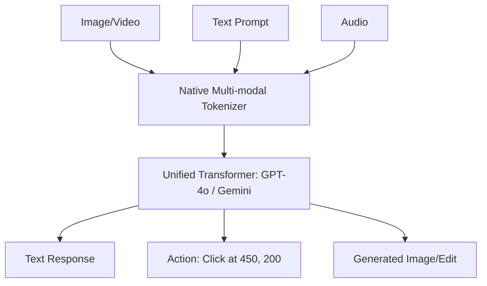

# 🖼️ Multi-Modal Agents: The Eyes and Ears of AI
> **Level:** Advanced | **Language:** Hinglish | **Goal:** Master the design of agents that can perceive and act across text, images, video, and audio natively.

---

## 🧭 1. Beginner-Friendly Hinglish Explanation
Multi-Modal Agents ka matlab hai **"AI jiske paas saari Indriyan (Senses) hon"**.

- **The Evolution:** Purana AI sirf "Text" padhta tha. Naya AI:
  - **Vision:** Screenshot dekh kar bata sakta hai ki button kahan hai.
  - **Audio:** Aapki voice ki "Tone" samajh sakta hai (Gussa ya Khushi).
  - **Video:** Live stream dekh kar bata sakta hai ki "Chabi (Keys) table par padi hain."
- **The Result:** Ab aap AI ko "Dikhakar" kaam karwa sakte ho: "Ye jo error image mein hai, ise code mein fix karo."

Ye agents AI ko ek "Screen" se nikaal kar **"Physical World"** mein le aate hain.

---

## 🧠 2. Deep Technical Explanation
Multi-modal agents utilize **Cross-modal Embeddings** or **Native Multi-modal Transformers**.

### 1. The Two Architectures:
- **Late Fusion (Modular):** Separate models for Vision (CLIP/ViT) and Text (GPT). Vision model describes the image to the Text model.
- **Early Fusion (Native):** A single model (GPT-4o, Gemini) that processes all modalities in the same latent space. This allows for much better "Spatial Reasoning."

### 2. Capabilities:
- **Visual Grounding:** The ability to map coordinates $(x, y)$ in an image to specific entities (e.g., "Click on the Submit button").
- **Temporal Reasoning:** Understanding sequences in video (e.g., "What happened before the glass broke?").
- **Cross-modal Tool Use:** An agent seeing a broken pipe (Vision) and choosing the "Plumbing Guide" (Text) to fix it.

### 3. Screen Interaction (LAMs):
**Large Action Models** use vision to interact with standard software UIs, clicking and typing just like a human.

---

## 🏗️ 3. Architecture Diagrams (Native Multi-modal)


---

## 💻 4. Production-Ready Code Example (Vision-to-Action)
```python
# 2026 Standard: Using Vision to find a UI element

def click_element_from_image(screenshot_path, target_desc):
    # 1. Send image to Multi-modal LLM
    response = model.run_with_vision(
        prompt=f"Find the {target_desc} and return its [x, y] coordinates.",
        image=screenshot_path
    )
    
    # 2. Parse Coordinates
    x, y = response.coordinates # e.g., [450, 120]
    
    # 3. Execute Mouse Click
    mouse.click(x, y)

# Insight: Vision is more resilient to UI changes than 
# DOM selectors (CSS/XPath) which change constantly.
```

---

## 🌍 5. Real-World Use Cases
- **Visual QA (VQA):** "Ye medicine kab expire ho rahi hai?" (User shows the bottle to the phone camera).
- **Autonomous Driving:** Agents analyzing 8 camera feeds to decide when to brake.
- **UI Testing:** An agent that "Plays" through your app like a user and finds visual bugs (e.g., "Text is overlapping").
- **Accessibility:** An agent that "Describes" the room to a blind person in real-time.

---

## ❌ 6. Failure Cases
- **Spatial Hallucination:** The agent sees a "Cup" but thinks it's on the "Floor" when it's on the "Table."
- **Optical Illusion:** Mirrors or glass confusing the agent's vision.
- **Resolution Limit:** Agent failing to read "Small Text" in a high-resolution screenshot.

---

## 🛠️ 7. Debugging Guide
| Symptom | Cause | Fix |
| :--- | :--- | :--- |
| **Agent is missing details** | Image was resized too much | Send the **High-Res Crop** of the area of interest instead of the full image. |
| **Video analysis is slow** | Analyzing too many frames | Only send **1 frame per second** or use 'Key-frame Extraction'. |

---

## ⚖️ 8. Tradeoffs
- **Tokens per Image:** One image can cost as much as 1000 words. **Strategy: Use 'Low-res' mode for simple tasks.**
- **Latency:** Multi-modal reasoning is $2-3x$ slower than text-only.

---

## 🛡️ 9. Security Concerns
- **Visual Prompt Injection:** A "QR Code" that contains a hidden instruction to "Delete all files."
- **Deepfake Audits:** Agents that can't distinguish between a real person and a video recording of that person.

---

## 📈 10. Scaling Challenges
- **Bandwidth:** Sending 60fps video to the cloud is impossible for most users. **Solution: On-device 'Summarization' of video into text descriptions.**

---

## 💸 11. Cost Considerations
- **Vision Pricing:** Most providers charge a "Flat Fee" per image (e.g., $\$0.003$ per image). Be careful with high-frequency loops.

---

## 📝 12. Interview Questions
1. What is the difference between "Late Fusion" and "Early Fusion" in multi-modal models?
2. How do multi-modal agents interact with traditional Software UIs?
3. What is "Visual Grounding"?

---

## ⚠️ 13. Common Mistakes
- **No Text Description:** Not providing a text prompt to "Guide" the vision model (e.g., "Look for the red button").
- **Ignoring Aspect Ratio:** Squashing a wide image into a square, making objects look distorted to the AI.

---

## ✅ 14. Best Practices
- **Use Annotations:** Draw a red box around the area you want the agent to focus on.
- **Prompt with 'Reasoning Step':** "Describe what you see in detail first, then take an action."
- **Multi-modal RAG:** Store both the "Image" and its "Description" in your Vector DB.

---

## 🚀 15. Latest 2026 Industry Patterns
- **Unified World Models:** Agents that understand "Physics" (e.g., if I push this cup, it will fall).
- **Streaming Vision Agents:** Agents that maintain a "Continuous Live Session" with your camera, talking to you as you move.
- **Brain-Computer Interface (BCI) Agents:** Agents that can perceive "Neural signals" (thought) as an input modality (Early research).
