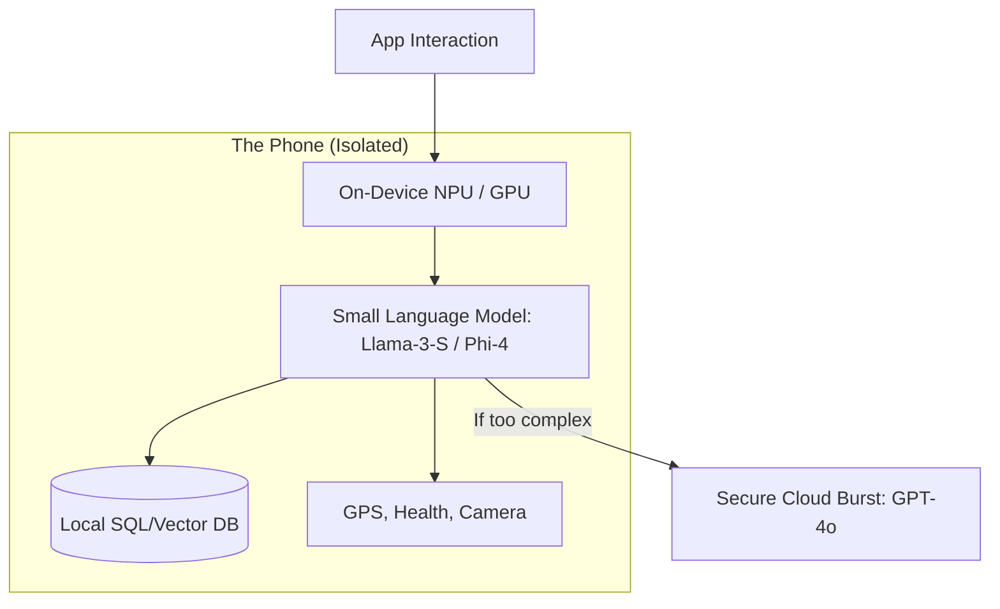

# 📱 On-Device Agents: Private and Persistent Intelligence
> **Level:** Advanced | **Language:** Hinglish | **Goal:** Master the development and deployment of agents that run locally on mobile phones, laptops, and edge devices using small, optimized language models.

---

## 🧭 1. Beginner-Friendly Hinglish Explanation
On-Device Agents ka matlab hai **"Aapke phone ka apna AI"**.

- **The Problem:** Aaj kal ka AI (ChatGPT) "Cloud" par chalta hai. Iske liye Internet chahiye aur aapka data company ke servers par jata hai.
- **The Solution:** On-Device AI aapke phone ke hardware (NPU/GPU) par chalta hai.
  - **Privacy:** Aapka data kabhi phone se bahar nahi jata.
  - **Speed:** Internet ki zaroorat nahi, toh "Zero Latency" (Turant response).
  - **Offline:** Aap pahadon (Mountains) par bhi AI use kar sakte ho.

Ye agents AI ko "Public" se **"Personal"** bana dete hain.

---

## 🧠 2. Deep Technical Explanation
On-device agents are made possible by **Quantization**, **Distillation**, and specialized **NPU (Neural Processing Unit)** hardware.

### 1. Model Optimization:
- **Quantization:** Reducing model weights from 16-bit to 4-bit (or even 1.5-bit) to save RAM while keeping $95\%+$ accuracy.
- **Speculative Decoding:** Using a tiny "Draft" model on-device to predict tokens and a slightly larger model to verify them (saves battery).

### 2. Frameworks for 2026:
- **MLX (Apple):** Optimized for M1/M2/M3/M4 chips.
- **ExecuTorch (Meta):** Running PyTorch models on mobile and edge.
- **CoreML:** Apple's native framework for integrating AI into iOS apps.

### 3. Local State Management:
Memory is stored in a **Local Vector DB** (like `LanceDB` or `DuckDB`) residing entirely in the app's private storage.

---

## 🏗️ 3. Architecture Diagrams (The Local Stack)


---

## 💻 4. Production-Ready Code Example (A Local Model Initialization)
```python
# 2026 Standard: Running a 4-bit quantized model locally (MLX Example)

import mlx.core as mx
from mlx_lm import load, generate

# 1. Load the model directly into NPU memory
model, tokenizer = load("mlx-community/Llama-3-8B-Instruct-4bit")

# 2. Local Inference
response = generate(model, tokenizer, prompt="What is my next meeting?", verbose=True)

# Insight: Local models are perfect for 'Search' over 
# private emails and calendar.
```

---

## 🌍 5. Real-World Use Cases
- **Smart Health:** An agent that watches your "Watch" data (Heart rate, Sleep) and gives advice without sending it to a server.
- **Secure Coding:** Developers writing proprietary code inside a "No-internet" environment using a local agent.
- **Personal Photo Assistant:** "Dhundho wo photo jisme main blue shirt mein tha" (Full local vision search).

---

## ❌ 6. Failure Cases
- **Battery Drain:** Running a large model for 10 minutes can take $10-20\%$ of a phone's battery.
- **Thermal Throttling:** The phone gets hot, and the AI starts getting slower.
- **Reasoning Gap:** A 3B model is great for "Task execution" but might fail at "Complex logic" where a 400B cloud model succeeds.

---

## 🛠️ 7. Debugging Guide
| Symptom | Cause | Fix |
| :--- | :--- | :--- |
| **Response is extremely slow** | Model is swapping to Disk | Use a smaller model (e.g., **1B** instead of 8B) to fit in the device's **VRAM**. |
| **Model is 'Gibberish'** | Bad Quantization | Use **GGUF** or **MLX** formats that are specifically tuned for your hardware. |

---

## ⚖️ 8. Tradeoffs
- **Cloud (Smart/Expensive/Public) vs. Local (Fast/Free/Private).**
- **Model Size:** 1B (Tiny/Fast) vs. 7B (Smart/Heavy).

---

## 🛡️ 9. Security Concerns
- **Side-channel Attacks:** Measuring the phone's power usage to guess what the AI is thinking.
- **Model Theft:** If an attacker gets physical access to the phone, they can steal your "Fine-tuned" local model.

---

## 📈 10. Scaling Challenges
- **Fragmentation:** One model might run fast on an iPhone 16 but crawl on a 3-year-old Android. **Solution: Use 'Adaptive Model Loading'.**

---

## 💸 11. Cost Considerations
- **Zero Token Cost:** Once the model is on the device, every "Thought" is free. This is the biggest driver for **Edge AI**.

---

## 📝 12. Interview Questions
1. What is "Quantization" and why is it needed for mobile AI?
2. How do you decide when to "Burst" a task from Local to Cloud?
3. What are the advantages of "Apple Intelligence" architecture?

---

## ⚠️ 13. Common Mistakes
- **Loading the model for every query:** Keep the model in memory as a "Service" to avoid a 5-second startup delay.
- **Ignoring RAM Limits:** Trying to run an 8B model on a phone with 4GB RAM.

---

## ✅ 14. Best Practices
- **Use 'NPU-Specific' Formats:** Always use models converted for the specific hardware (CoreML for iOS, WinML for Windows).
- **Graceful Degradation:** If the device is low on battery, switch to a smaller, more efficient model automatically.
- **Encrypted Memory:** Always encrypt the local SQLite/Vector database.

---

## 🚀 15. Latest 2026 Industry Patterns
- **Heterogeneous Swarms:** Your Phone, Watch, and Laptop agents talking to each other to solve a task using **Bluetooth/Local WiFi**.
- **User-Specific Fine-tuning (On-Device):** The local model "Learns" from your typing habits every night without the data leaving the device.
- **NPU-as-a-Service:** Apps sharing a single "Central Model" provided by the OS (like Apple's Private Cloud Compute).
