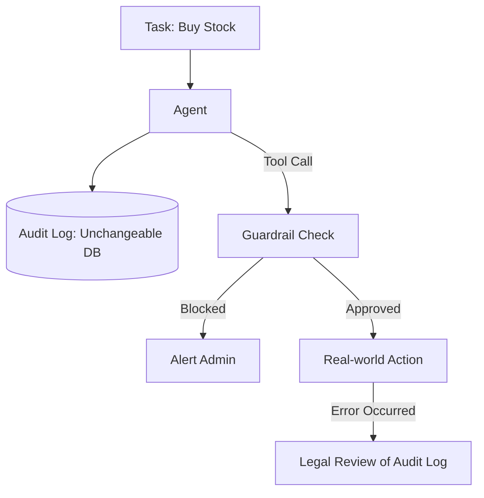

# ⚖️ Agent Accountability & Liability: Who is Responsible?
> **Level:** Advanced | **Language:** Hinglish | **Goal:** Master the complex legal and operational challenges of determining who pays and who is blamed when an autonomous agent makes a mistake.

---

## 🧭 1. Beginner-Friendly Hinglish Explanation
Accountability aur Liability ka matlab hai **"Galti ki zimmedari"**.

- **The Problem:** Socho ek autonomous agent ne aapke bank se bina puche $\$1000$ kisi galat jagah bhej diye.
  - Kya ye "AI" ki galti hai? (Nahi, AI ko jail nahi ho sakti).
  - Kya ye "User" ki galti hai? (Usne toh sirf task diya tha).
  - Kya ye "Developer" ki galti hai jisne AI banaya?
- **The Concept:** 2026 mein kanoon (Law) clear ho raha hai:
  - **Accountability:** "Kyun hua?" (Reason dhoondhna).
  - **Liability:** "Nuqsan kaun bharega?" (Paisa dena).

Ye topic AI engineers ke liye bahut zaroori hai taki wo aise systems banayein jo legally safe hon.

---

## 🧠 2. Deep Technical Explanation
Liability in agentic systems is moving from **Product Liability** to **Professional Malpractice** frameworks.

### 1. The Responsibility Chain:
- **Model Provider (OpenAI/Google):** Responsible for base model safety and inherent biases.
- **Application Developer:** Responsible for the system prompt, tool logic, and guardrails.
- **User:** Responsible for the "Instruction" and "Context" provided to the agent.

### 2. Duty of Care:
Developers must prove they took "Reasonable Steps" to prevent harm. This includes:
- Implementing **HITL (Human-in-the-loop)** for high-risk actions.
- Maintaining an **Audit Trail** (Traces) of every decision.
- Using **Deterministic Validators** for financial or legal tool calls.

### 3. Smart Contracts & Insurance:
In 2026, many agents operate with **AI Liability Insurance**. If the agent fails within its "Designated Bounds," the insurance covers the loss.

---

## 🏗️ 3. Architecture Diagrams (The Liability Audit)


---

## 💻 4. Production-Ready Code Example (An Accountability Logger)
```python
# 2026 Standard: Recording 'Decision Provenance'

import hashlib

def log_accountable_action(agent_id, decision, reason, tools_used):
    # 1. Create a tamper-proof hash of the decision
    log_entry = {
        "agent": agent_id,
        "decision": decision,
        "reasoning": reason,
        "tools": tools_used,
        "timestamp": "2026-05-10T14:00:00Z"
    }
    
    # 2. Save to a Read-only Database (e.g. Immutable Ledger)
    db.save_immutable(log_entry)
    
    print(f"✅ Decision logged. Provenance ID: {hashlib.sha256(str(log_entry).encode()).hexdigest()}")

# Insight: If the agent is sued, this log is the 
# only defense the developer has.
```

---

## 🌍 5. Real-World Use Cases
- **Autonomous Driving:** Who is liable in a crash? The car owner or the software company?
- **Medical AI Agents:** A "Diagnostic Agent" misses a tumor. Does the doctor or the software provider take the blame?
- **AI Real Estate Agents:** An agent accidentally signs a contract with a "Low Price" because of a hallucination.

---

## ❌ 6. Failure Cases
- **The "Black Box" Defense:** A company says "We don't know why the AI did that, it's a black box." **In 2026, this is NOT a valid legal defense.**
- **Delegation of Duty:** A human tells the AI "Take full control of my bank," and then sues when money is lost. (The user might be $50\%$ liable here).
- **Silent Failure:** The agent fails to perform a "Safety Check" because the API was down.

---

## 🛠️ 7. Debugging Guide
| Symptom | Cause | Fix |
| :--- | :--- | :--- |
| **Can't explain an agent's mistake** | No Reasoning Logs | Enable **'Thought-Chain'** logging to see the "Internal Monologue" of the agent. |
| **Agent bypassed a safety rule** | Ambiguous Prompt | Use **'Negative Constraints'** (e.g. "Never, under any circumstance, call Tool X"). |

---

## ⚖️ 8. Tradeoffs
- **Autonomy vs. Liability:** More autonomy (no human review) = Higher business speed but $10x$ higher legal risk.
- **Privacy vs. Accountability:** Logging everything for legal safety might violate the user's privacy.

---

## 🛡️ 9. Security Concerns
- **Log Tampering:** An attacker (or a rogue employee) deleting the logs to hide an agent's failure. **Fix: Use 'Write-once-Read-many' (WORM) storage.**

---

## 📈 10. Scaling Challenges
- **Massive Audit Logs:** Storing every thought of 1 million agents. **Solution: Use 'Summarized Audit Trails' where only key decisions are detailed.**

---

## 💸 11. Cost Considerations
- **Insurance Premiums:** High-risk agents (Healthcare/Finance) have higher "Digital Insurance" costs.

---

## 📝 12. Interview Questions
1. What is "Decision Provenance" in AI?
2. How do you design an agent to be "Auditable"?
3. What is the role of "Explainable AI" in legal liability?

---

## ⚠️ 13. Common Mistakes
- **No Signature:** Not recording *which* version of the system prompt caused the action.
- **Assuming the LLM is a 'Legal Person':** Forgetting that in the eyes of the law, the "Developer" is the one who created the capability.

---

## ✅ 14. Best Practices
- **Implement 'Transaction Limits':** Set a hard cap on how much money/data an agent can move without human approval.
- **Versioning:** Always link every action to a `commit_hash` of your agent's code and prompt.
- **Human-in-the-loop (HITL):** Use it as a "Safety Net" for any action with high liability.

---

## 🚀 15. Latest 2026 Industry Patterns
- **Liability-as-a-Service:** Companies that "Certify" your agent's safety and take over part of the liability.
- **Smart Contract Escrow:** An agent's action is only finalized if a second "Auditor Agent" and a human both sign off.
- **Algorithmic Transparency Reports:** Companies publishing monthly logs of their agents' "Error Rates" and "Safety Violations."
