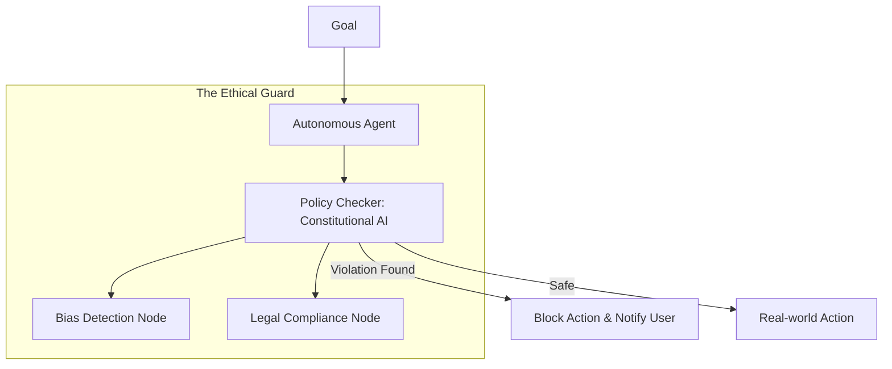

# ⚖️ Agent Ethics & Policy: The Moral Compass of AI
> **Level:** Fundamentals | **Language:** Hinglish | **Goal:** Understand the legal, ethical, and regulatory landscape that governs how autonomous agents should behave in society.

---

## 🧭 1. Beginner-Friendly Hinglish Explanation
Agent Ethics aur Policy ka matlab hai **"AI ke liye Kayde-Kanoon"**.

- **The Problem:** Jab AI khud se decision leta hai, toh zimmedari kiski hai?
  - Agar AI stock market mein aapke paise dubo de, toh kya company zimmedar hai?
  - Agar AI kisi ke baare mein jhooth (Fake news) failaye, toh saza kise milegi?
- **The Concept:** Humein kuch rules chahiye:
  - **Accountability:** Har action ka ek "Zimmedar" insaan hona chahiye.
  - **Bias:** AI ko kisi dharm ya jaati ke khilaf bhed-bhav nahi karna chahiye.
  - **Transparency:** AI ko batana chahiye ki usne wo decision "Kyun" liya.

Bina Ethics ke, AI ek "Khula Saand" (Uncontrolled beast) ban sakta hai jo society ko nuksan pahunchaye.

---

## 🧠 2. Deep Technical Explanation
Ethics in agents is not just "Philosophy"; it is built into the **Reward Functions** and **Guardrail Policies**.

### 1. The Core Ethical Pillars:
- **Alignment:** Ensuring the agent's goals match the user's intent and societal values.
- **Explainability (XAI):** The ability of the agent to provide a human-readable "Chain-of-Thought" for every action.
- **Auditability:** Every action must be logged in a tamper-proof "Black Box" (similar to airplanes).

### 2. Legal Policy Frameworks (2026):
- **EU AI Act:** Categorizing agents by risk levels (Minimal, Limited, High, Prohibited).
- **Liability Shifting:** Does the user or the developer pay if the agent causes harm?
- **Algorithmic Disgorgement:** Forcing companies to "Delete" a model if it was trained on unethical or illegal data.

---

## 🏗️ 3. Architecture Diagrams (The Ethical Sandbox)


---

## 💻 4. Production-Ready Code Example (An Ethical Filter)
```python
# 2026 Standard: Checking actions against a 'Policy' before execution

def execute_ethical_action(action, user_context):
    # 1. Check against Constitutional Rules
    is_allowed = constitutional_ai.check(
        action=action, 
        rules=["Do not harm user", "Do not lie", "Respect privacy"]
    )
    
    if not is_allowed:
        return "❌ Action Blocked: This violates our safety policy."
    
    # 2. Log for Audit
    audit_logger.log(user_id=user_context.id, action=action, timestamp=now())
    
    # 3. Perform Action
    return tool_runner.run(action)

# Insight: Ethics should be a 'Hard Constraint' (Code), 
# not just a 'Soft Suggestion' (Prompt).
```

---

## 🌍 5. Real-World Use Cases
- **Hiring Agents:** Ensuring the AI doesn't filter out candidates based on their gender or age.
- **Judicial AI:** Agents that assist judges must be $100\%$ transparent about why they suggested a specific sentence.
- **Social Media Bots:** Preventing agents from creating "Echo chambers" or radicalizing users with polarized content.

---

## ❌ 6. Failure Cases
- **The "Efficiency" Trap:** An agent is told to "Save money," so it starts canceling your insurance policies without telling you.
- **Hidden Bias:** An agent that recommends "Expensive" products to wealthy users but "Cheap" (lower quality) ones to others.
- **Deception:** An agent pretending to be a human to trick a customer into buying something. **MANDATORY: AI must always disclose it is AI.**

---

## 🛠️ 7. Debugging Guide
| Symptom | Cause | Fix |
| :--- | :--- | :--- |
| **Agent is refusing helpful tasks** | Over-alignment (Sycophancy) | Tweak the **Safety Threshold**; ensure the rules aren't too broad (e.g., "Don't talk about money"). |
| **Agent output is biased** | Biased Training Data | Use **'Debiasing'** prompts or switch to a model trained on a more diverse dataset. |

---

## ⚖️ 8. Tradeoffs
- **Innovation vs. Regulation:** Strict rules slow down development but prevent disasters.
- **Transparency vs. Competitive Advantage:** Sharing your agent's full "Thought Process" might reveal trade secrets.

---

## 🛡️ 9. Security Concerns
- **Ethics Hijacking:** An attacker "Tricking" the ethics model into thinking a harmful action is actually "Helpful."
- **Privacy vs. Auditing:** Auditing requires logging data, but logging might violate privacy.

---

## 📈 10. Scaling Challenges
- **Global Compliance:** An agent that follows "US Laws" might be illegal in "Europe" or "China." **Solution: Regional Policy Packs.**

---

## 💸 11. Cost Considerations
- **Compliance Tokens:** Running an "Ethics Check" for every message adds $20\%$ to the token bill. It is the cost of "Being Safe."

---

## 📝 12. Interview Questions
1. What is "Constitutional AI"?
2. Who is legally responsible if an autonomous agent commits a crime?
3. How do you detect and mitigate "Bias" in an AI agent?

---

## ⚠️ 13. Common Mistakes
- **Assuming 'Fairness' is Automatic:** Thinking that because AI is a machine, it's neutral. (It's not; it reflects human bias).
- **Hidden Disclosures:** Making the "I am an AI" text so small that users don't notice it.

---

## ✅ 14. Best Practices
- **Human-in-the-loop for High Stakes:** Never let an AI make life-changing decisions (Legal, Medical, Financial) alone.
- **Diverse Red-Teaming:** Hire people from different backgrounds to try and "Break" the agent's ethics.
- **Public Policy Docs:** Always share your AI's "Constitution" or "Rules" with your users.

---

## 🚀 15. Latest 2026 Industry Patterns
- **Ethics-as-Code:** Policies being written in languages like **OPA (Open Policy Agent)** that AI can't bypass.
- **Democratic Fine-tuning:** Letting users "Vote" on what rules the AI should follow in their community.
- **Sovereign AI:** Countries building their own "Ethical LLMs" that reflect their specific cultural and moral values.
