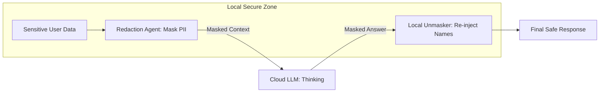

# 🔒 Privacy & Data Protection: The Agent's Secret Vault
> **Level:** Advanced | **Language:** Hinglish | **Goal:** Master the design of privacy-first agentic systems that comply with global regulations (GDPR/CCPA) and protect sensitive user data during processing.

---

## 🧭 1. Beginner-Friendly Hinglish Explanation
Privacy aur Data Protection ka matlab hai **"User ki info chhipana"**.

- **The Problem:** AI agents ko kaam karne ke liye aapki personal info chahiye (Emails, Health, Money). 
  - Agar agent ye data "OpenAI" ke servers par bhej de, toh kya wo safe hai? 
  - Kya wo data AI ki training mein use ho jayega?
- **The Solution:** Humein data ko "Safely" handle karna padta hai:
  - **Anonymization:** Naam aur phone number hata dena.
  - **Local Processing:** Data ko device se bahar na jaane dena.
  - **Encryption:** Data ko aise lock karna ki sirf "Owner" hi khol sake.

AI ki success is baat par depend karti hai ki hum uspar kitna **"Trust"** karte hain.

---

## 🧠 2. Deep Technical Explanation
Data protection in agents involves securing the **Inference Pipeline**, the **Memory Store**, and the **Feedback Loop**.

### 1. Data Minimization:
- Only provide the agent with the specific "Chunks" of data it needs for the current task.
- Avoid passing the entire "User Profile" in every prompt.

### 2. Privacy-Preserving Techniques:
- **Differential Privacy:** Adding "Noise" to the data so the agent can learn patterns without seeing individual secrets.
- **Federated Learning:** Training the agent on the user's device so the raw data never leaves.
- **PII Redaction:** Using specialized models (like Microsoft Presidio) to automatically black-out sensitive info before sending it to the LLM.

### 3. Memory Governance:
- **TTL (Time To Live):** Automatically deleting short-term agent memories after 24 hours.
- **Right to be Forgotten:** Building a system where a user can say "Delete everything you know about me" and the Vector DB is wiped instantly.

---

## 🏗️ 3. Architecture Diagrams (The Privacy Firewall)


---

## 💻 4. Production-Ready Code Example (A PII Scrubber)
```python
# 2026 Standard: Scrubbing PII before sending to API

from presidio_analyzer import AnalyzerEngine
from presidio_anonymizer import AnonymizerEngine

analyzer = AnalyzerEngine()
anonymizer = AnonymizerEngine()

def secure_agent_call(user_input):
    # 1. Analyze for PII (Names, Phones, IPs)
    results = analyzer.analyze(text=user_input, language='en')
    
    # 2. Anonymize (Replace with placeholders like <PERSON>)
    anonymized_result = anonymizer.anonymize(
        text=user_input,
        analyzer_results=results
    )
    
    # 3. Send safe text to LLM
    return agent.run(anonymized_result.text)

# Insight: Using a library like Presidio is much safer 
# than writing your own Regex for PII.
```

---

## 🌍 5. Real-World Use Cases
- **Health-Tech Agents:** Analyzing a patient's symptoms but masking their "Name" and "Address" before sending to the cloud AI.
- **HR Agents:** Summarizing resumes for a manager but hiding the "Gender" and "Age" to prevent bias.
- **Banking:** An agent that can see "Transaction History" but only processes "Aggregated Trends" (not individual amounts) for market research.

---

## ❌ 6. Failure Cases
- **Re-identification Attack:** An agent is given "Anonymized" data, but it uses its "Brain" to guess who the person is based on their unique habits.
- **Training Leakage:** A model trained on user data "Accidentally" reveals a user's credit card number to another user.
- **Log Leakage:** Developers forgetting to turn off "Debug Logs" in production, which capture every private conversation in plain text.

---

## 🛠️ 7. Debugging Guide
| Symptom | Cause | Fix |
| :--- | :--- | :--- |
| **Agent is confused by masked text** | Placeholders are too vague | Instead of `<MASK>`, use descriptive placeholders like `<PATIENT_NAME>` or `<ORDER_ID>`. |
| **Data not being deleted** | Soft-delete vs. Hard-delete | Ensure your database script performs a **'HARD DELETE'** (Purge) from the Vector DB. |

---

## ⚖️ 8. Tradeoffs
- **Privacy vs. Personalization:** High privacy (no memory) = Low personalization (the agent doesn't know you).
- **Latency:** Anonymizing data adds $200-500ms$ of overhead.

---

## 🛡️ 9. Security Concerns (Critical)
- **Model Inversion:** An attacker querying the agent thousands of times to "Reconstruct" the private data it was trained on.
- **Cloud Provider Access:** Even if you encrypt the data, the cloud provider (OpenAI/Azure) might see it during inference. **Fix: Use 'Zero-Knowledge' providers or On-premise models.**

---

## 📈 10. Scaling Challenges
- **GDPR Compliance at Scale:** Managing "Data Subject Requests" (DSRs) for millions of autonomous agent sessions.

---

## 💸 11. Cost Considerations
- **Storage for Encryption:** Encrypted databases are larger and slower.
- **Processing Power:** Running redaction models locally on the server uses more CPU/RAM.

---

## 📝 12. Interview Questions
1. What is "PII Redaction" and why is it important for agents?
2. How do you implement the "Right to be Forgotten" in a Vector Database?
3. What is "Differential Privacy"?

---

## ⚠️ 13. Common Mistakes
- **Assuming HTTPS is enough:** Encryption in transit (HTTPS) doesn't protect the data once it reaches the AI's "Brain."
- **Sharing Context across Users:** Using the same "Short-term Memory" buffer for two different users.

---

## ✅ 14. Best Practices
- **Use 'Synthetic Data':** For testing agents, never use real user data; use AI-generated "Fake" data.
- **Encryption at Rest:** Every database and log file must be encrypted with **AES-256**.
- **Privacy Audit:** Regularly check what information is being sent to third-party APIs using a "Proxy Filter."

---

## 🚀 15. Latest 2026 Industry Patterns
- **Personal Data Stores (PDS):** Users "Lending" their data to an agent for a specific task and then "Revoking" access immediately after.
- **Confidential Computing (TEEs):** Hardware-level security where the agent's code and data are invisible even to the OS.
- **Privacy-as-a-Service:** APIs that act as a "Clean Room," where you send data and it comes out perfectly anonymized for AI use.
