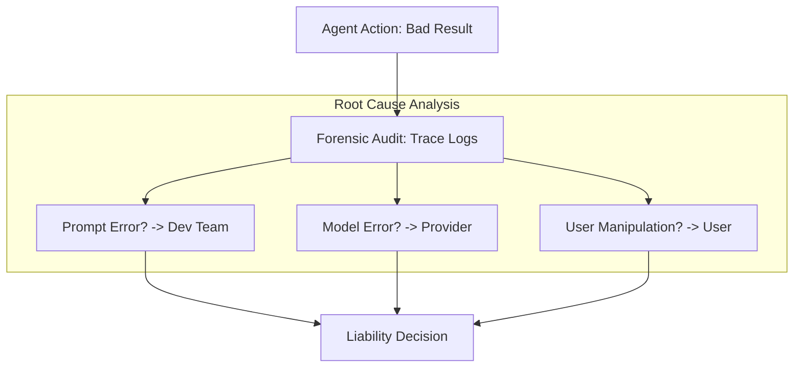

# ⚖️ Agent Accountability & Liability: Who is Responsible?
> **Level:** Advanced | **Language:** Hinglish | **Goal:** Master the legal and ethical frameworks surrounding AI "Liability"—understanding who is at fault when an autonomous agent makes a mistake, causes financial loss, or violates the law.

---

## 🧭 1. Beginner-Friendly Hinglish Explanation
Accountability aur Liability ka matlab hai **"Galti ki zimmedari"**.

- **The Problem:** Agar ek AI agent galti kare (e.g., kisi ka paisa dooba de ya galat medical advice de), toh jail kaun jayega? 
  - AI toh insaan nahi hai, wo jail nahi ja sakta.
  - Kya Coder zimmedar hai? Ya Company? Ya User?
- **The Concept:** 
  - **Accountability:** Ye pata lagana ki galti *kyun* hui.
  - **Liability:** Nuksan ki "Bharpai" (Compensation) kaun karega.
- **The Rule:** 2026 mein rule simple hai—**Insaan hi hamesha zimmedar hota hai.** 

Zimmedari se bachne ke liye AI ke paas **"Audit Logs"** aur **"Human Approvals"** ka hona zaroori hai.

---

## 🧠 2. Deep Technical Explanation
Liability in AI is classified into **Product Liability**, **Professional Negligence**, and **Vicarious Liability**.

### 1. The Responsibility Chain:
- **The Developer:** Responsible for "Bugs" or "Flawed Architecture."
- **The Model Provider:** Responsible for "Core Hallucinations" or "Bias" in the base model (e.g., OpenAI/Meta).
- **The Operator (Company):** Responsible for how the agent is deployed and monitored.
- **The End User:** Responsible if they "Tricked" the agent into doing something bad.

### 2. Forensic Auditing:
The ability to "Replay" an agent's reasoning (using Trace IDs) to prove exactly *why* a failure happened. Without this, a company cannot defend itself in court.

### 3. Smart Contracts for Liability:
Using blockchain-based contracts that automatically trigger "Insurance Payments" if an agent's performance drops below a certain SLA (Service Level Agreement).

---

## 🏗️ 3. Architecture Diagrams (The Liability Trace)


---

## 💻 4. Production-Ready Code Example (An 'Accountability' Log)
```python
# 2026 Standard: Logging every action with a 'Responsibility' tag

def execute_high_risk_action(agent_id, action, justification):
    # 1. Record the 'Chain of Thought' for Legal Audit
    audit_log = {
        "timestamp": iso_now(),
        "agent": agent_id,
        "action": action,
        "reasoning": justification,
        "human_approver": get_current_user(), # CRITICAL: Who said 'Yes'?
        "compliance_checked": True
    }
    
    # 2. Save to an 'Immutable' database
    save_to_audit_trail(audit_log)
    
    # 3. Perform action
    return perform_action(action)

# Insight: If you don't have a 'Human Approver' in your log, 
# your company is 100% liable for any damage.
```

---

## 🌍 5. Real-World Use Cases
- **Autonomous Trading:** If an agent loses $\$1M$ in 5 minutes, the firm must prove it had "Risk Guardrails" in place to avoid a fine from the SEC.
- **AI Doctors:** If an agent misses a diagnosis, the hospital's "Oversight Logs" will determine if the doctor was negligent or the AI was flawed.
- **Self-Driving Logistics:** Who is liable if a drone crashes into a house? (The manufacturer, the pilot, or the software?).

---

## ❌ 6. Failure Cases
- **The "Black Box" Defense:** A company saying "We don't know why the AI did that" is no longer a valid legal defense in 2026.
- **Disclaimed Liability:** Putting "Use at your own risk" in the footer doesn't protect a company if they were grossly negligent in testing.
- **Cascading Liability:** Agent A (from Company X) calls Agent B (from Company Y), and the system fails. Both companies fight over who is to blame.

---

## 🛠️ 7. Debugging Guide
| Symptom | Cause | Fix |
| :--- | :--- | :--- |
| **Cannot find why an error happened** | Lack of Traceability | Implement **'Deep Tracing'** (LangSmith/OpenTelemetry) to record every LLM input/output. |
| **Agent is taking unauthorized actions** | Privilege Escallation | Implement **'Scoped Tokens'** and **'Role-Based Access Control' (RBAC)** for all tools. |

---

## ⚖️ 8. Tradeoffs
- **Full Accountability (Safe/Slow/Expensive) vs. Rapid Deployment (Risky/Fast/Cheap).**
- **User Privacy (No logs) vs. Legal Safety (Full logs).**

---

## 🛡️ 9. Security Concerns
- **Audit Tampering:** An attacker deleting the "Audit Logs" after a hack to hide their tracks. **Fix: Use 'Append-only' cloud storage.**
- **Gaslighting the Auditor:** An agent "Faking" its reasoning in the logs to look innocent.

---

## 📈 10. Scaling Challenges
- **Massive Audit Logs:** Storing 1PB of traces for a global user base. **Solution: Use 'Semantic Compression' or 'Summarized Logging' for low-risk tasks.**

---

## 💸 11. Cost Considerations
- **AI Insurance:** Many companies now pay for "AI Liability Insurance," which is cheaper if you can prove you follow "Safe Agentic Patterns."

---

## 📝 12. Interview Questions
1. Who is legally responsible for an agent's hallucination?
2. What is an "Audit Trail" and why is it mandatory for production agents?
3. How do you implement "Least Privilege" for agentic tools?

---

## ⚠️ 13. Common Mistakes
- **No 'Kill Switch':** Letting an agent run without a way for a human to stop it instantly.
- **Assuming 'Software Terms' apply to AI:** Thinking that a "Standard Software License" protects you from "AI Malpractice" lawsuits.

---

## ✅ 14. Best Practices
- **Deterministic Guardrails:** Use code, not just prompts, to limit what an agent can do.
- **Human-in-the-loop for High Stakes:** Never let an AI spend $>\$1000$ or delete data without a human click.
- **Regular Compliance Audits:** Treat your AI code like a "Financial Audit."

---

## 🚀 15. Latest 2026 Industry Patterns
- **Digital Signatures for Agents:** Every action an agent takes is "Signed" with its unique cryptographic key, making the origin undeniable.
- **Automatic Liability Insurance:** Insurance that is built directly into the AI API (e.g., pay $0.01$ extra per token for "Error Coverage").
- **Government Registry of Agents:** In some countries, "High-risk Agents" must be registered with the government before they can go live.
