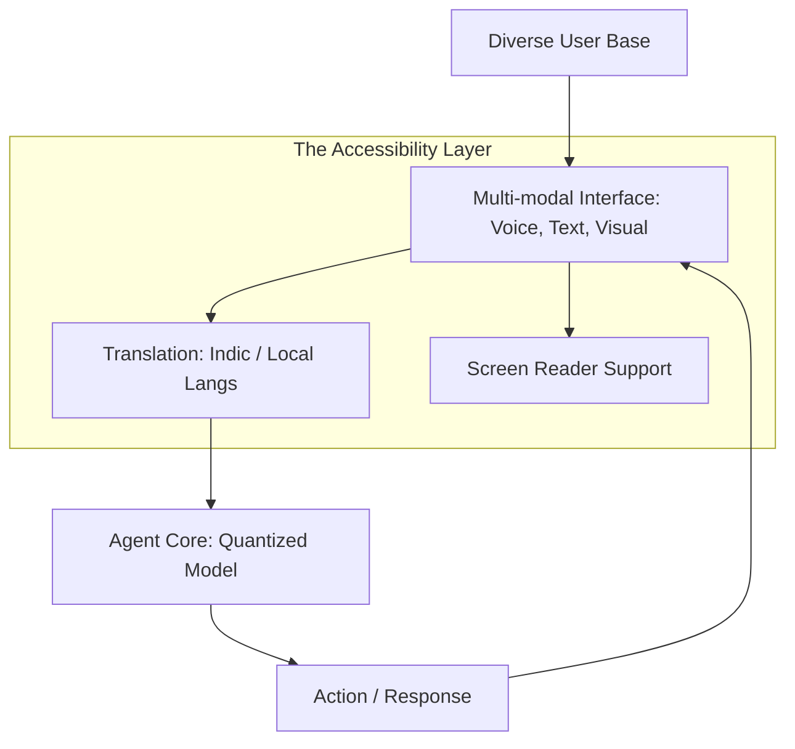

# 🌍 Digital Divide & Accessibility: AI for Everyone
> **Level:** Advanced | **Language:** Hinglish | **Goal:** Master the techniques for ensuring AI agents are accessible to all, regardless of language, physical ability, or socio-economic status, preventing the "AI Gap" from widening.

---

## 🧭 1. Beginner-Friendly Hinglish Explanation
Digital Divide aur Accessibility ka matlab hai **"AI sabke liye"**.

- **The Problem:** AI aksar un logon ke liye hota hai jo "English" bolte hain, jinke paas "High-speed Internet" hai, aur jo "Sighted" (dekh sakte) hain. Isse baaki log peeche reh jate hain.
- **The Concept:** 
  - **Inclusion:** AI ko local languages (Hindi, Hinglish, Marathi, etc.) mein banana.
  - **Accessibility:** AI ko unke liye bhi usable banana jo dekh ya sun nahi sakte (Voice-first or Braille-ready).
  - **Affordability:** AI ko sasta banana taki wo ek choti shop par bhi kaam aa sake.
- **The Goal:** AI ko ek "Luxury" se ek **"Public Utility"** (bijli-paani ki tarah) banana.

AI tabhi successful hai jab wo **"Last Mile"** tak pahunche.

---

## 🧠 2. Deep Technical Explanation
Bridging the divide involves **Multilingual LLMs**, **Edge Inference**, and **Inclusive UX Design**.

### 1. The Accessibility Stack:
- **ASR (Speech-to-Text):** Enabling users to interact via voice in their local dialect.
- **TTS (Text-to-Speech):** Allowing the agent to speak back in a natural, local voice.
- **Audio Descriptions:** Agents describing visual data for blind users.

### 2. Overcoming the Hardware Gap:
- **Quantization:** Running 4-bit models on old smartphones or low-cost NPU chips.
- **Local-first RAG:** Using offline vector stores so the agent works without $5G$.

### 3. Language Inclusion:
Using models like **Bhashini** or **IndicTrans2** to bridge the gap between English-centric AI and the global majority.

---

## 🏗️ 3. Architecture Diagrams (The Accessible Agent)


---

## 💻 4. Production-Ready Code Example (A Multilingual Voice Bridge)
```python
# 2026 Standard: Handling multiple languages in one agent

def accessible_agent_response(query, user_lang="hi"):
    # 1. Translate User Query to 'System Language' (if needed)
    internal_query = translator.translate(query, target="en")
    
    # 2. Run Agent Logic
    raw_answer = agent.run(internal_query)
    
    # 3. Translate back to User Language
    final_answer = translator.translate(raw_answer, target=user_lang)
    
    # 4. Generate Voice (TTS) for accessibility
    voice_output = tts_service.generate(final_answer, lang=user_lang)
    
    return {"text": final_answer, "audio": voice_output}

# Insight: Always provide 'Audio' fallbacks for 
# users with visual impairments or low literacy.
```

---

## 🌍 5. Real-World Use Cases
- **Rural Agriculture:** A farmer asking in "Hinglish" about crop diseases and getting a voice reply with a solution.
- **Disability Support:** A user with motor-impairment controlling their whole house via a "Voice-based" agent.
- **Education:** Students in remote villages accessing "GPT-4 level" knowledge via a cheap $\$50$ Android tablet.

---

## ❌ 6. Failure Cases
- **The "English Bias":** The agent works perfectly in English but gives "Dangerous" or "Stupid" advice in Hindi.
- **Internet Dependency:** The agent fails exactly when the user needs it most (e.g., in a remote emergency area with no signal).
- **Complex UI:** Designing an agent that only young "Techies" can understand, leaving the elderly behind.

---

## 🛠️ 7. Debugging Guide
| Symptom | Cause | Fix |
| :--- | :--- | :--- |
| **User doesn't understand the AI's Hindi** | Poor translation | Use **'Few-shot' Indic examples** to teach the model the nuances of local grammar and slang. |
| **App is too heavy for low-end phones** | Large model size | Use **'Mobile-optimized'** models like Phi-3 or Gemma-2B that run locally. |

---

## ⚖️ 8. Tradeoffs
- **Model Intelligence vs. Model Size (Speed on old phones).**
- **Full Privacy (Local processing) vs. Full Quality (Cloud processing).**

---

## 🛡️ 9. Security Concerns
- **Dialect Exploits:** Hackers using "Rare Dialects" to bypass safety filters that were only trained on major languages.
- **Voice Phishing:** Using TTS to trick illiterate users into giving away their PIN or passwords.

---

## 📈 10. Scaling Challenges
- **The 7,000 Language Problem:** How to support rare languages that have very little training data. **Solution: Use 'Zero-shot Cross-lingual Transfer'.**

---

## 💸 11. Cost Considerations
- **SMS Integration:** For users with no internet, agents can work via "SMS." This is expensive per message but crucial for inclusion.

---

## 📝 12. Interview Questions
1. How do you design an agent for "Low-literacy" users?
2. What is "Edge AI" and why is it important for the digital divide?
3. How do you test "Fairness" across different languages?

---

## ⚠️ 13. Common Mistakes
- **Assuming 'Everyone has a Smartphone':** Not building interfaces for "Feature Phones" or "Voice Calls."
- **Cultural Insensitivity:** Using western analogies or examples that don't make sense in a rural Indian context.

---

## ✅ 14. Best Practices
- **Voice-first Design:** Ensure the agent is $100\%$ usable without a screen.
- **Offline Fallbacks:** Cache the most important knowledge locally on the device.
- **Inclusive Testing:** Test your agent with real people from diverse backgrounds, not just your office colleagues.

---

## 🚀 15. Latest 2026 Industry Patterns
- **Multimodal Indic Models:** LLMs that "Understand" Hindi audio directly without converting to text (Faster/Better context).
- **Solar-powered AI Edge Boxes:** Small devices that provide "Local GPT" to a whole village without internet or grid power.
- **AI Literacy Agents:** An agent whose only job is to "Teach" the user how to use other agents.
