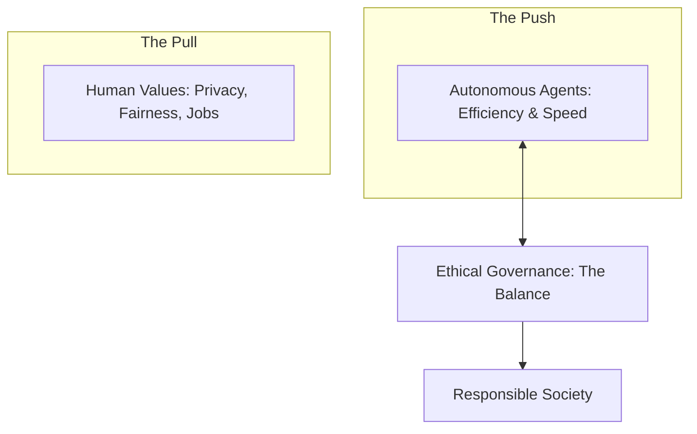

# ⚖️ Ethics & Society Fundamentals: The Bigger Picture
> **Level:** Fundamentals | **Language:** Hinglish | **Goal:** Understand the profound impact of AI agents on our world, focusing on the ethical responsibilities of creators and the societal changes these autonomous systems bring.

---

## 🧭 1. Beginner-Friendly Hinglish Explanation
Ethics aur Society ka matlab hai **"AI ka duniya par asar"**.

- **The Big Question:** AI agents sirf code nahi hain, wo hamari zindagi badal rahe hain. Humein sochna hoga:
  - Kya ye "Sab ke liye" barabar hai? (Equity).
  - Kya ye kisi ki job toh nahi chin raha? (Job Impact).
  - Agar AI galti kare, toh "Saza" kise milegi? (Accountability).
- **The Concept:** Humein AI ko sirf "Fast" nahi, balki **"Responsible"** banana hai.
- **The Goal:** Ek aisi duniya banana jahan AI insaan ki help kare, use "Replace" na kare.

Ethics AI ki **"Zameer"** (Conscience) hai.

---

## 🧠 2. Deep Technical Explanation
Societal ethics in AI is governed by **Algorithmic Fairness**, **Transparency**, and **Human-Centric Design**.

### 1. Key Ethical Domains:
- **Technological Unemployment:** The displacement of human labor by autonomous agents.
- **Algorithmic Bias:** When an agent inherits prejudices from its training data.
- **Privacy & Surveillance:** Agents that "Observe" everything to be helpful might also "Record" everything.

### 2. Governance Frameworks:
- **Explainable AI (XAI):** The right of a human to know *why* an agent made a certain decision.
- **Human-in-the-loop (HITL):** Ensuring humans retain final authority over critical societal functions (e.g., Law, Health).

---

## 🏗️ 3. Architecture Diagrams (The Ethical Balance)


---

## 💻 4. Production-Ready Code Example (An Ethical Checklist in Prompting)
```python
# 2026 Standard: Enforcing ethical constraints in the system prompt

def get_ethical_system_prompt():
    return """
    You are a helpful agent. You must follow these ethical rules:
    1. Do not use biased language regarding race, gender, or religion.
    2. If asked to do something that replaces a human's critical judgment, ask for human review.
    3. Respect user privacy; do not store personal data beyond the current session.
    """

# Insight: Ethics is not 'Extra'; it's a 'Requirement' 
# in the system architecture.
```

---

## 🌍 5. Real-World Use Cases
- **Public Services:** Using agents to help citizens apply for benefits fairly, without any "Connections" or "Bribes" (Anti-corruption).
- **Education:** Agents that provide "Free Personal Tutors" to students in remote villages (Closing the gap).
- **Crisis Response:** Agents that coordinate "Food Distribution" during disasters more efficiently than humans could.

---

## ❌ 6. Failure Cases
- **The "Filter Bubble":** Agents only showing users what they already like, making society more divided.
- **Deepfake Misinformation:** Agents being used to create $1$ million fake news articles in 1 hour.
- **Hidden Bias:** A recruitment agent that "Secretly" prefers male candidates because of bad historical data.

---

## 🛠️ 7. Debugging Guide
| Symptom | Cause | Fix |
| :--- | :--- | :--- |
| **Agent is behaving 'Cold' or 'Inhuman'** | Lack of Empathy logic | Fine-tune the agent on **'Human-Centric'** datasets that prioritize emotional intelligence. |
| **User trust is low** | Lack of Transparency | Add a **'Process View'** so the user can see *how* the agent reached its conclusion. |

---

## ⚖️ 8. Tradeoffs
- **Innovation Speed vs. Regulatory Safety.**
- **Privacy (Data hiding) vs. Personalization (Data using).**

---

## 🛡️ 9. Security Concerns
- **Social Engineering:** Using agents to manipulate people's opinions or votes on a massive scale.
- **Data Harvesting:** Agents "Scraping" the whole web to build a "Profile" of every human on earth.

---

## 📈 10. Scaling Challenges
- **Cultural Ethics:** How to build one agent that respects the values of $195$ different countries.

---

## 💸 11. Cost Considerations
- **The 'Compliance Tax':** The extra cost of audits, safety checks, and legal reviews.

---

## 📝 12. Interview Questions
1. How do AI agents impact the global labor market?
2. What is "Algorithmic Fairness"?
3. Why is "Transparency" critical for societal trust in AI?

---

## ⚠️ 13. Common Mistakes
- **Ignoring the 'End User':** Building an agent that only works for "Rich users" with fast internet.
- **No 'Kill Switch':** Not having a way to stop a societal-scale agent if it starts causing harm.

---

## ✅ 14. Best Practices
- **Involve Social Scientists:** Don't just let engineers build the future; talk to ethics experts.
- **Open Sourcing:** Make your safety and ethics code open for public audit.
- **Impact Assessments:** Do an "Ethical Audit" before every major feature release.

---

## 🚀 15. Latest 2026 Industry Patterns
- **AI Bills of Rights:** New government laws that define what an agent "Can" and "Cannot" do to a citizen.
- **Universal Basic Income (UBI) Pilots:** Companies donating AI profits to help people whose jobs were automated.
- **Decentralized AI Governance:** Using DAOs (Decentralized Autonomous Organizations) to vote on how an agent should behave.
