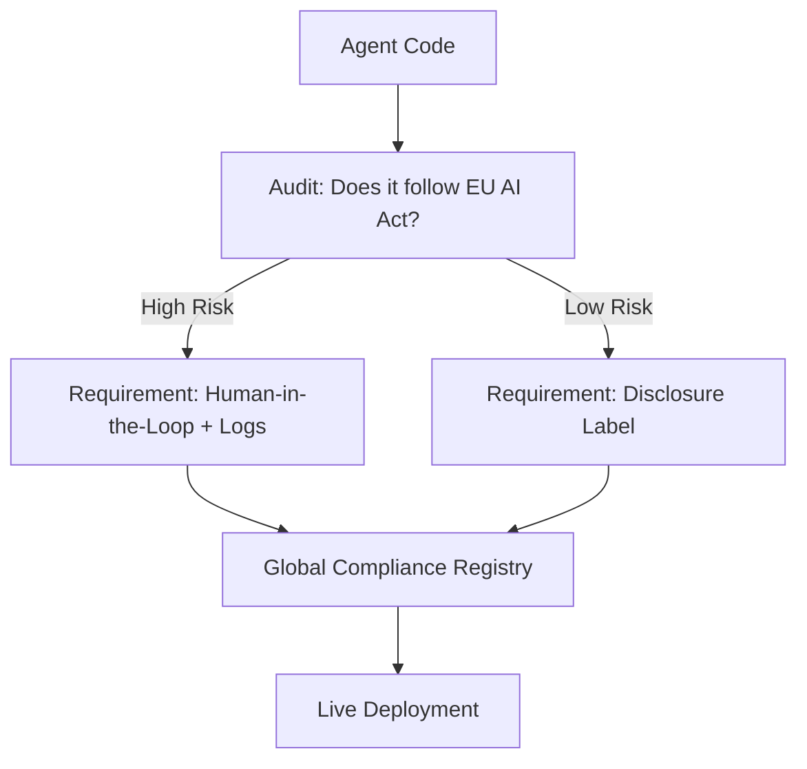

# 🌍 Global Regulations on AI Agents: Navigating the Law
> **Level:** Advanced | **Language:** Hinglish | **Goal:** Master the global legal landscape for AI agents, focusing on the EU AI Act, US Executive Orders, and Indian AI guidelines, ensuring your agents are "Compliant by Design."

---

## 🧭 1. Beginner-Friendly Hinglish Explanation
Global Regulations ka matlab hai **"AI ke liye Sarkari Rules"**.

- **The Problem:** AI itna fast badh raha hai ki sarkaron ko darr hai ki ye out-of-control na ho jaye. 
- **The Solution:** Duniya bhar ki sarkarein "Laws" bana rahi hain:
  - **EU (Europe):** "AI Act"—Duniya ka sabse strict law. Ye AI ko "Risk" ke hisaab se divide karta hai.
  - **USA:** "Executive Orders"—Innovation aur Security ke beech balance banane ki koshish.
  - **India:** "Digital India Act"—Accessibility aur Local languages par focus.
- **The Goal:** AI ko "Safe" banana aur companies ko "Zimmedar" (Accountable) rakhna.

Legal knowledge ke bina production agent banana **"Khatarnak"** (Dangerous) ho sakta hai.

---

## 🧠 2. Deep Technical Explanation
AI regulations focus on **Transparency**, **Risk Assessment**, and **Data Sovereignty**.

### 1. The EU AI Act (The Gold Standard):
- **Unacceptable Risk:** (Banned) Social scoring, manipulative AI.
- **High Risk:** (Strict Rules) Hiring, Healthcare, Justice systems. These require "Audit Logs" and "Human Oversight."
- **Limited/Minimal Risk:** (Transparency) Spam filters, Video games. Just tell the user "This is an AI."

### 2. US Framework (NIST AI RMF):
Focuses on "Trustworthiness"—Valid, Reliable, Safe, Secure, and Privacy-enhanced AI.

### 3. India's Position (GPAI & Bhashini):
Prioritizing "Sovereign AI"—building models on Indian data for Indian needs, with a focus on preventing "Digital Colonialism."

---

## 🏗️ 3. Architecture Diagrams (Compliance by Design)


---

## 💻 4. Production-Ready Code Example (An Automated Disclosure)
```python
# 2026 Standard: Mandatory Disclosure for AI Agents

def send_response_to_user(text):
    # LAW: Always disclose that this is an AI agent (Transparency)
    disclosure_tag = " [🤖 Generated by AI Agent v2.0]"
    
    # GDPR: Ensure no PII is being sent out
    safe_text = pii_scrubber.clean(text)
    
    return safe_text + disclosure_tag

# Insight: In many countries, 'Hiding' that you are 
# an AI is now ILLEGAL and can lead to big fines.
```

---

## 🌍 5. Real-World Use Cases
- **Enterprise Hiring:** A company using an agent to filter resumes must prove to the EU that the agent is not "Biased" against any group.
- **Financial Services:** An agent giving investment advice must follow the same "Fiduciary Duty" laws as a human advisor.
- **Health Tech:** A medical bot must be registered as a "Medical Device" if it provides specific diagnoses.

---

## ❌ 6. Failure Cases
- **The "Banned" Agent:** A company launches a "Social Scoring" agent and gets shut down by the government in 24 hours.
- **GDPR Violations:** An agent "Learning" from a user's private data and then showing it to another user.
- **Copyright Lawsuits:** An agent generating content that is "Too similar" to a copyrighted book or movie.

---

## 🛠️ 7. Debugging Guide
| Symptom | Cause | Fix |
| :--- | :--- | :--- |
| **Agent is blocked in Europe** | Non-compliance with AI Act | Review your **'Risk Level'** and implement **'Human Oversight'** and **'Audit Logging'** as required. |
| **User data is leaking across borders** | No Data Sovereignty | Use **'Local Cloud Regions'** (e.g., AWS Mumbai for Indian data) to keep data within the country. |

---

## ⚖️ 8. Tradeoffs
- **Regulatory Compliance (Safe/Legal/Expensive) vs. Innovation Speed (Fast/Risky/Cheap).**
- **Strict Transparency (Builds trust) vs. Smooth UX (Hides complexity).**

---

## 🛡️ 9. Security Concerns
- **Regulatory Hacking:** An attacker "Tricking" your agent into violating a law (e.g., giving medical advice) so your company gets sued.
- **Data Residency Theft:** Stealing data from an agent's "Local cache" that was supposed to be protected by national laws.

---

## 📈 10. Scaling Challenges
- **The 'Patchwork' Problem:** How to build one agent that follows 50 different countries' laws simultaneously. **Solution: Use 'Regional Compliance Middleware'.**

---

## 💸 11. Cost Considerations
- **Compliance Audits:** Hiring external legal firms to audit your AI can cost $\$10k - \$100k$ per year.

---

## 📝 12. Interview Questions
1. What are the 4 risk categories in the EU AI Act?
2. What is "Transparency" in AI and why is it legally required?
3. How does "Data Sovereignty" affect where you host your AI agents?

---

## ⚠️ 13. Common Mistakes
- **Assuming 'Internet is Borderless':** Thinking you can run a US-based agent for EU users without following EU laws.
- **Ignoring 'Shadow AI':** Employees using unauthorized AI agents that don't follow company or national laws.

---

## ✅ 14. Best Practices
- **Legal-as-Code:** Automate your compliance checks (e.g., "If User_Loc == EU: Enable_Strict_Privacy").
- **Maintain an 'AI Register':** Document every model, data source, and agent version you use.
- **Appoint an AI Ethics Officer:** Someone whose only job is to watch the laws and the AI.

---

## 🚀 15. Latest 2026 Industry Patterns
- **Digital Product Passports:** Every AI agent has a "Barcode" that shows its training data, safety score, and legal compliance history.
- **Automated Compliance Auditors:** AI agents that "Test" other agents to see if they violate the law (AI-auditing-AI).
- **Global AI Treaty:** A United Nations-style agreement for "Basic Safety Rules" for all AI agents on Earth.
