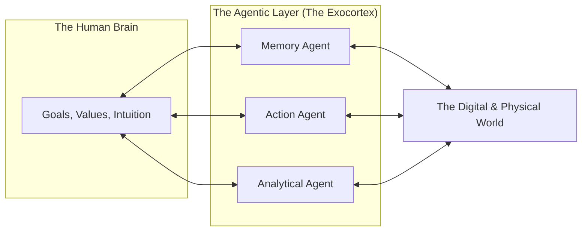

# 🚀 The Future of Human-Agent Coexistence: Living with AI
> **Level:** Advanced | **Language:** Hinglish | **Goal:** Explore the long-term vision of a world where humans and agents live and work together, focusing on collaboration, cognitive offloading, and the evolving nature of human identity.

---

## 🧭 1. Beginner-Friendly Hinglish Explanation
Human-Agent Coexistence ka matlab hai **"AI ke saath milkar rehna"**.

- **The Future:** Hum us waqt ki taraf badh rahe hain jahan har insaan ke paas ek ya zyada AI agents honge.
- **The Concept:** 
  - **Offloading:** Bore karne wale kaam AI karega, aur hum "Creative" aur "Human" cheezon par focus karenge.
  - **Augmentation:** Hum "Super-human" ban jayenge (e.g., koi bhi language bolna, complex math minto mein karna).
  - **Partnership:** AI sirf ek "Tool" nahi, balki ek "Colleague" ban jayega jo humein behtar decision lene mein help karega.
- **The Goal:** AI aur Insaan ke beech ek **"Symbiotic Relationship"** (Dosti) banana.

Bhavishya mein AI humein "Replace" nahi karega, wo humein **"Upgrade"** karega.

---

## 🧠 2. Deep Technical Explanation
The future of coexistence is driven by **Ubiquitous AI**, **Neural Interfaces**, and **Cognitive Offloading**.

### 1. Ubiquitous Intelligence:
AI won't just be in a chat box; it will be in your glasses, your clothes, and your home (Ambient Intelligence). It will know your context and "Predict" what you need before you ask.

### 2. Cognitive Offloading:
Humans will stop "Memorizing" facts and start focusing on "Synthesis" and "Goal Setting." The agent becomes your **"External Memory"** and **"Action Layer."**

### 3. Personal AI Swarms:
Each human will manage a personal "Squad" of specialized agents (Finance Agent, Health Agent, Learning Agent) that interact with other humans' agents.

---

## 🏗️ 3. Architecture Diagrams (The Symbiotic Future)


---

## 💻 4. Production-Ready Code Example (Designing for Long-term Memory)
```python
# 2026 Standard: Building an agent that 'Grows' with the user

class UserCompanion:
    def __init__(self, user_id):
        self.user_id = user_id
        self.long_term_memory = load_memory(user_id) # Vector DB

    def interact(self, query):
        # 1. Retrieve user's past preferences and personality
        context = self.long_term_memory.search(query)
        
        # 2. Respond in a way that respects the 'History'
        response = agent.run(f"User Context: {context}\nQuery: {query}")
        
        # 3. Save new learning about the user
        self.long_term_memory.save(query, response)
        return response

# Insight: Coexistence requires 'Continuity'. 
# An agent that forgets you every day isn't a companion.
```

---

## 🌍 5. Real-World Use Cases
- **Lifelong Learning:** An agent that follows a child from school to retirement, knowing exactly how they learn best and adapting its teaching style for $60$ years.
- **Universal Healthcare:** A personal health agent that monitors your vitals $24/7$ and coordinates with your doctor's agent automatically.
- **Conflict Resolution:** Personal agents "Negotiating" a meeting time or a business deal on behalf of their humans, finding the "Win-Win" without the stress.

---

## ❌ 6. Failure Cases
- **The "Wall-E" Scenario:** Humans becoming too lazy and dependent on AI, losing their physical and mental fitness.
- **Echo Chambers:** Your personal agent only showing you what it thinks you want to see, making you more biased.
- **Identity Theft:** If someone hacks your "Personal Agent," they effectively steal your "Digital Identity" and 20 years of your memory.

---

## 🛠️ 7. Debugging Guide
| Symptom | Cause | Fix |
| :--- | :--- | :--- |
| **User feels 'Stalked' by the AI** | Excessive proactivity | Implement **'Privacy Thresholds'** and let the user set "No-AI Zones" (e.g., family time). |
| **AI is giving 'Old' advice** | Memory decay / Over-weighting past data | Implement **'Temporal Decay'** so the agent prioritizes "Who you are today" over "Who you were 5 years ago." |

---

## ⚖️ 8. Tradeoffs
- **Convenience (AI does everything) vs. Agency (Human stays in control).**
- **Personalization (AI knows everything) vs. Privacy (AI knows nothing).**

---

## 🛡️ 9. Security Concerns
- **Brain-Hacking:** If agents are integrated via Neural Links (like Neuralink), the security of the agent becomes the security of the human brain itself.
- **Mass Manipulation:** A central authority "Steering" all personal agents to change the behavior of a whole population.

---

## 📈 10. Scaling Challenges
- **Inter-Agent Protocols:** How will 8 billion personal agents talk to each other without crashing the global internet?

---

## 💸 11. Cost Considerations
- **The 'Free vs. Paid' Divide:** Will only the rich have "Super-smart" personal agents, making the poor even less competitive? (The 'Intelligence Gap').

---

## 📝 12. Interview Questions
1. How does "Cognitive Offloading" change human intelligence?
2. What are the risks of "Over-dependence" on AI agents?
3. Describe the concept of an "Exocortex."

---

## ⚠️ 13. Common Mistakes
- **Designing 'Static' Agents:** Building agents that never change, while humans are constantly evolving.
- **Ignoring the 'Physical' World:** Forgetting that humans still live in a world of touch, smell, and real-world consequences.

---

## ✅ 14. Best Practices
- **Human-in-the-loop by Design:** Ensure the user always has the final "Veto" power.
- **Transparency of Memory:** Let the user "See" and "Edit" what the agent knows about them.
- **Encourage Autonomy:** Design agents that "Challenge" the human to think, not just give them easy answers.

---

## 🚀 15. Latest 2026 Industry Patterns
- **Agentic Avatars:** Photo-realistic 3D avatars that represent you in digital meetings while you are sleeping or busy.
- **Memory Inheritance:** Being able to "Pass on" your personal agent's knowledge to your children after you pass away.
- **Global Intelligence Swarm:** A shared "Layer" of intelligence that all personal agents can tap into to solve global problems like climate change.
