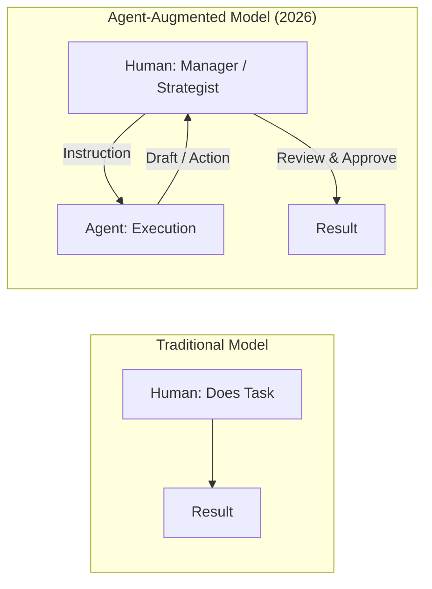

# 💼 The Impact of Agents on Jobs: The Future of Work
> **Level:** Advanced | **Language:** Hinglish | **Goal:** Analyze how AI agents are transforming the labor market, identifying which roles are evolving, which are at risk, and how to "Upskill" for a world where agents do the heavy lifting.

---

## 🧭 1. Beginner-Friendly Hinglish Explanation
Impact on Jobs ka matlab hai **"AI aur hamara Rozgaar"**.

- **The Big Shift:** AI agents sirf "Sawaal ka jawab" nahi dete, wo "Kaam" karte hain (e.g., code likhna, email bhejna, data entry). 
- **The Reality:** 
  - **Replacement:** Kuch "Repetitive" jobs (Data Entry, Basic Support) AI chin sakta hai.
  - **Augmentation:** Zyadatar jobs mein AI aapka "Partner" ban jayega (e.g., Doctor + AI diagnosis).
  - **New Jobs:** Nayi tarah ki jobs aayengi (e.g., AI Agent Manager, Prompt Engineer, AI Ethicist).
- **The Goal:** AI se darna nahi, balki AI ko "Chalana" seekhna hai.

AI aapki job nahi cheenega, wo **"Insaan jo AI chalana janta hai"** shayad cheen le.

---

## 🧠 2. Deep Technical Explanation
Technological displacement is analyzed through **Task-based Modeling** vs. **Role-based Modeling**.

### 1. The Automation Spectrum:
- **High Automation Potential:** Tasks that are "Routine," "Predictable," and "Digitized" (e.g., Bookkeeping, Schedule Management).
- **Low Automation Potential:** Tasks requiring "Empathy," "Physical Dexterity," "High-stakes Ethics," or "Creative Vision."

### 2. The Multi-agent Workplace:
In 2026, many companies are moving to an **"Agent-First"** architecture where 1 human manages a squad of 10 autonomous agents.

### 3. Skill Shift (The Upskilling Matrix):
Moving from "Execution" (Doing the task) to "Orchestration" (Defining the goal and reviewing the agent's work).

---

## 🏗️ 3. Architecture Diagrams (The Evolving Workforce)


---

## 💻 4. Production-Ready Code Example (An 'Assistant' that Empowers)
```python
# 2026 Standard: Designing agents that 'Assist' rather than 'Replace'

def coding_assistant(user_code):
    # 1. Don't just 'Overwrite' the user's code
    bug_report = analyze_code(user_code)
    
    # 2. Provide 'Suggestions' and 'Explanations'
    # This helps the human LEARN and grow.
    return {
        "suggestions": ["Add a try-except block here", "Use a list comprehension"],
        "reasoning": "This will make your code more robust against empty inputs.",
        "tutorial_link": "https://docs.python.org/3/tutorial/errors.html"
    }

# Insight: The best agents are 'Coaches', not just 'Servants'.
```

---

## 🌍 5. Real-World Use Cases
- **Customer Support:** Agents handle $80\%$ of common queries, allowing humans to focus on "High-Emotion" or "Complex" cases.
- **Law Firms:** Agents do the "Research" across 10,000 cases in seconds, so lawyers can focus on "Trial Strategy."
- **Content Creators:** Agents do the "Editing" and "SEO," so creators can focus on the "Story."

---

## ❌ 6. Failure Cases
- **The "Useless Human" Problem:** Over-reliance on AI makes humans lose their "Core Skills" (e.g., a coder who can't code without AI).
- **The "Gig Economy" Trap:** Using agents to micromanage workers, leading to high stress and low pay.
- **Bias in Hiring:** Using an agent to "Automatically Fire" people based on data that might be wrong or biased.

---

## 🛠️ 7. Debugging Guide
| Symptom | Cause | Fix |
| :--- | :--- | :--- |
| **Employees are scared of the AI** | Lack of Transparency | Host **'AI Workshops'** and show how the agent will save them time, not replace them. |
| **AI is making 'Dumb' mistakes** | No Human-in-the-loop | Implement **'Mandatory Checkpoints'** for all high-value business actions. |

---

## ⚖️ 8. Tradeoffs
- **Business Efficiency (Fast/Cheap) vs. Social Responsibility (Stable/Human-focused).**
- **Automating 'Hard' tasks (Saves money) vs. Automating 'Boring' tasks (Saves happiness).**

---

## 🛡️ 9. Security Concerns
- **Inside Knowledge:** An agent learning a company's "Trade Secrets" by watching employees work and then leaking them.
- **Social Engineering:** Using agents to "Impersonate" a boss to give wrong orders to employees.

---

## 📈 10. Scaling Challenges
- **The 'Education' Bottleneck:** Scaling AI is easy; scaling the "Knowledge" of humans to use that AI is hard.

---

## 💸 11. Cost Considerations
- **ROI of Augmentation:** Calculate: `(Human Salary + AI Cost) / Output`. If the output quality triples, the investment is a success.

---

## 📝 12. Interview Questions
1. How do you design an agent that "Empowers" a worker?
2. Which industries are most at risk from agentic automation?
3. What is the role of an "AI Orchestrator"?

---

## ⚠️ 13. Common Mistakes
- **Automating the 'Wrong' thing:** Automating the creative part and leaving the boring part for humans.
- **No 'Upskilling' Path:** Giving people AI but not teaching them how to use it.

---

## ✅ 14. Best Practices
- **Human-Centric Design:** Build for the person, not just the process.
- **Feedback Loops:** Let workers "Grade" the AI to make it a better partner.
- **Job Redesign:** Don't just add AI; rethink what the "Human Job" should be in 2026.

---

## 🚀 15. Latest 2026 Industry Patterns
- **AI-Human Pair Programming:** It's no longer just "GitHub Copilot"; it's a "Squad" of 3 agents working with 1 dev.
- **The 4-Day Work Week:** Using AI efficiency to give time back to humans.
- **Skill-based Routing:** An agent that detects what a human is "Good at" and gives them only the tasks that utilize their unique human strengths.
