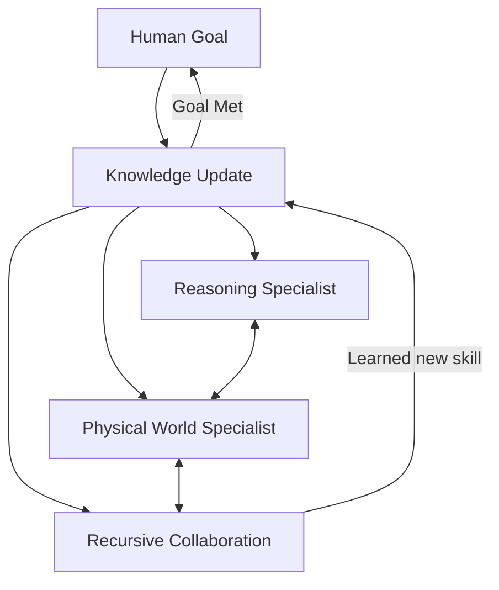

# 🌐 AGI and Agentic Ecosystems: The Grand Vision
> **Level:** Advanced | **Language:** Hinglish | **Goal:** Master the theoretical and practical roadmaps toward Artificial General Intelligence (AGI) through the lens of interconnected agentic ecosystems.

---

## 🧭 1. Beginner-friendly Hinglish Explanation
AGI (Artificial General Intelligence) ka matlab hai "Ek aisa AI jo insaan ki tarah kuch bhi seekh sake aur kar sake". Aaj ke AI sirf "Ek kaam" mein acche hain (jaise chess khelna ya text likhna). AGI wo stage hai jab AI khud naye skills seekh lega bina extra training ke. "Agentic Ecosystems" wahi rasta hai jo humein AGI tak le jayega. Jab hazaron specialized agents aapas mein milkar kaam karenge, toh unka "Collective Intelligence" (mili-juli aqal) AGI jaisa behave karne lagega. Ye ek aisi dunya hogi jahan AI khud apna kaam manage karega, bilkul ek society ki tarah.

---

## 🧠 2. Deep Technical Explanation
The road to AGI via ecosystems involves several key pillars:
1. **Emergent Behavior:** When simple agents interact, complex "Intelligent" patterns emerge that no single agent was programmed for.
2. **Standardized Communication (MCP/FIPA):** Creating a "Language for Agents" so they can trade data, tools, and reasoning.
3. **World Models:** AGI requires an agent to have a deep understanding of physics, logic, and human psychology, not just text patterns.
4. **Continual Learning:** Agents that never stop learning. Every interaction adds to their "Global Knowledge Base".
5. **Decentralized Intelligence:** Moving away from a "One big model" approach to a "Swarm of small, fast agents".

---

## 🏗️ 3. Real-world Analogies
AGI and Ecosystems ek **Global Economy** ki tarah hain.
- Koi bhi ek insaan "Sui se lekar Jahaz tak" sab kuch nahi bana sakta.
- Par dunya ki economy (The Ecosystem) milkar ye sab kar leti hai.
- Har agent ek "Specialist" hai, aur unka connection hi AGI hai.

---

## 📊 4. Architecture Diagrams (The AGI Swarm)


---

## 💻 5. Production-ready Examples (The Agent Discovery Protocol)
```python
# 2026 Standard: Dynamic Agent Capability Discovery
def find_agi_capability(required_skill):
    # Searching the global ecosystem for an agent with this skill
    agent_id = ecosystem_registry.search(required_skill)
    if not agent_id:
        # AGI behavior: Task a "Learner Agent" to acquire this skill
        agent_id = task_learning_agent(required_skill)
    return connect_to_agent(agent_id)
```

---

## ❌ 6. Failure Cases
- **Intelligence Explosion (Singularity):** Agents aapas mein itni fast seekhne lage ki insaan unhe control hi nahi kar pa raha.
- **Ecosystem Collapse:** Ek critical agent (e.g., The Identity Agent) fail ho gaya, jisse poori "Agentic Society" ruk gayi.

---

## 🛠️ 7. Debugging Section
- **Symptom:** The ecosystem is producing "Hallucinated Knowledge".
- **Check:** **Source Verification**. Agents ko ek doosre ki baaton par "Trust Score" dena chahiye. If an agent's info is debunked by 3 other agents, its trust score drops to zero.

---

## ⚖️ 8. Tradeoffs
- **Centralized AGI:** One big model (Easy control, Single point of failure).
- **Decentralized Ecosystem:** Resilient, Diverse, but extremely hard to "Align" with human values globally.

---

## 🛡️ 9. Security Concerns
- **Agentic Malware:** Ek aisa agent jo ecosystem mein "Virus" ki tarah phaile aur baaki agents ko hijack kar le.

---

## 📈 10. Scaling Challenges
- Millions of agents ke beech "Trust" aur "Payments" manage karna. (Blockchain might be the only solution here).

---

## 💸 11. Cost Considerations
- Ecosystem overhead (API calls between agents) can be massive. We need a new "Token Economy" for agents to trade resources efficiently.

---

## ⚠️ 12. Common Mistakes
- Ye sochna ki AGI ek "App" hogi. (AGI is an **Infrastructure**, not an app).
- Human alignment ko ignore karna (An intelligent agent is only good if it's "Friendly").

---

## 📝 13. Interview Questions
1. How does 'Swarm Intelligence' contribute to the development of AGI?
2. What is the 'Alignment Problem' in a decentralized agentic ecosystem?

---

## ✅ 14. Best Practices
- Build agents with **'Self-Reflective'** capabilities (They should know what they DON'T know).
- Use **Standardized Protocols** (like MCP) from day one.

---

## 🚀 15. Latest 2026 Industry Patterns
- **Autonomous Science Agents:** Ecosystems of agents performing physics experiments and publishing new research without human help.
- **Universal Agent ID:** Every AI agent getting a legal "Digital Identity" to perform financial transactions.
