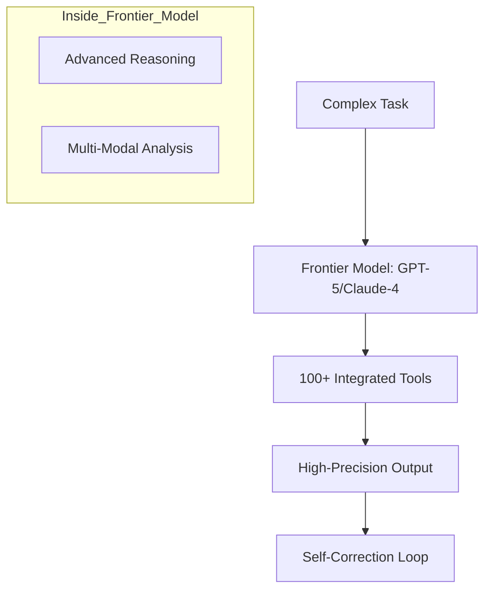

# 🚀 Frontier Models and Agents: Leading the Pack
> **Level:** Advanced | **Language:** Hinglish | **Goal:** Master the integration of the world's most powerful LLMs (Frontier Models like GPT-5, Claude-4, Gemini-2) into agentic architectures, optimizing for their unique strengths.

---

## 🧭 1. Beginner-friendly Hinglish Explanation
Frontier Models ka matlab hai "Sabse Naye aur Sabse Taqatwar AI Models". Sochiye dunya ke sabse hoshiyar scientists ek saath milkar ek "Super Brain" bana rahe hain. GPT-5 ya Claude-4 jaise models "Frontier" hain kyunki wo purane models ke muqable 100x zyada samajhdaar aur fast hain. Ek Agent Engineer ke liye in "Frontier" models ko use karna seekhna zaroori hai kyunki ye models aise kaam kar sakte hain jo purane models ke liye namumkin the—jaise complex math solve karna ya hazaaron pages ki files ko ek saath samajhna.

---

## 🧠 2. Deep Technical Explanation
Frontier models bring new capabilities to agents:
1. **Massive Context Windows (1M+ Tokens):** No more need for complex RAG; you can just feed the entire codebase or library to the model.
2. **Native Multimodality:** These models process Video, Audio, and Images natively, allowing for much more "Aware" agents.
3. **Advanced Reasoning (o1-style):** Models that "Think" before they speak (Hidden Chain of Thought), reducing logic errors in multi-step planning.
4. **Enhanced Tool Use:** Models that can generate complex JSON and handle 100+ tools without getting confused (Low "Tool Fatigue").
**Standard:** Always use the **"API-specific Features"** (like Claude's artifacts or OpenAI's function calling) to get the most out of these giants.

---

## 🏗️ 3. Real-world Analogies
Frontier Models ek **Super-Car Engine** ki tarah hain.
- Purane models "Basic Engines" the (Kaam chala dete the).
- Frontier Model wo engine hai jo 400km/h ki speed se bina garam huye chal sakta hai.
- Aapko bas sahi "Body" (Agent Architecture) banani hai taaki aap is engine ki poori taqat use kar sakein.

---

## 📊 4. Architecture Diagrams (The Frontier Agent)


---

## 💻 5. Production-ready Examples (Using Frontier Reasoning)
```python
# 2026 Standard: Leveraging 'Thinking' Models (e.g., o1)
def high_stakes_decision(query):
    # This model uses internal reasoning before returning an answer
    # Perfect for complex architecture or legal logic.
    response = frontier_model.invoke(
        query, 
        reasoning_effort="high" # 2026 feature to control 'Think Time'
    )
    return response.content
```

---

## ❌ 6. Failure Cases
- **Over-reliance:** Developer ne socha "Model itna hoshiyar hai ki use Guardrails ki zarurat nahi hai". (Even frontier models can hallucinate or be biased).
- **Cost Shock:** Frontier models mehenge hote hain. Bina dhyan diye inhe "Simple chat" ke liye use karna company ka budget bigad sakta hai.

---

## 🛠️ 7. Debugging Section
- **Symptom:** The Frontier model is giving too much detail (Over-explaining).
- **Check:** **System Prompt Constraints**. Frontier models instructions ko bahut "Strictly" follow karte hain. Use `concise` or `no_reasoning_output` tags if the response is too wordy.

---

## ⚖️ 8. Tradeoffs
- **Frontier Models:** Maximum intelligence, Highest cost, Higher latency.
- **Smaller Models (Llama-3-8B):** Fast, cheap, but lower reasoning power.

---

## 🛡️ 9. Security Concerns
- **Exfiltration of Knowledge:** Frontier models itne hoshiyar hain ki wo encrypted data ko crack karne ke tareeke suggest kar sakte hain. Always use **Safety Overrides**.

---

## 📈 10. Scaling Challenges
- Frontier models ki availability (Rate limits) aksar kam hoti hai kyunki dunya bhar ke log unhe use kar rahe hain. Use **Model Fallbacks**.

---

## 💸 11. Cost Considerations
- Use **Model Tiering**: Agent ke 90% simple steps ke liye sasta model use karein, aur sirf final 10% critical decision ke liye Frontier model.

---

## ⚠️ 12. Common Mistakes
- Frontier model ko "Small Context" prompts dena (It's like using a Ferrari in a narrow gali). Use its **Full Context** potential.
- Ignoring **Prompt Caching** (which saves 90% cost on frontier APIs).

---

## 📝 13. Interview Questions
1. When should you use a Frontier model vs a small, local model for an agent?
2. What is 'Reasoning Effort' and how does it change an agent's performance?

---

## ✅ 14. Best Practices
- Always **Pin the Version** (e.g., `gpt-5-v1.2`) to avoid behavior changes when the model provider updates the frontier.
- Use **Multimodal prompts** wherever possible to increase agent accuracy.

---

## 🚀 15. Latest 2026 Industry Patterns
- **Agentic Tuning:** Models jo specific "Agent behaviors" (like Tool use or Planning) ke liye fine-tune huye hain by the providers.
- **Frontier-as-an-Orchestrator:** Using a giant model to manage a team of 50 small local models.
