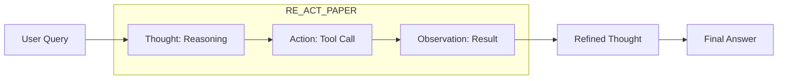

# 📄 Key Research Papers: The Foundation of Agents
> **Level:** Advanced | **Language:** Hinglish | **Goal:** Master the landmark research papers that defined the field of AI agents, from early reasoning models to modern multi-agent orchestration.

---

## 🧭 1. Beginner-friendly Hinglish Explanation
Key Research Papers ka matlab hai "Agent dunya ki Geeta/Quran". Ye wo original documents hain jinme scientist ne pehli baar bataya ki AI agent kaise banayein. Agar aapko samajhna hai ki agent "Chain-of-Thought" kaise karta hai, ya "ReAct" (Reason + Act) ka idea kahan se aaya, toh aapko ye papers samajhne honge. Interview mein jab aap kisi paper ka naam lete hain, toh interviewer ko pata chalta hai ki aap sirf "Tutorial" dekh kar nahi aaye, aapne "Depth" mein padha hai.

---

## 🧠 2. Deep Technical Explanation
The evolution of agents can be traced through these critical papers:
1. **Chain-of-Thought (CoT) Prompting (2022):** Showed that LLMs perform better if they "Think step-by-step".
2. **ReAct: Synergizing Reasoning and Acting (2023):** The foundation of modern agents. It combines reasoning ("I should search X") with actions ("Call Google Search").
3. **Reflexion (2023):** Introduced the idea of agents learning from their own mistakes via verbal reinforcement.
4. **AutoGPT / BabyAGI (2023):** The first attempts at fully autonomous, goal-driven agents.
5. **Generative Agents (Stanford Smallville - 2023):** Using architecture with Memory, Reflection, and Planning to create human-like social behavior.

---

## 🏗️ 3. Real-world Analogies
Research Papers ek **New Construction Technology** ki tarah hain.
- Pehle kisi ne paper likha ki "Steel use karne se building mazboot banti hai".
- Aaj hum steel ki badi-badi buildings (Modern Agents) banate hain.
- Agar aapko architecture seekhna hai, toh aapko wo purane steel technology ke papers padhne honge.

---

## 📊 4. Architecture Diagrams (The ReAct Evolution)


---

## 💻 5. Production-ready Examples (Implementing ReAct Logic)
```python
# 2026 Standard: Simple ReAct Loop inspired by the paper
def react_loop(task):
    history = []
    for i in range(5):
        # The prompt forces a 'Thought' before 'Action'
        thought_action = llm.generate_thought_and_action(task, history)
        if "Final Answer" in thought_action:
            return thought_action
        
        result = execute_tool(thought_action['action'])
        history.append(f"Observation: {result}")

# This logic is what powered the 2023 agent revolution.
```

---

## ❌ 6. Failure Cases
- **Over-Abstraction:** Paper padh liya par coding nahi aati. (Theoretical knowledge without practice).
- **Ignoring Context:** Purane papers (2021) ke techniques use karna jabki modern models (2026) unhe better handle karte hain naturally.

---

## 🛠️ 7. Debugging Section
- **Symptom:** Agent's reasoning is circular (Doing the same thing again and again).
- **Fix:** Study the **'Reflexion'** paper. Implement a "Critic" node that checks if the agent is repeating itself and forces it to try a new strategy.

---

## ⚖️ 8. Tradeoffs
- **Academic Rigor:** Papers provide deep understanding but might be too complex for a simple business bot.
- **Practical Hacking:** Fast results but lacks the robustness that paper-based architectures provide.

---

## 🛡️ 9. Security Concerns
- **Adversarial Research:** Kuch papers jailbreak karne ke "Scientific" tareeke batate hain. Use this knowledge to **Defend**, not to attack.

---

## 📈 10. Scaling Challenges
- Paper ki technical math ko production code (Python/JS) mein translate karna ek scaling aur engineering challenge hai.

---

## 💸 11. Cost Considerations
- Reading papers is free (ArXiv.org), par unki complex architectures (like 'Voyager') ko run karna tokens mein bahut mehenga ho sakta hai.

---

## ⚠️ 12. Common Mistakes
- Research ko "Old News" samajhna (Foundations don't change).
- Sirf "Abstract" padhna (The real magic is in the **Methodology** and **Appendix**).

---

## 📝 13. Interview Questions
1. Can you explain the core difference between 'CoT' and 'ReAct'?
2. What was the main contribution of the 'Generative Agents' (Smallville) paper?

---

## ✅ 14. Best Practices
- Join a **'Paper Reading Club'** or follow newsletters like **'The Batch'** to stay updated.
- Every time you build a feature, ask: "Which paper inspired this?"

---

## 🚀 15. Latest 2026 Industry Patterns
- **Vision-Language-Action (VLA):** Papers that are merging computer vision and robotics into a single model.
- **Self-Improving Papers:** Research on agents that can write their own research papers and perform their own experiments.
