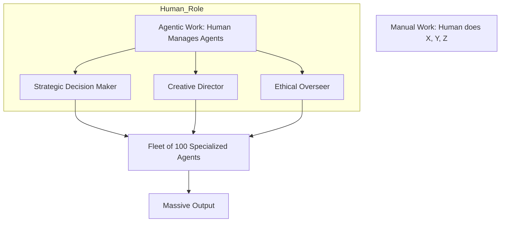

# 🌍 Societal Impact of Agents: Changing the World
> **Level:** Beginner | **Language:** Hinglish | **Goal:** Master the understanding of how AI agents will reshape jobs, economy, education, and human relationships, preparing you to build socially responsible AI.

---

## 🧭 1. Beginner-friendly Hinglish Explanation
Societal Impact ka matlab hai "Agent ka dunya par asar". Sochiye agar har koi apna personal agent rakhne lage jo unke liye saara kaam kar de, toh dunya kaisi dikhegi? Naukriyan (Jobs) badal jayengi—ab humein kaam "Karna" nahi hoga, balki agents se "Karwana" hoga. Isse log bahut productive ho sakte hain, par isme risk bhi hai: "Insaan ka aapas mein connection kam ho jana" aur "Amir aur gareeb ke beech ka fark badhna" (Jinke paas mehenge agents hain wo zyada kamayenge). Is section mein hum inhi bade sawalon ke jawab dhoondhenge.

---

## 🧠 2. Deep Technical Explanation
The societal transformation driven by agents involves:
1. **The 'Human-in-the-Loop' Economy:** Shifting from manual labor to "Supervisory Roles" where humans manage swarms of agents.
2. **Personalized Education/Healthcare:** Agents that act as 24/7 tutors or health monitors, democratizing access to expert knowledge.
3. **Information Overload/Manipulation:** Agents that can generate perfectly convincing misinformation at scale.
4. **Agentic Identity:** Legal questions about whether an agent's action (e.g., signing a contract) is legally binding for the human owner.
**Concept:** **"Universal Basic Income (UBI)"** is often discussed as a response to widespread agentic automation.

---

## 🏗️ 3. Real-world Analogies
Societal Impact ek **Industrial Revolution** (Masheenon ki kranti) ki tarah hai.
- Pehle sab haath se hota tha.
- Masheenein aayi toh factory mein kaam fast ho gaya.
- Kuch jobs gayi, par hazaron naye tarah ki naukriyan (Engineers, Managers) bani.
- Agents wahi "Next Revolution" hain.

---

## 📊 4. Architecture Diagrams (The Social Shift)


---

## 💻 5. Production-ready Examples (The Accountability Logger)
```python
# 2026 Standard: Logging Human Responsibility for Agent Actions
def log_societal_impact_action(user_id, agent_action):
    # Every high-impact action must be linked to a responsible human
    audit_trail.save({
        "timestamp": now(),
        "responsible_human": user_id,
        "action_taken": agent_action,
        "legal_consent": "OBTAINED"
    })
# Ensuring that humans stay accountable for what their agents do.
```

---

## ❌ 6. Failure Cases
- **The Echo Chamber:** Agent ne user ko sirf wahi dikhaya jo wo dekhna chahta hai, jisse log "Narrow-minded" ho gaye.
- **Dependency:** Insaan ne basic skills (jaise writing ya math) bhula di kyunki agent ne sab sambhaal liya.

---

## 🛠️ 7. Debugging Section
- **Symptom:** Users feel "Isolated" or "Scared" of the agent.
- **Check:** **Agent Tone & Persona**. Kya agent "Dhara-dharm" (Preachy) ya "Dominating" hai? Change the prompt to be **Supportive** and **Collaborative** rather than "Bossy".

---

## ⚖️ 8. Tradeoffs
- **High Automation:** Economic growth, but potential job displacement.
- **Slow Integration:** High job safety, but lagging behind in global competition.

---

## 🛡️ 9. Security Concerns
- **Agentic Propaganda:** Using agents to influence elections or social opinions by creating fake "Community discussions" on a massive scale.

---

## 📈 10. Scaling Challenges
- Millions of agents performing billions of tasks will require a new **Legal Framework** for global trade and liability.

---

## 💸 11. Cost Considerations
- Agents can reduce the cost of expert services (Legal, Medical) by 90%, making them affordable for the poor.

---

## ⚠️ 12. Common Mistakes
- Ye sochna ki "AI dunya ko khatam kar dega" (Hollywood style).
- Real risks (like algorithmic bias in hiring) ko ignore karna.

---

## 📝 13. Interview Questions
1. How will the 'Agentic Revolution' differ from the 'Internet Revolution'?
2. What are the ethical implications of using agents to replace customer service jobs?

---

## ✅ 14. Best Practices
- Build agents that **Empower** humans, not just replace them.
- Always include **'Human-Centric'** safety filters for sensitive topics.

---

## 🚀 15. Latest 2026 Industry Patterns
- **AI Philanthropy:** Using agents to solve world problems like climate change and disease discovery.
- **Digital Equity Programs:** Governments providing "Free Basic Agents" to all citizens to ensure everyone has access to AI's power.
