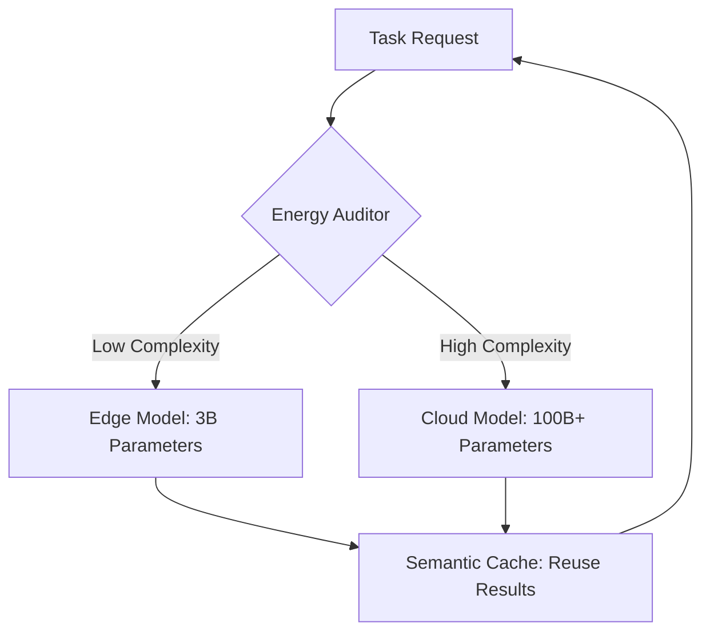

# 🌿 Sustainable AI Agent Design: The Green Machine
> **Level:** Intermediate | **Language:** Hinglish | **Goal:** Master the techniques for building energy-efficient, cost-effective, and environmentally conscious AI agents that minimize their carbon footprint while maximizing utility.

---

## 🧭 1. Beginner-friendly Hinglish Explanation
Sustainable AI ka matlab hai "Aisa AI jo dunya ko nuksan na pahunchaye". AI models ko chalane mein bahut saari bijli (electricity) lagti hai aur servers bahut garam ho jate hain (Carbon footprint). Sochiye aapne ek aisa agent banaya jo chote kaam ke liye bhi duniya ka sabse bada supercomputer use karta hai—ye waste hai. Sustainable design ka matlab hai ki hum "Smartly" kaam karein: Chote kaam ke liye chota model, aur sirf zarurat padne par bada model. Isse hum "Paisa" bhi bachate hain aur "Environment" bhi.

---

## 🧠 2. Deep Technical Explanation
Sustainability in agents is achieved through **Efficiency Engineering**:
1. **Model Distillation:** Using a smaller, 10x more efficient model for 90% of the agent's life.
2. **Compute-Aware Routing:** An agent that checks the "Cost/Energy" of a request before deciding which model to use.
3. **Optimized RAG:** Instead of searching the whole internet, using a well-indexed local vector store to reduce compute.
4. **Token Pruning:** Reducing the length of prompts to save both money and GPU cycles.
5. **Event-Driven Architecture:** The agent's "Brain" should only wake up when needed, instead of running 24/7 in an idle loop.

---

## 🏗️ 3. Real-world Analogies
Sustainable AI ek **Smart Home** ki tarah hai.
- Aap poore ghar ki light hamesha on nahi rakhte.
- Jab aap kamre mein jate hain, tabhi light on hoti hai (Event-driven).
- Aap LED bulbs use karte hain jo kam bijli lete hain (Small models).
- Isse aapka bill kam aata hai aur planet bhi bachta hai.

---

## 📊 4. Architecture Diagrams (The Energy-Aware Agent)


---

## 💻 5. Production-ready Examples (The Energy Auditor)
```python
# 2026 Standard: Routing based on Task Complexity
def get_efficient_response(query):
    # Heuristic to check if the task is simple
    if len(query.split()) < 10 and "calculate" not in query:
        # Use a local, tiny model (Ultra-sustainable)
        return local_llama.invoke(query)
    
    # Use the big cloud model only if absolutely needed
    return cloud_gpt.invoke(query)
```

---

## ❌ 6. Failure Cases
- **The Infinite Loop:** Agent galti se loop mein phans gaya aur poori raat GPU power consume karta raha bina kisi result ke. Always use **Max-Step Limits**.
- **Over-Caching:** Purana data reuse karne se accuracy kam ho gayi (Accuracy vs Sustainability tradeoff).

---

## 🛠️ 7. Debugging Section
- **Symptom:** The cloud bill is $1000/month for 100 users.
- **Check:** **Token usage per task**. Kya aap har prompt mein unwanted "Metadata" bhej rahe hain? Clean your context window. Use **LLM Summarization** for history to keep it short.

---

## ⚖️ 8. Tradeoffs
- **Sustainability:** Lower cost, Lower carbon, potentially lower accuracy.
- **Brute Force AI:** Maximum intelligence, Highest cost, High environmental impact.

---

## 🛡️ 9. Security Concerns
- **Energy Exhaustion Attack:** Attacker deliberately "Complex" sawal bhejta hai taaki aapka budget aur compute resources exhaust ho jayein. Implement **Rate Limiting by Compute Cost**.

---

## 📈 10. Scaling Challenges
- Millions of users ke liye sustainability manage karna mushkil hai. Use **Decentralized Inference** (Users running AI on their own devices).

---

## 💸 11. Cost Considerations
- Sustainable design is the **only way to be profitable**. If your agent costs $1 to run but you charge $0.50, your business will fail.

---

## ⚠️ 12. Common Mistakes
- Sirf cloud APIs par depend karna.
- Prompt caching (Redis/Cloud native) use na karna.

---

## 📝 13. Interview Questions
1. How do you measure the 'Carbon Footprint' of an AI agent?
2. What are the top 3 techniques to reduce token consumption in an agentic loop?

---

## ✅ 14. Best Practices
- Every agent should have a **'Budget Header'** that tracks its own spend.
- Prefer **Fine-tuned Small Models** over General-purpose Giant Models.

---

## 🚀 15. Latest 2026 Industry Patterns
- **Carbon-Neutral AI Hosting:** Servers jo hamesha Solar ya Wind energy par chalte hain.
- **Hardware-AI Codesign:** Chips jo specifically AI agents ke "Wait" time ko 0 bijli par handle karte hain.
