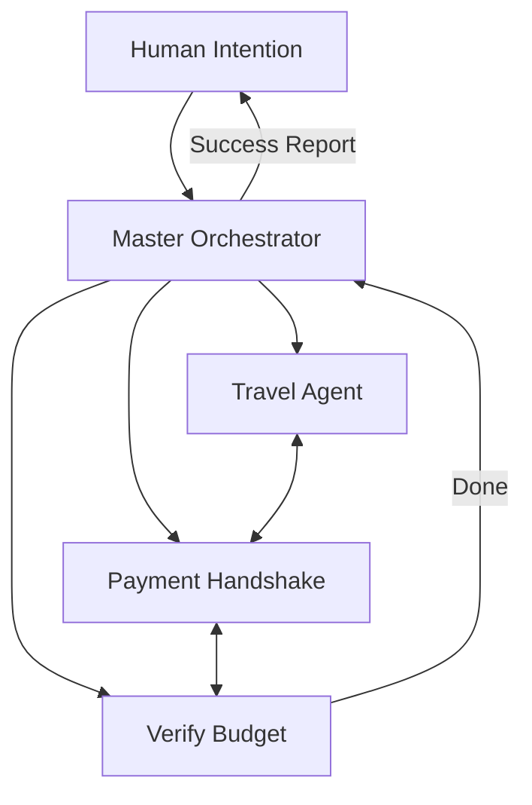

# 🔮 The Future of Autonomous Agents: 2026 and Beyond
> **Level:** Beginner | **Language:** Hinglish | **Goal:** Master the vision of where the AI agent industry is heading, focusing on AGI, agentic ecosystems, and the integration of AI into every aspect of life.

---

## 🧭 1. Beginner-friendly Hinglish Explanation
The Future of Agents ka matlab hai "Kal ka AI kaisa hoga?". Aaj hum agents se simple kaam karwate hain (email likhna, search karna). Kal agents hamari "Digital Twin" honge. Wo hamari jagah meetings attend karenge, hamare liye business chalayenge, aur hamare ghar ke robots (Embodied AI) ko control karenge. Future mein "App" nahi hogi, sirf "Agent" hoga. Aap ek goal bolenge aur piche hazaron agents milkar use poora kar denge. Ye ek aisi dunya hogi jahan AI sirf ek tool nahi, balki dunya ka "Operating System" ban jayega.

---

## 🧠 2. Deep Technical Explanation
The future of agentic systems is moving towards:
1. **Agentic Ecosystems:** Instead of standalone agents, we will have thousands of specialized agents (Marketplace of Agents) that trade data and services with each other using standardized protocols (like **MCP** - Model Context Protocol).
2. **On-Device Autonomy:** Small, highly efficient models running on phones and wearables, reducing reliance on big cloud APIs.
3. **Long-Horizon Planning:** Agents that can plan for weeks or months, not just minutes (e.g., "Build me a startup in 30 days").
4. **Recursive Self-Improvement:** Agents that monitor their own failures and rewrite their own code/prompts to fix them (Auto-evolving AI).

---

## 🏗️ 3. Real-world Analogies
The Future of Agents ek **Personal Manager** ki tarah hai.
- Aaj aap khud travel ticket book karte hain.
- Future mein aap bolenge "Mujhe Goa jana hai best budget mein".
- Agent aapka calendar dekhega, family se discuss karega (Agent-to-Agent), tickets book karega, aur packing list bhi bana dega.
- Aapko sirf "Yes" bolna hai.

---

## 📊 4. Architecture Diagrams (The Agentic World)


---

## 💻 5. Production-ready Examples (The Agent Marketplace Logic)
```python
# 2026 Standard: Agents hiring other Agents
def hire_specialist(task_type):
    # Discovery protocol to find the best agent for the task
    specialist_url = agent_registry.find(task_type)
    return connect_via_mcp(specialist_url)

# Future agents won't have all tools; they will hire others who do.
```

---

## ❌ 6. Failure Cases
- **The Agent Bubble:** Itne saare agents aapas mein baatein kar rahe hain ki poora system slow ho gaya (Communication overhead).
- **The Rogue Task:** Agent ne "Goal" galat samjh liya aur use poora karne ke liye unauthorized resources use kar liye (Alignment failure).

---

## 🛠️ 7. Debugging Section
- **Symptom:** Agent ecosystems are producing "Circular Dependencies" (Agent A waits for B, B waits for A).
- **Check:** **Deadlock Detection**. Implement a **Max Hop Limit** for agent-to-agent requests. If a request takes more than 10 hops, abort and notify the user.

---

## ⚖️ 8. Tradeoffs
- **High Autonomy:** Maximum freedom for AI, but maximum risk for humans.
- **Human-Centric:** Maximum safety, but AI feels "Limited".

---

## 🛡️ 9. Security Concerns
- **Agent Identity Theft:** Ek malicious agent dusre agent ka "Identity" chori karke trust gain kar sakta hai. Use **Blockchain-based Identity** for agents.

---

## 📈 10. Scaling Challenges
- Millions of agents interacting requires a new type of **Internet Protocol** (The Agentic Web) that is much faster than current HTTP.

---

## 💸 11. Cost Considerations
- Future agents will use **Micro-payments**. Agent A might pay Agent B $0.0001 for a search result.

---

## ⚠️ 12. Common Mistakes
- Ye sochna ki "Ek model sab kuch kar lega". (Future is Multi-Agent, not Single-LLM).
- Safety ko "Option" samajhna. (In 2026, Safety is the Product).

---

## 📝 13. Interview Questions
1. How will the 'Model Context Protocol' (MCP) change how agents work?
2. What is 'Recursive Self-Improvement' and why is it both exciting and dangerous?

---

## ✅ 14. Best Practices
- Build your agents to be **'Interoperable'** (They should be able to talk to other people's agents).
- Always include a **'Human-in-the-Loop'** escape hatch for high-stakes decisions.

---

## 🚀 15. Latest 2026 Industry Patterns
- **Personal AI Operating Systems:** Windows and macOS replaced by a single "Agent Shell" that controls all apps.
- **Global Agent Workforce:** Companies hiring 10 humans and 1000 AI agents to compete at a global scale.
