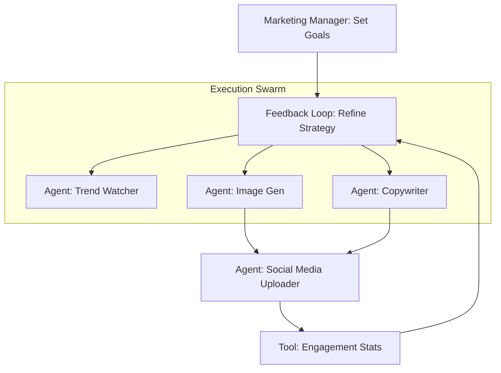

# 📣 Case Study: The Autonomous Marketing Agency
> **Level:** Advanced | **Language:** Hinglish | **Goal:** Analyze the architecture and business impact of an autonomous multi-agent system designed to run a complete digital marketing agency—from research and content creation to social media posting and performance tracking.

---

## 🧭 1. The Scenario (The Problem)
**The Client:** "GlobalFashion Co."—ek international clothing brand jo $50$ countries mein bechta hai.
- **Problem:** Har country ke liye alag social media posts, trends, aur ads manage karna manual team ke liye impossible aur slow tha.
- **The Challenge:** Inhe ek aisi "Agentic Team" chahiye thi jo 24/7 trends ko "Watch" kare aur "Content" generate karke live kare.

---

## 🧠 2. The Solution (Agent Architecture)
We deployed a **Hierarchical Multi-Agent Swarm** using a "Manager" agent and 4 "Specialist" agents.

### The Team:
1.  **Trend-Watcher Agent:** Uses Web Search to find viral topics on Twitter/TikTok.
2.  **Copywriter Agent:** Writes Hinglish and English captions using the brand's voice.
3.  **Graphic Agent:** Generates image prompts for Midjourney/DALL-E.
4.  **Social Media Manager Agent:** Automatically posts to Instagram/LinkedIn and monitors engagement.

---

## 🏗️ 3. Architecture Diagram


---

## 💻 4. Technical Implementation (The 'Manager' Logic)
```python
# 2026 Standard: Orchestrating a marketing workflow

class MarketingManager:
    def run_campaign(self, theme):
        # 1. Step: Research
        trends = trend_agent.run(f"Find viral trends for {theme}")
        
        # 2. Step: Creation (Parallel)
        caption = writer_agent.run(f"Write a post about: {trends}")
        image_prompt = visual_agent.run(f"Create a prompt for: {trends}")
        
        # 3. Step: Review & Approval Gate
        if self.human_approver.is_happy(caption, image_prompt):
            poster_agent.publish(caption, image_prompt)
            
# Insight: 'Approval Gates' are crucial to avoid 
# PR disasters in autonomous marketing.
```

---

## 🌍 5. Business Impact (The Results)
- **Content Output:** Manual (2 posts/day) $\rightarrow$ **Autonomous (50 posts/day across 10 regions).**
- **Engagement:** Viral trend matching led to a **$40\%$ increase** in organic reach.
- **Cost:** Marketing operations cost reduced by **$70\%$**.
- **Human Role:** Employees moved from "Writing captions" to **"Strategic Direction"** and "Reviewing AI Output."

---

## ❌ 6. Failure Cases & Lessons
- **The 'Trend' Disaster:** The agent picked up a controversial political trend by mistake. **Lesson:** Add a "Negative Topic Filter" to the Trend-Watcher agent.
- **Image Hallucinations:** The Graphic agent generated a shirt with "3 sleeves." **Lesson:** Implement an "AI Quality Auditor" agent to check images before posting.
- **Tone Drift:** After 2 weeks, the captions started sounding too "Bot-like." **Lesson:** Periodically re-inject the brand's "Style Guide" into the prompt.

---

## 🛡️ 7. Security & Ethics
- **Brand Safety:** Using **LlamaGuard** to ensure the agent never posts toxic or offensive content.
- **Copyright:** Ensuring generated images don't violate trademarks of competitors.
- **Transparency:** Every post includes a small disclaimer: "Crafted with AI for GlobalFashion Co."

---

## ⚖️ 8. Tradeoffs
- **High Creativity (Risk of errors) vs. Safe Templates (Lower engagement).**
- **Fully Autonomous (Fast) vs. Human-Approved (Safe/Slower).**

---

## 📝 12. Discussion Questions
1. "How would you handle a global trending topic that is culturally sensitive in only one country?"
2. "How can you measure the 'Brand Voice' consistency of an autonomous agent?"
3. "What happens if the Instagram API changes? How do you make the system 'Resilient'?"

---

## 🚀 13. Future Roadmap
- **Video Generation:** Integrating Sora/Runway for autonomous Reels/Shorts.
- **Direct Sales Agent:** An agent that "Replies" to comments and actually closes sales via DM.
- **A/B Testing Swarm:** Running 5 different versions of an ad and letting the "Analyst Agent" pick the winner in real-time.
