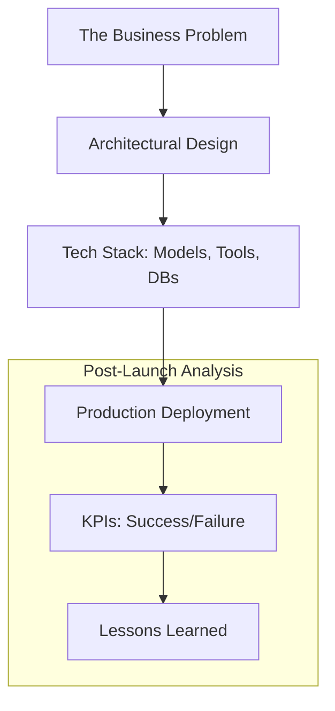

# 📚 Case Studies Overview: Learning from the Field
> **Level:** Advanced | **Language:** Hinglish | **Goal:** Understand how to approach real-world AI agent problems by analyzing successful deployments, failure modes, and architectural decisions across different industries.

---

## 🧭 1. Beginner-Friendly Hinglish Explanation
Case Studies ka matlab hai **"Asli duniya ke examples se seekhna"**.

- **The Goal:** Sirf coding seekhna kafi nahi hai. Humein ye dekhna hai ki badi companies (Amazon, Uber, Fintech startups) AI agents ko "Asli Mushkilon" ko solve karne ke liye kaise use karti hain.
- **The Process:**
  - **The Problem:** Har case study ek "Problem" se start hoti hai.
  - **The Solution:** Agent ne use kaise solve kiya?
  - **The Result:** Kya wo solution successful tha?
- **The Value:** Case studies se humein **"Design Thinking"** aur **"Trade-offs"** samajh aate hain.

Case studies aapko ek **"Product-Minded Engineer"** banati hain.

---

## 🧠 2. Deep Technical Explanation
Analyzing a case study requires looking at the **End-to-End lifecycle** of an agent.

### 1. The Analysis Framework (The 4 Pillars):
- **Pillar 1: Orchestration.** Was it a single agent or a swarm? (e.g., LangGraph vs CrewAI).
- **Pillar 2: Tooling.** What external APIs and sandboxes were used?
- **Pillar 3: Evaluation.** How was the agent's performance measured? (e.g., G-Eval, Human-in-the-loop).
- **Pillar 4: Governance.** What safety and ethical guardrails were in place?

### 2. The 'Evolution' of Case Studies:
- **Phase 1 (2023):** Basic Chatbots.
- **Phase 2 (2024-25):** RAG-based search engines.
- **Phase 3 (2026):** Autonomous Agent Swarms with real-world tool execution.

---

## 🏗️ 3. Architecture Diagrams (The Case Study Template)


---

## 💻 4. Production-Ready Code Example (A Metric Tracking Class)
```python
# 2026 Standard: Defining KPIs for Case Study evaluation

class CaseStudyAudit:
    def __init__(self, agent_name):
        self.agent = agent_name
        self.metrics = {
            "task_completion_rate": 0.0,
            "cost_reduction_percent": 0.0,
            "human_handover_count": 0
        }
    
    def log_incident(self, incident_type, details):
        # Critical for 'Failure Analysis' in case studies
        print(f"🚨 INCIDENT [{incident_type}]: {details}")

# Insight: In professional case studies, 
# 'Human Handover' is a key metric for ROI.
```

---

## 🌍 5. Real-World Industry Scenarios
- **Healthcare:** Using agents to automate "Insurance Pre-authorization."
- **Finance:** Agents that detect "Insider Trading" by analyzing news vs. trade patterns.
- **Retail:** "Hyper-personalized" shopping agents that act as personal stylists.

---

## ❌ 6. Failure Cases (Learning from Mistakes)
- **The 'Infinite Loop' Disaster:** A support agent that kept calling the same refund API, losing the company millions.
- **The 'Hallucinated Lawsuit':** A legal agent that used "Fake Cases" in a court filing.
- **The 'Security Breach':** An agent that was tricked into giving root access via a prompt injection attack.

---

## 🛠️ 7. Debugging Guide (How to read a Case Study)
| Look for... | Why it matters? |
| :--- | :--- |
| **The Constraints** | Shows the limitations the team faced (Budget, Privacy). |
| **The Failure Mode** | This is where you learn the most "Edge Cases." |
| **The ROI** | Proves the business value of the AI agent. |

---

## ⚖️ 8. Tradeoffs to Master
- **Build vs Buy:** Using an off-the-shelf agent platform vs building from scratch.
- **Speed vs Accuracy:** When is it okay for an agent to be $80\%$ accurate? (e.g., Marketing copy) vs $100\%$? (e.g., Medical dose).

---

## 🛡️ 9. Security & Ethics in Practice
- "How did the team ensure PII wasn't leaked in the 'Customer Support' case study?"
- **Answer:** They used **Presidio** to scrub all outgoing logs.

---

## 📈 10. Scaling Challenges
- Scaling an agent from 10 beta users to 10 million global users. (Focus on: Kubernetes, Cache Sharding).

---

## 💸 11. Cost Considerations
- Analyzing the **"Token Budget"** of a large-scale agentic deployment.

---

## 📝 12. Interview Case Study Questions
1. "How would you improve the 'Personal Finance Agent' case study for a high-net-worth user?"
2. "Identify the biggest security risk in the 'Autonomous Marketing Agency' example."
3. "What other tools would you add to the 'Supply Chain Optimizer'?"

---

## ⚠️ 13. Common Mistakes
- **Ignoring the 'Human' element:** Forgetting how real people interact with the agent.
- **Thinking AI is 'Set and Forget':** Not realizing that agents need constant "Maintenance" and "Fine-tuning."

---

## ✅ 14. Best Practices for Case Analysis
- **Be Critical:** Don't just accept that the solution was perfect. Look for gaps.
- **Think 'Multi-modal':** How would adding "Vision" or "Voice" change the case study?
- **Stay Updated:** Follow companies like **OpenAI, Anthropic, and Microsoft** for their official deployment case studies.

---

## 🚀 15. Latest 2026 Industry Patterns
- **Agentic ROI Models:** New mathematical formulas to predict how much an agent will save a company.
- **Sovereign Agent Clouds:** Countries building their own "Agent Infrastructure" for government case studies.
- **Cross-Enterprise Agents:** Case studies of agents from different companies (e.g., a Buyer agent and a Seller agent) negotiating a deal.
