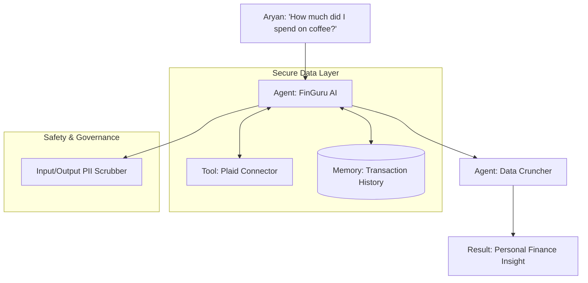

# 💰 Case Study: The Personal Finance Agent (FinGuru AI)
> **Level:** Advanced | **Language:** Hinglish | **Goal:** Analyze the design and implementation of a hyper-personalized financial agent that manages personal expenses, detects fraudulent transactions, and provides investment advice using secure tool-use and long-term memory.

---

## 🧭 1. The Scenario (The Problem)
**The User:** "Aryan"—a busy software engineer with multiple bank accounts, credit cards, and investments.
- **Problem:** Aryan ko ye nahi pata chalta ki uska paisa "Kahan ja raha hai." Subscription management aur budget tracking manually karna exhausting hai.
- **The Solution:** "FinGuru AI"—ek secure agent jo bank APIs se connect ho kar Aryan ki "Financial Health" ka dhyan rakhta hai.

---

## 🧠 2. The Solution (Agent Architecture)
FinGuru uses a **Stateful RAG** and **Secure Tool-Execution** architecture.

### The System Components:
1.  **Transaction Fetcher:** Connects to bank APIs (via Plaid/SaltEdge) securely.
2.  **Classifier Agent:** Automatically categorizes "Zomato" as 'Food' and "Netflix" as 'Entertainment.'
3.  **Fraud Monitor:** Flags unusual transactions (e.g., a high-value purchase in a new city).
4.  **Financial Coach:** Uses the user's spending "Memory" to suggest savings.

---

## 🏗️ 3. Architecture Diagram


---

## 💻 4. Technical Implementation (Categorization Logic)
```python
# 2026 Standard: Categorizing transactions with an agent

class FinGuruAgent:
    def categorize(self, merchant_name, amount):
        # 1. Look in 'Cache' for known merchants
        category = self.cache.get(merchant_name)
        
        # 2. If unknown, ask the 'Classifier Agent'
        if not category:
            prompt = f"Merchant: {merchant_name}. Amount: {amount}. Assign one category: FOOD, BILLS, SHOPPING, RENT."
            category = llm.run(prompt)
            self.cache.save(merchant_name, category)
            
        return category

# Insight: Personal finance agents need 'Zero-trust' 
# security for API keys and tokens.
```

---

## 🌍 5. Business Impact (The Results)
- **User Engagement:** Aryan now checks his finances every day (vs once a month).
- **Savings:** The agent identified $\$200$ in "Unused Subscriptions" in the first week.
- **Fraud Detection:** It caught a duplicate charge from a gym that Aryan would have missed.
- **Human Agency:** Aryan feels more in control of his money without doing any "Math."

---

## ❌ 6. Failure Cases & Lessons
- **The 'Privacy' Scare:** The agent accidentally read a "Private Note" attached to a transaction. **Lesson:** Use strict **'PII Filtering'** on all data sources.
- **Categorization Error:** It categorized a "Stock Investment" as "Spending," making Aryan think he was broke. **Lesson:** Implement a **'User Feedback'** loop (e.g., "Was this category correct?").
- **API Downtime:** The bank API went down, and the agent gave "Old Data" without telling the user. **Lesson:** Always show a **'Data Freshness'** timestamp.

---

## 🛡️ 7. Security & Ethics
- **Encryption:** All financial data is encrypted using **AES-256**.
- **Least Privilege:** The agent has "Read-only" access to the bank. It cannot "Send" money without a 2FA (Human-in-the-loop).
- **Ethical Investing:** The agent only suggests "Socially Responsible" (ESG) stocks if the user has that preference set in their profile.

---

## ⚖️ 8. Tradeoffs
- **Full History (Better advice) vs. Privacy (Risk of data leak).**
- **Cloud Processing (Fast/Smart) vs. Local-only Processing (Private/Slower).**

---

## 📝 12. Discussion Questions
1. "How do you handle a scenario where a user has two conflicting financial goals (e.g., 'Save for a House' vs 'Buy a Car')?"
2. "Should a financial agent be allowed to 'Automatically' cancel a subscription for you?"
3. "How do you ensure the agent doesn't give 'Bad Advice' during a market crash?"

---

## 🚀 13. Future Roadmap
- **Tax Filing Agent:** Automatically generating tax reports at the end of the year.
- **Family Swarm:** Agents for different family members that "Talk" to each other to manage a household budget.
- **Smart Negotiator:** An agent that "Calls" your internet provider to negotiate a lower bill for you.
