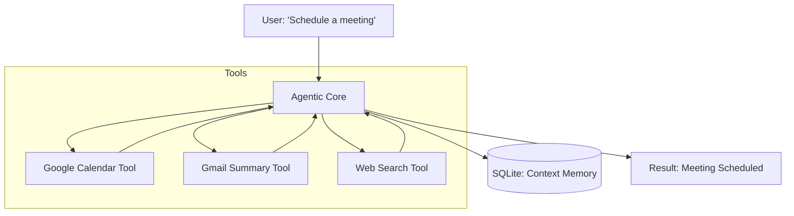

# 🏗️ Project 1: The Personal Executive Assistant
> **Level:** Beginner-Intermediate | **Language:** Hinglish | **Goal:** Build a production-ready personal assistant that can manage your calendar, summarize emails, and provide daily briefings using LangGraph and the Model Context Protocol (MCP).

---

## 🧭 1. Project Overview (The 'Why')
Is project ka goal hai ek aisa agent banana jo sirf "Chat" nahi karta, balki aapki digital life ko **"Manage"** karta hai.

- **Problem:** Hum roz 100 emails aur calendar invites handle karte hain. Ye boring aur time-consuming hai.
- **Solution:** Ek AI Agent jo Gmail aur Google Calendar se connect ho sake (using Tools) aur aapke behalf par "Actions" le sake.
- **Key Features:**
  - Daily Briefing (Morning summary).
  - Conflict detection in calendar.
  - Priority-based email summarization.

---

## 🧠 2. The Technical Stack
- **Orchestration:** LangGraph (Stateful).
- **LLM:** GPT-4o-mini (Cost-effective) or Llama-3-8B.
- **Tools:** Google Calendar API, Gmail API, Web Search (Tavily).
- **State Management:** SQLite (Local persistence).

---

## 🏗️ 3. Architecture Diagram


---

## 💻 4. Core Implementation (The Agent Loop)
```python
# 2026 Standard: Building a stateful assistant

from langgraph.graph import StateGraph, END
from typing import TypedDict, Annotated

class AgentState(TypedDict):
    query: str
    schedule: list[str]
    is_authorized: bool

# 1. Define the 'Check Calendar' Node
def check_calendar(state: AgentState):
    # Logic to call Google Calendar API
    state['schedule'] = ["10 AM: Sync", "2 PM: Lunch"]
    return state

# 2. Define the 'Planner' Node
def planner(state: AgentState):
    # Logic to decide if we need to book something
    return state

# Build the Graph
workflow = StateGraph(AgentState)
workflow.add_node("calendar", check_calendar)
workflow.add_node("planner", planner)
workflow.set_entry_point("calendar")
workflow.add_edge("calendar", "planner")
workflow.add_edge("planner", END)

app = workflow.compile()
```

---

## 🌍 5. Real-World Execution (The Workflow)
1. **Morning Call:** Agent checks your calendar at 8 AM.
2. **Action:** It finds a double-booking.
3. **Draft:** It drafts an email to the second person to reschedule.
4. **Approval:** It sends a Slack message to you: "Should I send this reschedule email?"
5. **Execution:** After you say "Yes," it sends the email and updates the calendar.

---

## ❌ 6. Potential Failure Cases
- **Hallucinated Dates:** Agent tries to book a meeting for "February 31st." **Fix: Use Pydantic for date validation.**
- **Privacy Leak:** Agent summarizes a "Confidential" email to a public chat. **Fix: Use 'Sensitivity Filters'.**
- **Rate Limits:** Calling the Gmail API too many times in a loop.

---

## 🛠️ 7. Debugging & Testing
- **Unit Test:** `test_calendar_parsing()` to ensure API responses are turned into clean text.
- **Integration Test:** `test_full_booking_flow()` to ensure the agent doesn't stop mid-way.
- **Mocking:** Use `unittest.mock` for Gmail API during development to save quota.

---

## 🛡️ 8. Security & Safety
- **OAuth2:** Never store passwords; always use official Google OAuth tokens.
- **Approval Gate:** The agent MUST NOT send an email without your explicit "Yes."
- **Scope Limitation:** Only give the agent "Read-Write" access to Calendar, not your whole Google Drive.

---

## 🚀 9. Bonus Features (The 'Expert' Level)
- **Voice Integration:** Talk to your agent via your phone using Whisper (STT) and ElevenLabs (TTS).
- **Proactive Reminders:** Agent notifies you 15 minutes before a meeting with a "Cheat Sheet" of who you are meeting.
- **Self-Correction:** If a tool call fails, the agent automatically retries with different parameters.

---

## 📝 10. Exercise for Learners
1. Add a "Weather Tool" so the agent warns you if it will rain during your outdoor meeting.
2. Implement a "Conflict Resolver" that suggests 3 alternative times when a booking fails.
3. Create a "Dashboard" (using Streamlit) to see your agent's logs in real-time.
