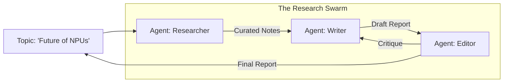

# 🤝 Project 2: Multi-Agent Research Team (The 'Think Tank')
> **Level:** Intermediate-Advanced | **Language:** Hinglish | **Goal:** Build a collaborative multi-agent system where a "Researcher," a "Writer," and an "Editor" work together to produce high-quality technical reports autonomously using CrewAI.

---

## 🧭 1. Project Overview (The 'Why')
Is project ka goal hai ek **"Digital Newsroom"** ya **"Research Lab"** banana.

- **Problem:** Kisi topic par deep research karke report likhne mein ghanton lagte hain. Insaan biased ho sakta hai ya sources miss kar sakta hai.
- **Solution:** Ek multi-agent team jahan har agent ka ek "Specialized Role" hai.
- **Key Roles:**
  - **The Researcher:** Internet scan karta hai aur sources dhoondta hai.
  - **The Writer:** Research ko summarize karke ek draft likhta hai.
  - **The Editor:** Fact-check karta hai, tone sahi karta hai, aur final polish deta hai.

---

## 🧠 2. The Technical Stack
- **Framework:** CrewAI (for role-playing and orchestration).
- **LLM:** Claude 3.5 Sonnet (Superior reasoning) or GPT-4o.
- **Search:** Tavily API or DuckDuckGo.
- **Environment:** Python 3.11+.

---

## 🏗️ 3. Architecture Diagram


---

## 💻 4. Core Implementation (Defining the Crew)
```python
# 2026 Standard: Using CrewAI for specialized roles

from crewai import Agent, Task, Crew, Process

# 1. Define Agents
researcher = Agent(
    role='Senior Research Analyst',
    goal='Uncover cutting-edge developments in {topic}',
    backstory='You are a curious researcher with a knack for finding hidden gems in technical blogs.',
    tools=[search_tool],
    verbose=True
)

writer = Agent(
    role='Technical Content Writer',
    goal='Write a compelling report based on research findings',
    backstory='You translate complex technical data into easy-to-read Hinglish blogs.'
)

# 2. Define Tasks
task1 = Task(description='Research the {topic} thoroughly', agent=researcher)
task2 = Task(description='Write a 1000-word blog about {topic}', agent=writer)

# 3. Assemble the Crew
crew = Crew(
    agents=[researcher, writer],
    tasks=[task1, task2],
    process=Process.sequential # Sequential workflow
)

result = crew.kickoff(inputs={'topic': 'Quantum Computing in 2026'})
```

---

## 🌍 5. Real-World Execution (The Workflow)
1. **Delegation:** The Researcher starts searching for "Quantum Computing" latest news.
2. **Analysis:** It finds 5 key articles, extracts the main points, and categorizes them.
3. **Drafting:** The Writer takes these categories and creates an outline, then fills in the text.
4. **Review:** (Optional Editor Agent) checks if the technical terms are used correctly and if the tone is "Hinglish" friendly.

---

## ❌ 6. Potential Failure Cases
- **Hallucinated Sources:** Researcher makes up a URL that doesn't exist. **Fix: Use 'Source Verification' tools.**
- **Repetitive Content:** Writer repeats what the Researcher already said without adding structure.
- **Role Bleeding:** The Researcher starts trying to "Write" the blog itself.

---

## 🛠️ 7. Debugging & Testing
- **Observation Logs:** Watch the terminal to see "Agent Thoughts" (Self-reflection).
- **Quality Check:** Compare the agentic report with a human-written report on the same topic.
- **Iteration:** If the report is too short, update the Writer's `goal` to specify a word count.

---

## 🛡️ 8. Security & Ethics
- **Attribution:** Ensure the agent cites its sources correctly to avoid plagiarism.
- **Sensitive Topics:** If the topic is "Medical" or "Legal," add a mandatory "Not Professional Advice" disclaimer.
- **Data Privacy:** Don't let the researcher access internal company docs unless authorized.

---

## 🚀 9. Bonus Features (The 'Expert' Level)
- **Hierarchical Process:** Use a "Manager" agent to oversee the Researcher and Writer.
- **Multi-modal Output:** Have the Writer generate "Image Prompts" for DALL-E to illustrate the blog.
- **Continuous Monitoring:** The Researcher runs every 24 hours and updates the blog if new info appears.

---

## 📝 10. Exercise for Learners
1. Add a "Fact-Checker" agent that specifically looks for "Dates" and "Numbers" in the research.
2. Change the `process` from `sequential` to `hierarchical` and see how the output changes.
3. Integrate a "Telegram Tool" so the final report is automatically sent to a channel.
