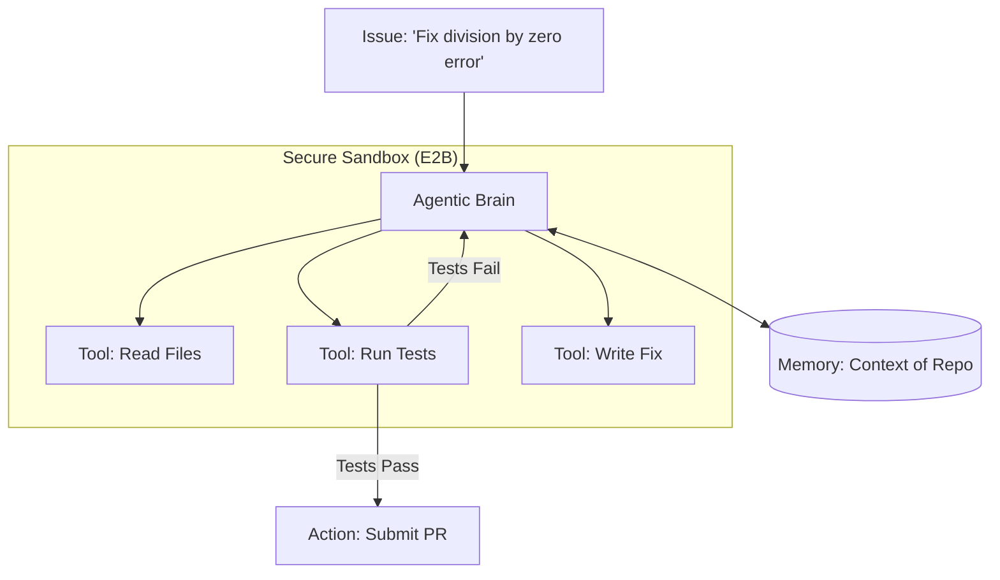

# 💻 Project 3: The Autonomous Coding Agent (Your AI Senior Dev)
> **Level:** Advanced | **Language:** Hinglish | **Goal:** Build an agent that can read a GitHub repo, identify bugs, write a fix, run unit tests, and submit a Pull Request—completely autonomously using a sandboxed execution environment.

---

## 🧭 1. Project Overview (The 'Why')
Is project ka goal hai ek **"Junior Developer"** AI banana jo real codebases par kaam kar sake.

- **Problem:** Bug fixing aur refactoring mein developers ka $30-40\%$ time nikal jata hai.
- **Solution:** Ek aisa agent jo:
  - Repository ko "Understand" kare.
  - Bug ko "Reproduce" kare.
  - Fix "Write" kare.
  - Test karke verify kare ki "Sab sahi hai."
- **The Concept:** AI ko sirf "Code" nahi dikhana, use ek "Terminal" aur "Debugger" dena hai.

---

## 🧠 2. The Technical Stack
- **Execution:** E2B (Sandboxed Cloud Environment) or Docker.
- **LLM:** GPT-4o or Claude 3.5 Sonnet (Best for coding).
- **Tools:** Terminal, File System (Read/Write), Git, Pytest.
- **Framework:** LangGraph (to handle the iterative 'Code-Test-Fix' loop).

---

## 🏗️ 3. Architecture Diagram


---

## 💻 4. Core Implementation (The 'Fix' Loop)
```python
# 2026 Standard: Executing code in a secure sandbox

from e2b import Sandbox

def coding_agent_step(code_to_fix, test_command):
    with Sandbox() as sb:
        # 1. Write the current (broken) code
        sb.files.write("app.py", code_to_fix)
        
        # 2. Try to run tests
        result = sb.run_command(test_command)
        
        # 3. If tests fail, give logs to the LLM
        if result.exit_code != 0:
            new_code = llm.generate(f"Fix this error: {result.stderr}\nCode: {code_to_fix}")
            # Loop starts again...
            return new_code
            
    return "✅ Code Fixed!"

# Insight: Never run AI-generated code on your 
# local machine. Always use a 'Micro-VM Sandbox'.
```

---

## 🌍 5. Real-World Execution (The Workflow)
1. **Discovery:** Agent reads the `README.md` and `requirements.txt` to understand the environment.
2. **Reproduction:** It creates a new test file that "Fails" (proving the bug exists).
3. **Drafting:** It modifies the source code to fix the logic.
4. **Validation:** It runs ALL tests to ensure it didn't break anything else (Regression testing).
5. **Completion:** It commits the changes with a professional commit message.

---

## ❌ 6. Potential Failure Cases
- **Infinite Bug-Fixing:** The agent fixes one bug but creates another, looping forever. **Fix: Set 'Max Iterations' to 5.**
- **Deleting the Repo:** Agent accidentally runs `rm -rf /` in the sandbox. **Fix: Use 'Read-only' mounts for sensitive parts of the sandbox.**
- **Hallucinated Libraries:** Agent tries to import `magic_fix_lib` which doesn't exist.

---

## 🛠️ 7. Debugging & Testing
- **Log Everything:** Capture every terminal command and output.
- **Snapshotting:** Save the "State" of the filesystem before and after the agent's work.
- **Trace Analysis:** Use **LangSmith** to see where the agent's reasoning went wrong during a complex fix.

---

## 🛡️ 8. Security & Ethics
- **Isolation:** The sandbox must have NO access to your internal network or secrets.
- **Rate Limiting:** Ensure the agent doesn't spam the GitHub API.
- **Code Review:** A human MUST review the PR before it is merged.

---

## 🚀 9. Bonus Features (The 'Expert' Level)
- **Multi-file Refactoring:** Agent can modify 10+ files simultaneously while keeping them consistent.
- **Automatic Documentation:** Agent updates the Docstrings and README after fixing the code.
- **Performance Profiling:** Agent runs the code through a profiler and optimizes the slowest functions.

---

## 📝 10. Exercise for Learners
1. Build an agent that can "Automatically add Unit Tests" to an existing Python file.
2. Integrate "Pylint" or "Flake8" so the agent fixes linting issues automatically.
3. Create a "Security Scanner" agent that looks for hard-coded API keys in a repo and moves them to `.env`.
