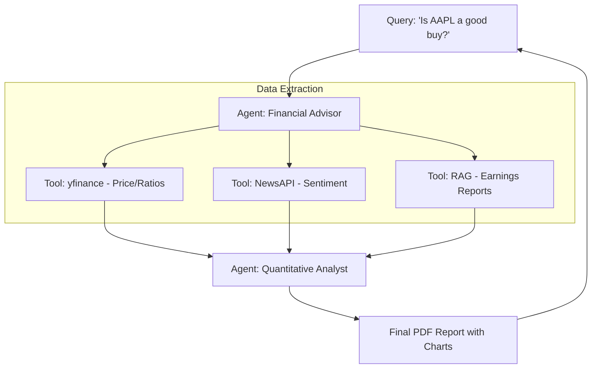

# 📈 Project 4: Financial Analysis Agent (The 'Wall Street' Agent)
> **Level:** Advanced | **Language:** Hinglish | **Goal:** Build a high-precision agent that can analyze stock market data, read quarterly earnings reports (PDFs), and provide "Buy/Sell" recommendations based on a customizable risk profile.

---

## 🧭 1. Project Overview (The 'Why')
Is project ka goal hai ek **"Professional Investment Analyst"** AI banana.

- **Problem:** Financial data bikhra hua hota hai (News, Balance Sheets, Stock Prices). Ek insaan ke liye sab kuch minto mein analyze karna namumkin hai.
- **Solution:** Ek agent jo structured data (APIs) aur unstructured data (PDFs) dono ko combine karke ek "Deep Analysis" de sake.
- **The Concept:** Agent sirf "Price" nahi dekhta, balki company ki "Health" (Ratios) aur "Future" (Earnings Call sentiments) ko samajhta hai.

---

## 🧠 2. The Technical Stack
- **Data Source:** YFinance API (Prices), AlphaVantage (News).
- **PDF Processing:** `LlamaIndex` or `Unstructured.io` (for complex table extraction from earnings reports).
- **Reasoning:** GPT-4o (Strong mathematical reasoning).
- **Visualization:** Matplotlib or Plotly (to generate charts).

---

## 🏗️ 3. Architecture Diagram


---

## 💻 4. Core Implementation (RAG for Financial PDFs)
```python
# 2026 Standard: Extracting insights from complex tables

from llama_index import VectorStoreIndex, SimpleDirectoryReader

def analyze_earnings_report(pdf_path, query):
    # 1. Load the PDF (High-fidelity parsing for tables)
    documents = SimpleDirectoryReader(input_files=[pdf_path]).load_data()
    
    # 2. Build a local vector index
    index = VectorStoreIndex.from_documents(documents)
    
    # 3. Query the index for specific financial metrics
    query_engine = index.as_query_engine()
    response = query_engine.query(f"Extract the Revenue and Profit margin for Q3. {query}")
    
    return response

# Insight: Financial reports have complex tables. 
# Use 'Table-aware' RAG to avoid hallucinating numbers.
```

---

## 🌍 5. Real-World Execution (The Workflow)
1. **Search:** Agent fetches the last 30 days of stock prices.
2. **Sentiment:** Agent reads the latest 10 news headlines and scores them (-1 to +1).
3. **Deep Dive:** Agent reads the $50$-page annual report and finds "Risk Factors."
4. **Synthesis:** It calculates if the stock is "Under-valued" using the P/E ratio and growth forecasts.
5. **Output:** It generates a 3-page summary with a clear "Recommendation."

---

## ❌ 6. Potential Failure Cases
- **Metric Mismatch:** Agent confuses "Revenue" with "Net Income." **Fix: Use strict 'Pydantic' schemas for data extraction.**
- **Stale Data:** Analyzing a report from 2022 thinking it's 2024.
- **Hallucinated Numbers:** AI making up a profit margin because it couldn't find the table. **Fix: Implement 'Self-Consistency' checks.**

---

## 🛠️ 7. Debugging & Testing
- **Fact-checking:** Use a second agent to cross-verify the numbers extracted by the first agent.
- **Backtesting:** Run the agent on "Past Data" (e.g., Jan 2023) and see if its recommendation was correct.
- **Visual Audit:** Always output the "Source Text" alongside the numbers for a human to double-check.

---

## 🛡️ 8. Security & Ethics
- **Compliance:** Add a "Not Financial Advice" disclaimer in bold at the start.
- **Privacy:** Don't send a user's "Personal Portfolio" data to the public LLM unless necessary (Anonymize it!).
- **Bias:** Ensure the news-sentiment tool uses multiple sources to avoid a single-news-site bias.

---

## 🚀 9. Bonus Features (The 'Expert' Level)
- **Portfolio Tracking:** Agent manages a virtual $\$100,000$ portfolio and "Rebalances" it every month.
- **Real-time Alerts:** Agent sends a WhatsApp message if a stock drops by $>5\%$.
- **Macro-economic Agent:** A second agent that watches "Interest Rates" and "Inflation" to provide context.

---

## 📝 10. Exercise for Learners
1. Add a "Competitor Analysis" tool that compares the chosen stock with 3 others in the same sector.
2. Build an "ESG Scorer" that reads the company's sustainability report and gives a score.
3. Integrate "Google Trends" API to see if the company's products are becoming more or less popular.
