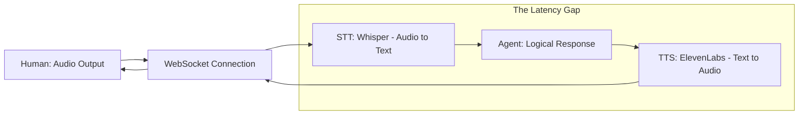

# 🎙️ Project 5: Real-Time Voice Agent (The 'Human-like' AI)
> **Level:** Advanced | **Language:** Hinglish | **Goal:** Build a low-latency, conversational voice agent that can talk to users in real-time with natural "Hinglish" nuances, using OpenAI's Realtime API or a combination of Whisper (STT) and ElevenLabs (TTS).

---

## 🧭 1. Project Overview (The 'Why')
Is project ka goal hai AI ko **"Aawaz"** dena.

- **Problem:** Standard chat bots "Text-based" hote hain. Hand-free situations (driving, cooking) mein wo kaam nahi aate. 
- **The Challenge:** Voice mein **"Latency"** (deeri) sabse badi dushman hai. Agar AI 5 second baad bolega, toh conversation "Robotic" lagegi.
- **Solution:** Ek aisa agent jo $<1$ second mein response start kare aur user ki baaton ko "Interrupt" bhi samajh sake.

---

## 🧠 2. The Technical Stack
- **Real-time Audio:** WebSockets or WebRTC (for low-latency streaming).
- **STT (Speech-to-Text):** OpenAI Whisper or Deepgram.
- **LLM:** GPT-4o-mini (Fast response).
- **TTS (Text-to-Speech):** ElevenLabs (Natural Hinglish tone) or Cartesia.

---

## 🏗️ 3. Architecture Diagram


---

## 💻 4. Core Implementation (Streaming Audio via WebSocket)
```python
# 2026 Standard: Handling real-time audio streams

async def voice_loop(websocket):
    async for message in websocket:
        # 1. Receive Audio Chunk from User
        audio_chunk = message.data
        
        # 2. Convert to Text (Incremental)
        text = await stt_service.transcribe_stream(audio_chunk)
        
        # 3. Generate LLM Response (Streaming)
        async for chunk in llm.stream(text):
            # 4. Generate Audio for each chunk and send back
            audio_response = await tts_service.synthesize(chunk)
            await websocket.send(audio_response)

# Insight: Use 'Streaming TTS' so the agent starts 
# speaking the first word while it's still thinking of the last word.
```

---

## 🌍 5. Real-World Execution (The Workflow)
1. **Listening:** The agent continuously listens for a "Wake Word" or active voice.
2. **VAD (Voice Activity Detection):** It detects when the user has finished speaking (to avoid awkward silences).
3. **Reasoning:** It understands the "Intent" (e.g., "Mummy ko call lagao").
4. **Synthesis:** It speaks back in a friendly, "Hinglish" accent: "Theek hai, call laga rahi hoon..."
5. **Interruption:** If the user says "Ruko!" mid-sentence, the agent stops speaking immediately.

---

## ❌ 6. Potential Failure Cases
- **Background Noise:** The agent tries to "Transcribe" the TV in the background. **Fix: Use 'Noise Suppression' filters.**
- **Latency Spikes:** Internet slow hone par AI 10 second chup rehta hai. **Fix: Use 'Fillers' like "Hmm..." or "Ek minute..." while thinking.**
- **Hallucinated Audio:** TTS mispronouncing Indian names. **Fix: Use 'Phonetic Spelling' in the prompt.**

---

## 🛠️ 7. Debugging & Testing
- **Latency Testing:** Measure the "Mouth-to-Ear" (M2E) delay. Aim for $<1.5s$.
- **Word Error Rate (WER):** Test how accurately the STT understands different Indian accents.
- **Interruptions Test:** Ensure the agent stops the audio buffer instantly when new user audio is detected.

---

## 🛡️ 8. Security & Ethics
- **Privacy:** Always have a "Mic Muted" indicator.
- **Voice Cloning:** Never clone a real person's voice without their legal consent.
- **Transparency:** The agent must disclose: "I am an AI assistant speaking to you."

---

## 🚀 9. Bonus Features (The 'Expert' Level)
- **Emotion Detection:** Agent detects if the user is "Angry" and changes its tone to be more "Calming."
- **Multi-lingual Switching:** The agent can switch from English to Hindi mid-sentence based on how the user is talking.
- **Environment Awareness:** Agent "Hears" a dog barking and asks "Is your dog okay?"

---

## 📝 10. Exercise for Learners
1. Integrate a "Spotify Tool" so the voice agent can play music on command.
2. Build a "Voice-based Cooking Assistant" that reads recipes step-by-step and waits for you to say "Next."
3. Implement "Speaker Diarization" so the agent can distinguish between 2 different people in the same room.
