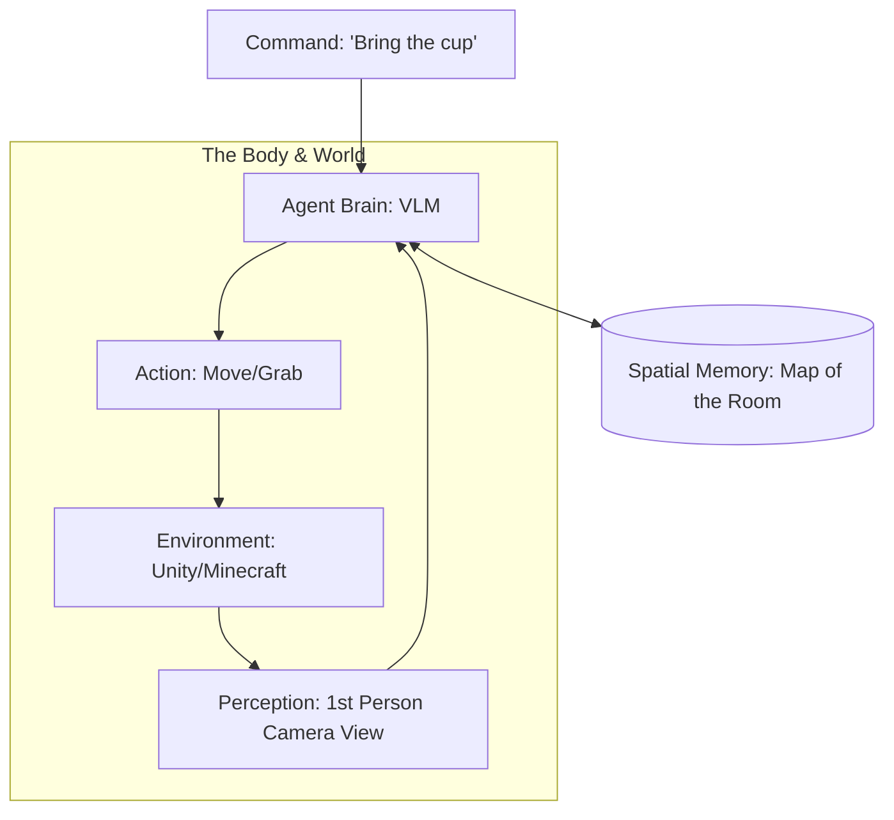

# 🤖 Project 6: Embodied AI Simulation (The 'Physical' Agent)
> **Level:** Extreme Advanced | **Language:** Hinglish | **Goal:** Build an agent that can control a "Body" in a simulated environment (like Minecraft, Unity, or Habitat), navigating obstacles and completing physical tasks using "Vision-Language Models" (VLM).

---

## 🧭 1. Project Overview (The 'Why')
Is project ka goal hai AI ko **"Duniya"** dikhana.

- **Problem:** Zyadatar agents sirf "Text" aur "API" ki duniya mein rehte hain. Unhe nahi pata ki "Chair" kya hai ya "Darwaza" kaise khulta hai. 
- **The Concept:** **Embodied AI** ka matlab hai wo AI jiska ek "Jism" (Body) ho.
- **The Task:** Agent ko ek virtual room mein rakho aur use bolo: "Go to the kitchen and find the red apple."
- **The Challenge:** Agent ko pixels (images) ko "Actions" (Move Forward, Turn Left) mein badalna hoga.

---

## 🧠 2. The Technical Stack
- **Simulation Environment:** AI2-THOR (Standard for house tasks) or Minecraft (Voyager pattern).
- **VLM (Vision-Language Model):** GPT-4o (Vision) or LLaVA (Open-source vision).
- **Control Logic:** Reinforcement Learning (RL) or Skill-based prompting.
- **Memory:** Spatial Memory (Mapping where things are).

---

## 🏗️ 3. Architecture Diagram


---

## 💻 4. Core Implementation (The Vision-to-Action Loop)
```python
# 2026 Standard: Integrating Vision into the agent loop

def embodied_step(image_path, goal):
    # 1. Ask the VLM to 'Describe' the scene
    analysis = vlm.analyze(image_path, f"Goal: {goal}. What do you see?")
    
    # 2. Plan the next physical move
    # Analysis: "I see a table on the left and a chair on the right."
    action = brain.decide(f"Scene: {analysis}. What is the next move?")
    
    # 3. Execute in Simulator
    simulator.execute(action) # e.g., 'move_forward', 'turn_90_left'
    
    return action

# Insight: Embodied agents need a 'Mental Map' to avoid 
# going in circles.
```

---

## 🌍 5. Real-World Execution (The Workflow)
1. **Perception:** Agent gets a $360^{\circ}$ view of the room.
2. **Planning:** It identifies the "Target" (The cup) and the "Obstacles" (The sofa).
3. **Navigation:** It generates a path (A* or Waypoints).
4. **Interaction:** It uses an "Inverse Kinematics" tool to reach out and "Grab" the object.
5. **Report:** It says: "Task finished. The cup is on the table."

---

## ❌ 6. Potential Failure Cases
- **Collision:** Agent keeps walking into a wall because it didn't "See" the glass door. **Fix: Add 'Proximity Sensors' as a tool.**
- **Object Disappearance:** Agent looks away and "Forgets" where the apple was. **Fix: Use 'Persistent Spatial Memory'.**
- **Infinite Looping:** Agent gets stuck between a chair and a table.

---

## 🛠️ 7. Debugging & Testing
- **Top-down View:** Use a "God-eye" view in the simulator to see the agent's path.
- **Success Rate:** Measure how many times the agent successfully finds the object out of 100 tries.
- **Compute Optimization:** Running vision every $100ms$ is expensive. **Fix: Run vision only when the 'Sensors' detect a change.**

---

## 🛡️ 8. Security & Ethics
- **Safety:** In the real world, an embodied agent could "Break" things. The simulator must test for "Safe Movements."
- **Privacy:** If the agent has a camera, it must follow "Privacy Zones" (e.g., don't record in bathrooms).
- **Control:** Always have a "Remote Kill Switch" for the robot's motors.

---

## 🚀 9. Bonus Features (The 'Expert' Level)
- **Multi-agent Coordination:** Two robots working together to "Carry a heavy table."
- **Natural Language Steering:** Telling the agent "A bit to the left... no, too much... stop!" and it adapts in real-time.
- **Sim-to-Real Transfer:** Training the agent in Unity and then deploying the same code to a real **Unitree** or **Tesla Bot**.

---

## 📝 10. Exercise for Learners
1. Build an agent that can "Explore" a new house and create a floor plan autonomously.
2. Implement a "Trash Sorting" agent that identifies and picks up "Plastic" vs. "Paper" in a simulated park.
3. Create a "Drone Agent" that navigates a $3D$ obstacle course without crashing.
