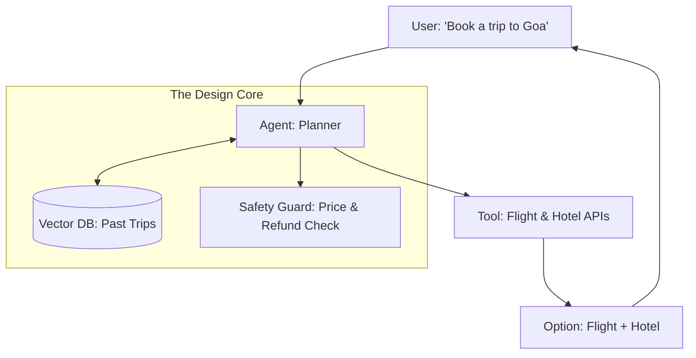

# 🎨 AI Agent Design Questions: Mastering the Architecture
> **Level:** Advanced | **Language:** Hinglish | **Goal:** Master the specific "Design" questions that test your ability to build functional, user-centric, and robust agentic systems.

---

## 🧭 1. Beginner-Friendly Hinglish Explanation
Design Questions ka matlab hai **"AI ko ek Solution mein badalna"**.

- **The Challenge:** Interviewer aapko ek problem dega (e.g., "Ek Travel Agent banao") aur aapse puchega ki aap use "A to Z" kaise build karoge.
- **The Core Parts:**
  - **The Persona:** Agent kaisa behave karega?
  - **The Tools:** Use kaunse APIs chahiye?
  - **The Memory:** Use purani baatein kaise yaad rahengi?
  - **The Safety:** Wo galat ticket toh book nahi kar dega?
- **The Goal:** Ye dikhana ki aap "Engineer" ho jo poore system ko dhyan mein rakhta hai.

Design questions mein **"Decision Making"** ka logic sabse important hai.

---

## 🧠 2. Deep Technical Explanation
Design questions test your ability to balance **Autonomy**, **Predictability**, and **Safety**.

### 1. The Design Framework (The 5-Step Approach):
- **Step 1: Scoping:** Defining the "Goal" and "Constraints" (e.g., "Book flights under $\$500$").
- **Step 2: Architecture Selection:** Choosing between a **Single Agent**, **Multi-agent Swarm**, or a **Hierarchical Model**.
- **Step 3: Toolset Definition:** Listing the specific functions (e.g., `search_flights`, `process_payment`).
- **Step 4: Memory Strategy:** Defining Short-term (Conversation Buffer) and Long-term (Vector Store) memory.
- **Step 5: Guardrails:** Implementing "Approval Gates" and "Output Filtering."

### 2. Common Scenarios:
- "Design an agent for autonomous code refactoring."
- "Design a multi-agent system for a complex supply chain."

---

## 🏗️ 3. Architecture Diagrams (The 'Travel Agent' Example)


---

## 💻 4. Production-Ready Code Example (Designing the Tool Interface)
```python
# 2026 Standard: Defining clear interfaces for your design

class TravelAgentDesign:
    def __init__(self):
        self.tools = [
            {"name": "search_flight", "params": ["origin", "dest", "date"]},
            {"name": "confirm_booking", "params": ["flight_id", "user_consent"]}
        ]
        
    def check_safety(self, proposal):
        # 1. Price constraint
        if proposal['price'] > 10000:
            return False
        # 2. Return success
        return True

# Insight: In design questions, show how tools 
# 'Interact' with each other.
```

---

## 🌍 5. Real-World Use Cases (Design Challenges)
- **Support Agent:** Handling 1000 tickets/hour with "Sentiment-based Routing."
- **Financial Agent:** "Auto-Invest" agent that respects "Risk Profiles."
- **Social Media Agent:** "Trend-following" agent that creates and posts content.

---

## ❌ 6. Failure Cases
- **Over-Autonomy:** Letting a "Travel Agent" book a non-refundable $\$5000$ flight without human consent.
- **Context Fragmentation:** The agent "Forgets" the budget mid-conversation.
- **Circular Tool Use:** Searching for flights, finding none, then searching for the same flights again.

---

## 🛠️ 7. Debugging Guide (Improving your Design)
| Symptom | Cause | Fix |
| :--- | :--- | :--- |
| **Agent is too 'Generic'** | Poor Persona definition | Add a **'System Message'** that defines its expert role and tone. |
| **Agent makes logic errors** | No 'Reflection' step | Add a **'Self-Correction'** node where the agent reviews its own plan before execution. |

---

## ⚖️ 8. Tradeoffs to Master
- **Hierarchical (Manager-Worker) vs. Collaborative (Peer-to-Peer).**
- **Stateful (Graph-based) vs. Stateless (Simple Chain).**

---

## 🛡️ 9. Security Concerns
- "How do you ensure the agent doesn't use the 'Payment API' without an OTP?"
- "How do you handle 'Malicious User Intent' trying to get free trips?"

---

## 📈 10. Scaling Challenges
- Handling 100 concurrent "Planning" steps. (Focus on: Async/Await and Task Queues).

---

## 💸 11. Cost Considerations
- "How many LLM calls does one 'Booking' take? Can we reduce it?"

---

## 📝 12. Top 3 Design Questions
1. "Design an agentic system that can migrate a codebase from Python 2 to Python 3 autonomously."
2. "How would you design a 'Research Agent' that identifies fake news?"
3. "Design an agent for a Smart Home that manages energy usage based on real-time prices."

---

## ⚠️ 13. Common Mistakes
- **Ignoring the 'Observation' Step:** Designing an agent that only "Acts" but never "Learns" from the tool's output.
- **Hard-coding Logic:** Trying to write `if/else` for everything instead of letting the LLM reason.

---

## ✅ 14. Best Practices
- **Human-in-the-loop for Actions:** Always ask for permission for high-stakes tasks.
- **Atomic Tools:** Tools should do one thing and do it well.
- **Traceability:** Design the system so you can see "Why" a decision was made.

---

## 🚀 15. Latest 2026 Industry Patterns
- **Agentic OS:** Designing agents as "Operating System" components.
- **Cooperative Multi-agent Systems:** Agents from different companies talking to each other.
- **Adaptive Memory:** Memory that "Cleans itself" by deleting irrelevant info over time.
