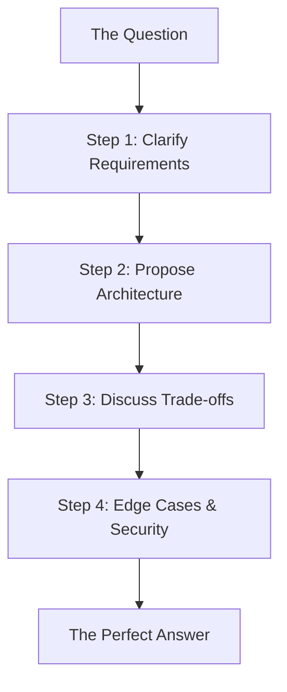

# ❓ AI Agent Interview Questions: The Ultimate Question Bank
> **Level:** Advanced | **Language:** Hinglish | **Goal:** Master the most common and challenging questions asked in AI Engineering interviews, organized by category (Fundamentals, Architecture, Security, Ethics).

---

## 🧭 1. Beginner-Friendly Hinglish Explanation
Interview Questions ka matlab hai **"Sawaal aur Jawab ka khazana"**.

- **The Problem:** AI Engineering naya field hai, isliye log confuse hote hain ki kya pucha jayega.
- **The Concept:** 
  - **Theory Questions:** "LLM aur Agent mein kya farq hai?"
  - **Design Questions:** "Customer support agent kaise banaoge?"
  - **Troubleshooting:** "Agent agar loop mein phas jaye toh kya karoge?"
- **The Goal:** Aapke pass har "Kyun" aur "Kaise" ka logical aur technical jawab hona chahiye.

Questions ko **"Ratna"** nahi, unke piche ka **"Logic"** samajhna hai.

---

## 🧠 2. Deep Technical Explanation
Interview questions in 2026 test for **Practical Problem Solving** and **Architectural Maturity**.

### 1. Category: Agent Architectures & Planning:
- **Q:** What is the difference between **Chain-of-Thought (CoT)** and **Tree-of-Thoughts (ToT)**?
  - **A:** CoT is linear reasoning; ToT explores multiple reasoning branches simultaneously and evaluates them to find the best path.
- **Q:** How does a **ReAct** loop differ from **Plan-and-Execute**?
  - **A:** ReAct interleaved reasoning and acting step-by-step; Plan-and-Execute creates a full plan first and then carries it out, allowing for better global optimization but less adaptability to unexpected tool results.

### 2. Category: Memory & Context:
- **Q:** When would you use a **Graph Database** (like Neo4j) for an agent instead of a **Vector DB**?
  - **A:** Use Graph DBs when relationships between entities (e.g., "Person X is the CEO of Company Y") are more important than semantic similarity.

---

## 🏗️ 3. Architecture Diagrams (The Answer Strategy)


---

## 💻 4. Production-Ready Code Example (The 'Show, Don't Just Tell' approach)
```python
# 2026 Standard: Explaining code logic during an interview

def handle_agent_loop_stalling(history):
    # Interviewer: "How do you detect if an agent is stuck?"
    # Me: "I monitor for 'Repetitive Observations' in the trace logs."
    
    last_three = history[-3:]
    if all(h['result'] == last_three[0]['result'] for h in last_three):
        return "ERROR: Stuck in loop. Diverging strategy..."
    
    return "CONTINUE"

# Insight: Using specific terms like 'Observation' and 
# 'History' shows you have built real agents.
```

---

## 🌍 5. Real-World Use Cases (Sample Questions)
- **"Design an agent that researches stock prices and writes a summary report."**
- **"How would you build a multi-agent system to automate a software QA process?"**
- **"How do you handle a scenario where an agent has access to 500 different tools?"**

---

## ❌ 6. Failure Cases (Bad Answers)
- **"I don't know, I just use the default LangChain settings."** (Shows lack of curiosity).
- **"The model will handle it automatically."** (Shows lack of engineering rigor).
- **"I would just use GPT-4 for everything."** (Shows lack of cost awareness).

---

## 🛠️ 7. Debugging Guide (Common Concepts to Master)
| Concept | Interview Context | Key Insight |
| :--- | :--- | :--- |
| **Hallucination** | How to mitigate it? | Focus on **'Grounding,' 'Few-shotting,'** and **'N-shot Sampling'**. |
| **Context Window** | How to manage it? | Focus on **'Semantic Compression,' 'Summarization,'** and **'RAG'**. |

---

## ⚖️ 8. Tradeoffs to Master
- **Fine-tuning (High Control/High Cost) vs. Prompt Engineering (Low Control/Low Cost).**
- **Centralized Agent (Simple) vs. Decentralized Swarm (Resilient).**

---

## 🛡️ 9. Security Concerns (Questions to expect)
- "What is Prompt Injection and how do you prevent it?"
- "How do you secure 'Tool Execution' in a production environment?"

---

## 📈 10. Scaling Challenges
- "How do you handle rate-limiting when 100 agents are calling the same API?"

---

## 💸 11. Cost Considerations
- "How would you optimize an agent that costs $\$1.00$ per task?"

---

## 📝 12. Top 5 'Hard' Questions
1. "Explain the mathematical difference between Dot Product and Cosine Similarity for embeddings."
2. "How would you implement 'Cross-Agent Memory' in a system with 50 specialized agents?"
3. "What is 'State Drift' and how do you monitor for it in an autonomous workflow?"
4. "How do you evaluate the 'Planning' capability of a model independently of its 'Execution'?"
5. "Design a system that allows a human to 'Intervene' in an agentic loop without breaking the context."

---

## ⚠️ 13. Common Mistakes
- **Ignoring the User:** Forgetting that the agent's ultimate goal is to help a human.
- **Over-complicating:** Proposing a 5-agent swarm for a task that one `if/else` could solve.

---

## ✅ 14. Best Practices for Answering
- **The STAR Method:** (Situation, Task, Action, Result) for behavioral questions.
- **Thinking Out Loud:** Let the interviewer see your thought process.
- **Draw Diagrams:** Use the whiteboard to explain complex data flows.

---

## 🚀 15. Latest 2026 Industry Trends
- **Agentic Evaluation (Auto-Evals):** Using one agent to test another.
- **Long-context Reasoning Models:** Models with 1M+ context window and how they change agent design.
- **Open-source Agent Orchestrators:** The shift from closed platforms to open-source control.
