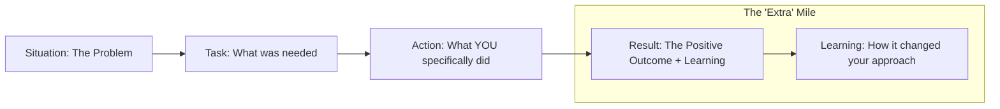

# 🤝 Behavioral Questions for AI Engineers: Culture & Mindset
> **Level:** Advanced | **Language:** Hinglish | **Goal:** Master the "Soft Skills" and "Mindset" questions that test your ability to work in high-stakes AI teams, handle uncertainty, and build ethical products.

---

## 🧭 1. Beginner-Friendly Hinglish Explanation
Behavioral Questions ka matlab hai **"Aapki Personality ke sawaal"**.

- **The Focus:** Interviewer ye nahi dekh raha ki aapko "Code" aata hai ya nahi (wo technical round mein check ho gaya). Wo dekh rahe hain ki:
  - Kya aap pressure mein kaam kar sakte hain?
  - Kya aap team ke saath collab kar sakte hain?
  - Kya aapki ethics "Clear" hain?
- **The Core Themes:**
  - **Ambiguity:** Jab requirements clear nahi hain, tab aap kya karte ho?
  - **Failure:** Jab aapka agent production mein "Galti" karta hai, tab aap use kaise handle karte ho?
  - **Disagreement:** Jab aapki team ke saath conflict ho, toh use kaise solve karte ho?
- **The Goal:** Ye prove karna ki aap ek **"Mature Professional"** ho.

Behavioral rounds mein **"Sacchai"** aur **"Learning"** sabse important hain.

---

## 🧠 2. Deep Technical Explanation
Behavioral interviews for AI Engineers focus on **Algorithmic Responsibility**, **Iterative Mindset**, and **Communication of Complexity**.

### 1. The 'AI Specific' Behavioral Questions:
- **Q:** "Tell me about a time an AI model you deployed behaved unexpectedly. What did you do?"
  - **STAR Answer:** Focus on: 1. Detecting the anomaly. 2. Implementing a quick guardrail. 3. Root cause analysis. 4. Permanent fix.
- **Q:** "How do you explain a complex 'Hallucination' issue to a non-technical stakeholder?"
  - **Focus:** Use analogies, be honest about AI limitations, and focus on the "Risk Mitigation" plan.

### 2. The STAR Method (Situation, Task, Action, Result):
Every answer should follow this structure to be clear and impactful.

---

## 🏗️ 3. Architecture Diagrams (The Perfect Behavioral Answer)


---

## 💻 4. Production-Ready Code Example (Not code, but a 'Communication' Schema)
```python
# 2026 Standard: How to structure a 'Post-Mortem' report for a behavioral answer

class PostMortemReport:
    def __init__(self, incident_id):
        self.what_happened = "Agent started loop in Production"
        self.impact = "Spent $200 on tokens in 10 mins"
        self.immediate_action = "Triggered Kill-switch"
        self.root_cause = "Missing max_iterations parameter"
        self.prevention_plan = "Added strict Pydantic validation for all loops"

# Insight: Having a 'Structured Approach' to failure shows seniority.
```

---

## 🌍 5. Real-World Use Cases (Behavioral Scenarios)
- **Ethical Dilemma:** Your boss wants to launch an agent that might be biased. How do you push back?
- **Tight Deadlines:** Launching a "Mission-critical" agent in 1 week. How do you prioritize "Safety" vs. "Speed"?
- **Cross-functional Collab:** Working with "Legal" and "Product" teams to define agent boundaries.

---

## ❌ 6. Failure Cases (Common Mistake Answers)
- **"I never make mistakes."** (Total lie, shows lack of self-awareness).
- **"It was the model's fault, not mine."** (Lack of accountability).
- **"I just did what I was told."** (Lack of leadership/ownership).

---

## 🛠️ 7. Debugging Guide (Improving your Soft Skills)
| Symptom | Cause | Fix |
| :--- | :--- | :--- |
| **Talking too much** | Nervousness | Practice the **'2-minute rule'**—no answer should be longer than 2 mins. |
| **Vague answers** | Lack of preparation | Have **'3-5 Core Stories'** ready (Failure, Success, Conflict, Innovation). |

---

## ⚖️ 8. Tradeoffs to Master
- **Transparency (Honest about AI flaws) vs. Confidence (Selling the AI solution).**
- **Perfectionism (Wait for 99% accuracy) vs. Agility (Launch at 85% and iterate).**

---

## 🛡️ 9. Security & Ethics in Behavior
- "How do you handle a situation where you discover a potential 'Backdoor' in an open-source model your team is using?"

---

## 📈 10. Scaling Challenges
- "How do you manage a team of 5 AI Engineers working on the same complex agentic graph?"

---

## 💸 11. Cost Considerations
- "Tell me about a time you had to make a 'Cost-benefit' decision regarding model selection."

---

## 📝 12. Top 5 Behavioral Questions
1. "Tell me about a time you had to deal with a 'Hallucination' that caused a real business problem."
2. "How do you stay up-to-date with the 100s of new AI papers released every week?"
3. "Describe a conflict you had with a team member over an 'Ethical' decision. How was it resolved?"
4. "Tell me about a project that failed. What did you learn and how did you apply it to the next one?"
5. "How do you balance 'Innovation' (using the latest experimental tech) with 'Stability' (using boring, proven tech)?"

---

## ⚠️ 13. Common Mistakes
- **Negativity:** Bad-mouthing your previous company or boss.
- **Ignoring the 'Why':** Explaining *what* you did but not *why* you made that specific choice.

---

## ✅ 14. Best Practices for Answering
- **Be 'Vulnerable':** Admit when you were wrong. It shows strength.
- **Focus on 'Impact':** Use numbers (e.g., "Reduced latency by $30\%$," "Saved $\$5k/month").
- **Mention 'Ethics' Unprompted:** Show that you care about safety and bias without being asked.

---

## 🚀 15. Latest 2026 Industry Patterns
- **AI Ethics Officers:** A new role that every behavioral round now checks for alignment with.
- **The 'Agentic' Workflow of Teams:** How humans and agents collaborate within the engineering team itself.
- **Continuous Learning Mindset:** Showing that you are not just an "Engineer" but a "Researcher" who loves to learn.
