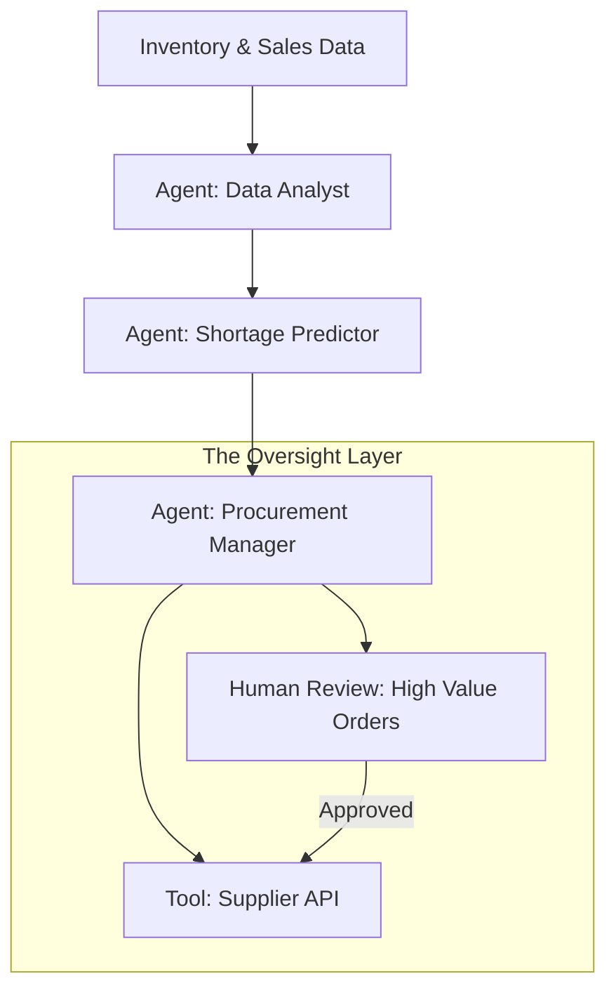

# 📚 Case Study Analysis: Solving Real-World AI Problems
> **Level:** Advanced | **Language:** Hinglish | **Goal:** Master the art of analyzing and solving complex "Real-world" case studies often presented in AI engineering interviews, focusing on practical trade-offs and multi-agent solutions.

---

## 🧭 1. Beginner-Friendly Hinglish Explanation
Case Study Analysis ka matlab hai **"Business problem ko AI solution mein badalna"**.

- **The Problem:** Interviewer aapko ek complex scenario dega (e.g., "Ek bank ko apna poora customer support automate karna hai").
- **The Task:** Aapko sirf "Code" nahi likhna, balki poora **"Product Thinking"** dikhana hai:
  - Kya ye problem AI se solve ho sakti hai?
  - Isme kya-kya risk hain?
  - Kitna kharcha aayega?
  - Result kaise measure karoge?
- **The Goal:** Ye prove karna ki aap "Business" aur "Technology" dono ko samajhte ho.

Case studies mein **"Logic"** aur **"Trade-offs"** (Nuksan aur Fayda) ki baat sabse important hai.

---

## 🧠 2. Deep Technical Explanation
Case study analysis in 2026 focuses on **End-to-End Lifecycle**, **Operational Excellence**, and **Risk Mitigation**.

### 1. The Case Study Framework:
- **Clarify:** Ask 3-5 clarifying questions (e.g., "How many users?", "What's the budget?", "What data is available?").
- **Strategy:** Propose a high-level solution (e.g., "A multi-agent swarm with a human-in-the-loop audit layer").
- **Architecture:** Draw the data flow (RAG, Tools, Memory).
- **Execution:** Discuss the rollout plan (Canary release, A/B testing).
- **Measurement:** Define the KPIs (e.g., "Reduced response time by 50%," "90% accuracy in data extraction").

### 2. Sample Case Study: "Autonomous Supply Chain Optimizer"
**Scenario:** A global retail company wants to use agents to predict stock shortages and automatically place orders with suppliers.

---

## 🏗️ 3. Architecture Diagrams (The Supply Chain Case)


---

## 💻 4. Production-Ready Code Example (Defining KPIs for a Case Study)
```python
# 2026 Standard: Tracking the 'Success' of a business case

class CaseStudyMetrics:
    def __init__(self):
        self.kpis = {
            "accuracy": 0.0,
            "cost_per_task": 0.0,
            "user_satisfaction": 0.0,
            "human_intervention_rate": 0.0 # CRITICAL for AI cases
        }
    
    def report_success(self):
        if self.kpis['human_intervention_rate'] < 0.1:
            return "✅ HIGH AUTONOMY SUCCESS"
        return "⚠️ NEEDS REFINEMENT"

# Insight: In case studies, always mention 'Human Intervention Rate'. 
# It shows you understand the limits of AI.
```

---

## 🌍 5. Real-World Case Scenarios
- **Case 1: Legal Document Review.** Automating the analysis of 100,000 contracts for "Non-compliance."
- **Case 2: Healthcare Triage.** Building a bot that directs patients to the right specialist based on symptoms.
- **Case 3: Automated Video Production.** An agent swarm that researches a topic, writes a script, generates images, and edits a video.

---

## ❌ 6. Failure Cases
- **The "Over-Promise":** Saying the AI will be $100\%$ accurate and replace all humans. (Red flag for interviewers).
- **The "Silent Failure":** An agent failing to place an order but not telling anyone, leading to empty shelves.
- **Data Privacy Breach:** Using customer "Personal Data" in the agent's prompt without masking it.

---

## 🛠️ 7. Debugging Guide (Common Case Pitfalls)
| Pitfall | Cause | Fix |
| :--- | :--- | :--- |
| **System is too expensive** | Using GPT-4 for everything | Suggest **'Model Tiering'**—use small models for simple tasks and big models only for critical decisions. |
| **Users don't trust the AI** | Opaque decision making | Implement **'Explainable AI'** (XAI) where the agent shows its reasoning. |

---

## ⚖️ 8. Tradeoffs to Master
- **Custom Fine-tuned Model (High upfront cost/High accuracy) vs. RAG with Base Model (Low upfront/Good enough).**
- **Autonomous Action (Fast) vs. Human Approval (Safe).**

---

## 🛡️ 9. Security & Governance in Cases
- "How do we ensure the 'Supply Chain Agent' doesn't get tricked into ordering $\$1M$ of fidget spinners by a fake supplier?"
- **Solution:** Multi-factor authentication for suppliers and "Threshold-based" human approval.

---

## 📈 10. Scaling Challenges
- Scaling the "Legal Review" agent to handle $10$ different languages across $20$ countries with different laws.

---

## 💸 11. Cost Considerations
- "How do we calculate the ROI (Return on Investment) for this AI project?"

---

## 📝 12. Top 3 Analysis Questions
1. "How would you handle the 'Data Privacy' concerns in a medical AI case study?"
2. "What are the most important KPIs for an 'Autonomous Sales Agent'?"
3. "How do you handle 'Edge Cases' where the AI has never seen the scenario before?"

---

## ⚠️ 13. Common Mistakes
- **Ignoring the 'Maintenance' phase:** Forgetting that AI needs to be updated and monitored after launch.
- **Not Asking Questions:** Jumping into the solution without understanding the user's "Real" pain points.

---

## ✅ 14. Best Practices for Case Study Rounds
- **Draw the Diagram First:** It helps the interviewer follow your logic.
- **Think about 'Worst-case Scenarios':** What if the internet is down? What if the model hallucinations?
- **Be 'Cost-aware':** Always mention that you are thinking about the company's money.

---

## 🚀 15. Latest 2026 Industry Patterns
- **Digital Twins for AI Simulation:** Running a case study solution in a "Simulated World" before going live.
- **Agentic ROI Calculators:** Tools that automatically predict the savings from an AI agent deployment.
- **ESG (Environmental, Social, Governance) in AI:** Considering the "Carbon Footprint" of your AI solution.
