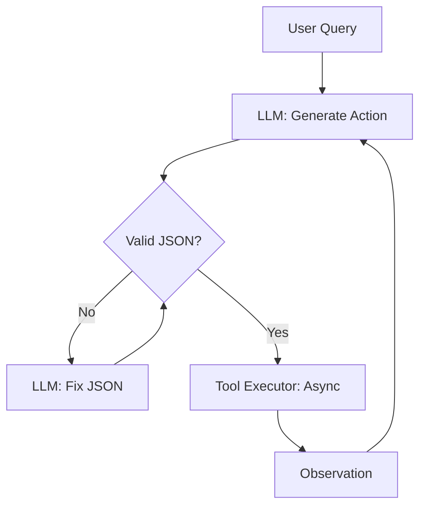

# 💻 Coding Challenges for Agents: Real-World Implementation
> **Level:** Advanced | **Language:** Hinglish | **Goal:** Master the specific coding patterns and challenges used in AI Engineering interviews, focusing on Tool-use, State management, and Asynchronous agentic loops.

---

## 🧭 1. Beginner-Friendly Hinglish Explanation
Coding Challenges ka matlab hai **"AI logic ko code mein badalna"**.

- **The Problem:** Standard "LeetCode" questions (like sorting an array) AI Engineering ke liye kafi nahi hain.
- **The Challenge:** Interviewer aapse aise sawaal puchega jo AI ki "Unpredictability" ko handle karein:
  - **Tool Integration:** Agent ko "Calculator" tool ke saath kaise connect karoge?
  - **State Persistence:** Agent ki "Yaddash" (Memory) ko restart hone par kaise restore karoge?
  - **Error Handling:** Agar LLM "Galat JSON" de, toh use code se kaise fix karoge?
- **The Goal:** Ye prove karna ki aap "AI-Native" code likh sakte ho.

Coding challenges mein **"Robustness"** aur **"Async logic"** sabse important hain.

---

## 🧠 2. Deep Technical Explanation
Coding for agents requires a shift from **Sequential Logic** to **Event-driven/Stateful Logic**.

### 1. Key Coding Themes:
- **Asynchronous Execution:** Handling multiple tool calls in parallel using `asyncio`.
- **Schema Enforcement:** Using `Pydantic` to ensure LLM outputs match your expectations.
- **Retry Logic:** Implementing exponential backoff for failed API calls using `tenacity`.
- **Streaming:** Implementing real-time output streaming for a better user experience.

### 2. Sample Challenge: "The Multi-Tool Orchestrator"
**Problem:** Write a Python class that takes a user query, decides between 3 tools (Search, Math, Email), and executes the plan. Handle the case where the LLM's output is not valid JSON.

---

## 🏗️ 3. Architecture Diagrams (The Agentic Code Flow)


---

## 💻 4. Production-Ready Code Example (The 'Robust Loop' Pattern)
```python
# 2026 Standard: A production-ready ReAct loop snippet

import asyncio
from tenacity import retry, stop_after_attempt, wait_exponential

class RobustAgent:
    @retry(stop=stop_after_attempt(3), wait=wait_exponential(multiplier=1, min=4, max=10))
    async def call_llm(self, prompt):
        # Implementation of LLM call with retry logic
        pass

    async def run_loop(self, task):
        history = []
        for _ in range(5): # Max 5 iterations to avoid infinite loops
            response = await self.call_llm(f"Task: {task}\nHistory: {history}")
            action = self.parse_json(response)
            
            if action['type'] == 'final':
                return action['value']
            
            # Execute tool and update history
            result = await self.execute_tool(action['name'], action['params'])
            history.append({"action": action['name'], "result": result})

# Insight: Always mention 'Retry Logic' and 'Max Iterations' 
# during your coding interview.
```

---

## 🌍 5. Real-World Use Cases (The 'Hard' Challenges)
- **Challenge A:** Build a "Parallel Search" agent that calls 5 different APIs and merges the results.
- **Challenge B:** Implement a "Long-term Memory" system using a local SQLite database and embeddings.
- **Challenge C:** Write a "Self-Correction" layer that detects if an agent's code has a syntax error and fixes it.

---

## ❌ 6. Failure Cases
- **The "Blocking" Agent:** Writing code that waits for one tool to finish before starting the next, wasting time. (Fix: Use `asyncio.gather`).
- **The "Fragile" Parser:** Code that crashes if the LLM adds a single extra character (like "```json") to the output.
- **Leaking Secrets:** Hard-coding API keys in your challenge solution.

---

## 🛠️ 7. Debugging Guide (Common Interview Issues)
| Issue | Cause | Fix |
| :--- | :--- | :--- |
| **Code hangs indefinitely** | Unhandled async task | Always use **'Timeouts'** for every network call. |
| **JSON decode error** | LLM output is messy | Use a **'Regex'** to find the JSON block inside the LLM's text response. |

---

## ⚖️ 8. Tradeoffs to Master
- **Pydantic Validation (Safe/Slower) vs. Direct Parsing (Fast/Risky).**
- **State in Memory (Fast) vs. State in DB (Persistent).**

---

## 🛡️ 9. Security Concerns in Coding
- "How do you ensure the `tool_name` from the LLM is actually in your allowed list?"
- **Solution:** Use an **'Allow-list'** dictionary mapping strings to function objects.

---

## 📈 10. Scaling Challenges
- "How do you handle 100 parallel agent threads in Python?" (Focus on: `ThreadPoolExecutor` vs `Asyncio`).

---

## 💸 11. Cost Considerations
- "How can you minimize tokens in a multi-turn loop?" (Focus on: **'Prompt Pruning'** and **'Summarization'**).

---

## 📝 12. Top 5 Coding Tasks
1. "Implement a Rate-Limiter for an LLM agent."
2. "Write a function that calculates the 'Cosine Similarity' between two vectors from scratch."
3. "Build a simple 'State Machine' for an agent that has 3 stages: Plan, Execute, Report."
4. "Implement a 'Context Compactor' that keeps the last 5 messages but summarizes the rest."
5. "Create a 'Tool Factory' that dynamically registers new Python functions as agent tools."

---

## ⚠️ 13. Common Mistakes
- **No Type Hinting:** Writing "Messy" Python without type hints (Shows lack of professionalism).
- **Ignoring Edge Cases:** What if the tool returns an empty list? What if the LLM is down?

---

## ✅ 14. Best Practices for Coding
- **Use `async/await` by default.**
- **Implement Robust Logging:** `logging.info(f"Agent Action: {action}")`.
- **Write Modular Code:** Keep your "Planner," "Executor," and "Parser" as separate classes.

---

## 🚀 15. Latest 2026 Industry Patterns
- **Function Calling via Tool Definitions:** Using the native JSON-schema support of models like GPT-4o.
- **Structured Pydantic Graphs:** Using LangGraph to define complex agent logic as a set of nodes and edges.
- **Native PDF/Image Parsing in Code:** Writing code that handles multi-modal inputs as part of the agent loop.
