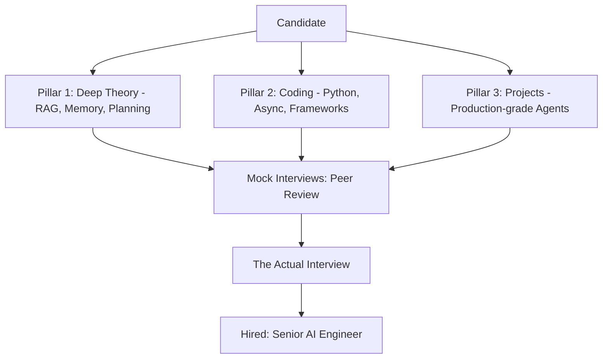

# 🎓 Interview Prep Overview: Landing the AI Engineer Role
> **Level:** Advanced | **Language:** Hinglish | **Goal:** Master the strategy for cracking AI Engineering interviews in 2026, focusing on the core pillars of System Design, Coding, and Domain Expertise.

---

## 🧭 1. Beginner-Friendly Hinglish Explanation
Interview Prep ka matlab hai **"2026 ke AI Job market ke liye taiyar hona"**.

- **The Market:** 2026 mein companies sirf "Prompt Engineering" nahi maang rahi hain. Unhe **"AI Software Engineers"** chahiye jo agents build, scale, aur secure kar sakein.
- **The Core Pillars:**
  - **System Design:** Ek lakh users ke liye agentic workflow kaise design karoge?
  - **Coding:** Kya aap LangGraph ya CrewAI use karke complex state manage kar sakte ho?
  - **Domain Knowledge:** RAG, Memory, aur Tool-use ke deep concepts pata hain?
- **The Goal:** Sirf "Concepts" nahi, balki "Production Experience" dikhana.

Interview nikalne ka mantra hai: **"Build in Public, Explain in Deep."**

---

## 🧠 2. Deep Technical Explanation
The 2026 AI Engineering Interview focuses on **Agentic Reasoning**, **Infrastructure for LLMs**, and **Evaluation Science**.

### 1. The Interview Loop (Elite Tech Companies):
- **Technical Screen:** Coding challenges involving asynchronous tool-calling or state machines.
- **System Design (AI focus):** Designing a "Customer Support Swarm" or "Automated Dev Agent."
- **Deep Dive (Knowledge):** Explaining the trade-offs between different Memory architectures (Vector vs. SQL vs. Graph).
- **Evaluation Task:** How would you measure if your agent is hallucinating in production?

### 2. The 2026 "Must-Know" Tech Stack:
- **Orchestration:** LangGraph (Stateful), CrewAI (Multi-agent), Autogen.
- **Observability:** LangSmith, Arize Phoenix, Weights & Biases.
- **Deployment:** Docker, Micro-VMs (E2B), Kubernetes.

---

## 🏗️ 3. Architecture Diagrams (The Interview Success Map)


---

## 💻 4. Production-Ready Code Example (A 'Signature' Portfolio Snippet)
```python
# 2026 Standard: Demonstrating state management in a portfolio project

from langgraph.graph import StateGraph, END

class AgentState(TypedDict):
    task: str
    plan: list[str]
    current_step: int
    results: list[str]

# Insight: In interviews, show that you handle 'Cycles' and 'Error Correction'.
# A linear chain is 'Junior' level; a graph with self-correction is 'Expert'.
```

---

## 🌍 5. Real-World Use Cases (What to talk about)
- **Talk about Scale:** "I built an agent that processed 10,000 tickets/day using a hierarchical multi-agent system."
- **Talk about Security:** "I implemented LlamaGuard to prevent prompt injection in our public-facing bot."
- **Talk about Cost:** "I reduced token costs by $40\%$ using prompt caching and semantic routing."

---

## ❌ 6. Failure Cases (Common Interview Mistakes)
- **The "Vague Architect":** Not being able to explain *why* you chose a specific model or vector DB.
- **Ignoring Latency:** Designing a system that takes 5 minutes to respond without mentioning streaming or optimization.
- **No Evaluation Plan:** Not knowing how to prove your agent actually works.

---

## 🛠️ 7. Debugging Guide (Mock Interview Prep)
| Symptom | Cause | Fix |
| :--- | :--- | :--- |
| **Failing at System Design** | Thinking only about 'The Model' | Start thinking about **'Data Flow,' 'Storage,' 'Safety,'** and **'Monitoring'**. |
| **Cannot explain complex terms** | Lack of First-Principles understanding | Practice explaining concepts to a **'5-year-old'** (Feynman Technique) to build deep intuition. |

---

## ⚖️ 8. Tradeoffs to Master
- **LVM (Large Volume Memory) vs. SVM (Short Variable Memory).**
- **Cloud LLMs (Expensive/Powerful) vs. Local SLMs (Cheap/Private).**

---

## 🛡️ 9. Security Concerns (Expect these questions)
- "How would you prevent an agent from leaking its system prompt?"
- "What is your strategy for secure tool execution?"

---

## 📈 10. Scaling Challenges
- Handling 10,000 concurrent agents. (Focus on: Message Queues, Load Balancing, and GPU Clusters).

---

## 💸 11. Cost Considerations
- Budgeting for a production agent (Tokens vs. Infra vs. Human Reviewers).

---

## 📝 12. Interview Questions (The Big Three)
1. "How do you handle non-determinism in your testing pipeline?"
2. "Explain the trade-offs between ReAct and Plan-and-Solve patterns."
3. "Walk me through the architecture of a production-ready RAG system."

---

## ⚠️ 13. Common Mistakes
- **Over-relying on Frameworks:** Using LangChain without knowing what it does "Under the hood."
- **Neglecting Fundamentals:** Forgetting basic Python optimization or Data Structures.

---

## ✅ 14. Best Practices for Prep
- **Write Technical Blogs:** Demonstrate that you can explain complex ideas.
- **Contribute to Open Source:** Show that you can work in a professional team.
- **Practice System Design on a Whiteboard:** Master the "Visual" explanation.

---

## 🚀 15. Latest 2026 Industry Patterns
- **Cognitive Architecture Design:** Designing the "Mind" of the agent, not just the code.
- **Agentic DevSecOps:** Integrating agents into the development lifecycle.
- **Multi-modal Interviews:** Be ready to design systems that handle images, voice, and video.
